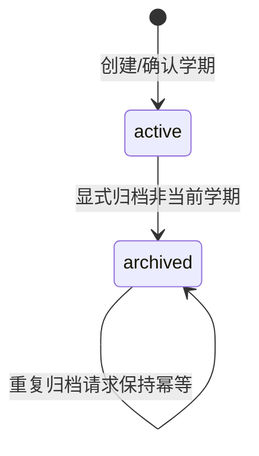

# Phase 1-T09E 练习历史与学期归档 Implementation Plan

> **For agentic workers:** REQUIRED SUB-SKILL: Use superpowers:subagent-driven-development (recommended) or superpowers:executing-plans to implement this plan task-by-task. Steps use checkbox (`- [ ]`) syntax for tracking.

**Goal:** 交付学生端“练习历史与学期归档”增强：学生可按学期查看已完成练习记录与结果，管理员/学生可将非当前学期归档，归档学期保留只读查看能力且禁止业务写入。

**Architecture:** T09E 复用现有 global catalog + per-semester SQLite 模型，不复制、不移动、不删除学期库；归档是 global `semesters.status` 的状态转换，练习历史是针对指定 `semesterId` 的只读查询。后端新增最小 global migration 记录真实归档时间并集中执行 archived 写保护；前端新增学期管理页入口与独立历史页面，不改变 T09D 已完成的全局导航范围。

**Tech Stack:** TypeScript, Express, SQLite/better-sqlite3, React, Vite, Vitest/Testing Library, Playwright, PowerShell docs governance.

---

## 0. 计划门禁状态

- **任务编号**：Phase 1-T09E：练习历史与学期归档。
- **计划分支**：`codex/phase1-t09e-practice-history-archive-plan`。
- **计划文件**：`.plans/phase1-t09e-practice-history-archive-plan.md`。
- **基线事实**：T09D 已 fast-forward 合入 `master`，主线复验通过并推送 `origin/master`；T09E 尚未实施。
- **本计划状态**：独立实施计划已创建并完成计划级审查，等待用户明确批准。未批准前不得创建实现分支、不得写业务代码、不得新增 schema/migration/API/前端逻辑/测试实现。
- **文档映射说明**：当前仓库索引中的 `docs/10` 与 `docs/11` 分别为后端/前端开发规范；用户提示中的旧式“数据库设计/API设计”名称不在当前索引中，本计划以 `docs/00` 当前索引为准。

## 1. 产品目标与范围

### 1.1 用户目标

1. 学生在学期管理中能进入某个学期的练习历史，回看已经完成并评分的 S3 练习。
2. 学生可按课程、考试/目标、练习完成时间筛选历史列表，列表按最近完成时间倒序。
3. 学生可打开历史练习结果，看到当次题目、自己的答案、正确答案、解析、得分、正确率、用时/超时信息。
4. 学生可理解练习记录与课程、考试、错题之间的关系：每条历史记录显示课程名、考试名（如有关联）、错题数量/错误数量和可追溯的练习结果。
5. 学生/家长设备管理员可将“非当前学期”归档。归档后该学期仍可从学期管理页进入只读历史查看，但不再可被选为当前学期，也不能继续写入业务数据。

### 1.2 用户入口和页面范围

- 修改现有 `学期管理` 页面，增加：
  - active 学期列表中的“查看练习历史”入口；
  - 非当前 active 学期的“归档学期”操作；
  - archived 学期列表与“查看归档历史”入口。
- 新增独立路由：
  - `/semesters/:semesterId/practice-history`：练习历史列表与筛选；
  - `/semesters/:semesterId/practice-history/:sessionId`：持久化练习结果只读详情。
- 不新增或修改 T09D 全局导航项；这些页面通过学期管理页进入，不把“练习历史”加入全局导航侧栏。
- 不修改既有 `/practice-sessions/:sessionId/result` 的即时提交后体验；历史详情走带 `semesterId` 的独立路由，避免依赖浏览器内存草稿。

### 1.3 明确非目标

- 不做 S5 期末冲刺 PRD、页面、Worker、冲刺复习或预测。
- 不做 S7 课堂采集 PRD、录音、转写或课堂资料流。
- 不做家长 Web 面板，不扩展 S6 报告订阅/外部推送。
- 不运行真实 AI Provider、QQ SMTP、飞书、Windows Task Scheduler 或外部渠道 smoke。
- 不改 T09D 已完成的全局导航结构、考试上下文导航范围或学生旅程 E2E 基线。
- 不做学期删除、数据库搬迁、跨学期数据合并、归档压缩、恢复/反归档或“受控纠错”界面。
- 不把 `FOLLOW_UP` 做成新的学期状态；本阶段只使用现有 `active | archived`。

## 2. 数据与状态模型

### 2.1 学期状态

现有 shared 类型已有：

```ts
export type SemesterStatus = 'active' | 'archived';
```

T09E 继续使用该状态，不新增 `deleted`、`frozen`、`follow_up` 等状态。

状态转换：



约束：

- 当前学期仍由 global `app_meta.current_semester_id` 表示。
- `GET /api/semesters` 继续只返回可选择的 active + ready 学期，保持 T09A/T09D current selector 语义。
- archived 学期不得被 `PUT /api/semesters/current` 选为当前学期。
- 归档当前学期必须失败，错误码 `CURRENT_SEMESTER_CANNOT_ARCHIVE`；用户需要先切换到另一个 active 学期。
- 归档只更新 global catalog 状态，不移动、不复制、不删除学期 SQLite 或上传文件。
- 对 archived 学期，允许只读查询：历史练习列表、历史结果、课程/考试名称展示、错题计数展示。
- 对 archived 学期，禁止业务写入：课程、课表、考试、学习任务、StudyEvent、资料上传/重试/替换、知识模块编辑、练习创建/提交、错因确认、错题状态更新、错题重做。

### 2.2 是否需要 schema/migration

需要 **一个最小 global migration**，不需要 semester schema migration。

理由：

- global `semesters.status` 已存在，足够表达 `active | archived`。
- global `semesters.final_archive_date` 表示计划/最终归档边界日期，不等同于实际归档发生时间。
- 归档操作需要可审计的真实发生时间，避免把 planned date 当成 operation timestamp。

最小方案：

```sql
ALTER TABLE semesters ADD COLUMN archived_at TEXT;
```

同步更新 fresh schema：

```sql
archived_at TEXT,
```

不新增归档审计表；本阶段用 `archived_at` + `updated_at` 足够。未来若需要恢复/反归档/受控纠错，再另行走门禁。

### 2.3 练习历史引用关系

练习历史从 `practice_sessions` 出发，保持 S3/S4 边界：

- `practice_sessions.course_instance_id` -> `course_instances.id`：展示课程名。
- `practice_sessions.assessment_attempt_id` -> `assessment_attempts.id`：展示考试/目标名；无考试关联时显示“未关联考试”。
- `practice_questions` 与 `practice_answers`：构造结果详情、得分、正确/错误题目。
- `mistakes.first_practice_answer_id` / `mistakes.latest_practice_answer_id`：只做错题计数或弱提示，不跳转到当前学期专用错题工作台，不修改错题状态。

列表仅展示已评分的普通 S3 练习：

```sql
WHERE ps.status = 'graded'
  AND ps.session_kind = 'regular'
```

S4 错题重做产生的 `mistake_redo` 练习不混入 T09E 的“练习历史列表”，避免把错题改错闭环重复计入普通练习历史。

## 3. 后端 API 设计

所有响应继续使用统一 envelope `{ success, data, error }`，错误码固定、前端只展示安全摘要。

### 3.1 学期归档 API

新增：

- `GET /api/semesters/archived`
  - 返回 ready + archived 学期，按 `archivedAt DESC, updatedAt DESC` 排序。
  - 不影响 `GET /api/semesters` active-only 行为。
- `POST /api/semesters/:id/archive`
  - 将非当前 active 学期归档。
  - 成功返回 `SemesterSummaryDto`。
  - 若已 archived，幂等返回该学期，不刷新 `archivedAt`。
  - 若目标是 current，返回 409 `CURRENT_SEMESTER_CANNOT_ARCHIVE`。
  - 若目标不存在或不是 ready，返回现有 404 类错误。

扩展 shared DTO：

```ts
export interface SemesterSummaryDto {
  id: string;
  semesterCode: string;
  studentName: string;
  teachingStartDate: string;
  teachingEndDate: string;
  finalArchiveDate?: string | null;
  archivedAt?: string | null;
  status: SemesterStatus;
  isCurrent: boolean;
  createdAt: string;
  updatedAt: string;
}
```

### 3.2 练习历史 API

新增：

- `GET /api/practice-sessions/history?semesterId=...&courseInstanceId=...&assessmentAttemptId=...&from=YYYY-MM-DD&to=YYYY-MM-DD&page=1&pageSize=20`
  - `semesterId` 必填。
  - `courseInstanceId`、`assessmentAttemptId`、`from`、`to` 可选。
  - `pageSize` 默认 20，最大 100。
  - 仅返回 `status='graded'` 且 `session_kind='regular'`。
  - active 和 archived 学期都允许读取。
  - 返回学期摘要、筛选条件、分页信息、列表项。
- `GET /api/practice-sessions/:id/history-result?semesterId=...`
  - 返回持久化练习结果详情。
  - 只允许读取已评分 session。
  - 不能依赖前端内存中的 submission result。

新增 shared DTO：

```ts
export interface PracticeHistoryFiltersDto {
  semesterId: string;
  courseInstanceId?: string;
  assessmentAttemptId?: string;
  from?: string;
  to?: string;
  page: number;
  pageSize: number;
}

export interface PracticeHistoryItemDto {
  sessionId: string;
  semesterId: string;
  courseInstanceId: string;
  courseName: string;
  assessmentAttemptId?: string | null;
  assessmentName?: string | null;
  status: 'graded';
  questionCount: number;
  totalScore: number;
  correctRate: number;
  overtime: boolean;
  totalDurationSeconds: number;
  gradedAt: string;
  mistakeCount: number;
}

export interface PracticeHistoryResponseDto {
  semester: SemesterSummaryDto;
  readOnly: boolean;
  filters: PracticeHistoryFiltersDto;
  total: number;
  page: number;
  pageSize: number;
  items: PracticeHistoryItemDto[];
}

export interface PracticeHistoryResultDto {
  semester: SemesterSummaryDto;
  session: PracticeSessionDetailDto;
  result: SubmitPracticeSessionResponse;
  readOnly: true;
}
```

`PracticeHistoryResultDto.result` 可以复用提交结果形状，但由数据库重新组装。实现时必须确保 `correctAnswer`、`explanation` 等字段只来自已评分结果，不向未提交练习泄露。

### 3.3 archived 写保护

新增后端共用守卫，避免只靠前端隐藏按钮：

```ts
export function assertSemesterReadable(semesterId: unknown): SemesterAccessInfo;
export function assertSemesterWritable(semesterId: unknown): SemesterAccessInfo;
```

守卫职责：

- 校验 UUID、ready 学期和 DB 路径。
- `readable` 允许 active/archived。
- `writable` 仅允许 active；archived 返回 409 `SEMESTER_ARCHIVED`。
- 不改变现有 `openReadySemesterDb` 的物理路径规则；业务服务在写入入口调用 `assertSemesterWritable` 后再打开 DB。

必须覆盖的写入口：

- `StudyRhythmService`：`createCourse`、`updateCourse`、`createScheduleEntry`、`updateScheduleEntry`、`deleteScheduleEntry`、`createExam`、`updateExam`、`confirmExam`、`createTask`、`updateTaskStatus`、`createEvent`。
- `NoteBuilderService`：`uploadMaterial`、`retry`、`replaceText`、`updateKnowledgeModule`。
- `PracticeRunnerService`：`createPracticeSession`、`submitPracticeSession`。
- `ErrorFixerQueryService`：`confirmErrorCause`、`updateStatus`、`createRedoSession`。

只读入口改用 `assertSemesterReadable` 或继续等价的 ready 校验：课程/课表/考试/任务列表、时间线、每日首页、资料/笔记/知识模块查询、错题/薄弱点查询、练习历史查询。

## 4. 前端交互设计

### 4.1 学期管理页

修改 `packages/frontend/src/pages/semester-page.tsx`：

- 保持 active semester list 与 current selector 语义不变。
- 对每个 active 学期显示“查看练习历史”。
- 对非 current active 学期显示“归档学期”按钮。
- current 学期的归档按钮不渲染或禁用，并说明“请先切换当前学期后再归档”。
- 增加 archived 学期区块：显示学期代码、学生名、教学日期、`finalArchiveDate`、`archivedAt`、只读标签和“查看归档历史”。
- 归档操作使用确认对话或页面内确认区，明确“归档不是删除；归档后只读，不能继续编辑课程、考试、资料、练习或错题”。
- 归档成功后刷新 active 与 archived 列表；如果服务端返回 `CURRENT_SEMESTER_CANNOT_ARCHIVE`，保留用户当前选择不变并显示安全错误。

### 4.2 练习历史列表页

新增 `packages/frontend/src/pages/practice-history-page.tsx`：

- 页面标题：`练习历史`；若 archived，标题旁显示 `已归档 · 只读`。
- 筛选控件：课程、考试/目标、开始日期、结束日期、重置筛选。
- 列表列：完成时间、课程、考试/目标、题数、得分、正确率、用时、错题数、操作。
- 操作只包含“查看结果”；不提供“继续练习”“重新提交”“生成错题重做”。
- 空态：
  - 无任何历史：`这个学期还没有已完成练习`。
  - 有筛选但无结果：`没有符合筛选条件的练习`，提供重置筛选。
- 错误态：展示固定错误摘要，提供重试和返回学期管理。
- 响应式：窄屏下列表折叠为卡片；筛选控件纵向排列。
- 无障碍：筛选控件有 `label`，结果区域用 `aria-live="polite"` 汇报加载/结果数量，按钮可键盘操作。

### 4.3 练习历史结果页

新增 `packages/frontend/src/pages/practice-history-result-page.tsx`：

- 通过 `semesterId` + `sessionId` 拉取持久化结果。
- 显示只读状态、课程/考试信息、总分/正确率/用时/是否超时。
- 逐题展示题干、选项/填空、学生答案、正确答案、解析、对错状态。
- 返回按钮回到该学期历史列表，并保留浏览器 URL 查询参数中的筛选条件。
- 不显示可写操作按钮。

## 5. 文件清单

### 5.1 计划批准后允许创建

- `packages/backend/src/db/sql/migration-global-v2.ts`：global `archived_at` migration。
- `packages/backend/src/services/semester-access-service.ts`：学期 readable/writable 守卫。
- `packages/frontend/src/pages/practice-history-page.tsx`：历史列表页。
- `packages/frontend/src/pages/practice-history-result-page.tsx`：历史结果页。
- `packages/backend/test/practice-history-api.test.mjs`：练习历史 API 集成测试。
- `packages/backend/test/semester-archive-api.test.mjs`：学期归档与写保护集成测试。
- `packages/frontend/test/practice-history-page.test.tsx`：历史列表/详情组件测试。
- `e2e/practice-history-archive.spec.ts`：T09E 浏览器验收。

### 5.2 计划批准后允许修改

- `packages/shared/src/types.ts`：新增 history DTO，扩展 `SemesterSummaryDto.archivedAt`。
- `packages/backend/src/db/sql/schema-global.ts`：fresh global schema 增加 `archived_at`。
- `packages/backend/src/db/migrations.ts`：注册 `GLOBAL_MIGRATIONS` v2。
- `packages/backend/src/services/semester-selector-service.ts`：archived list、archive action、summary mapping。
- `packages/backend/src/api/semester-selector.ts`：新增 archived list 与 archive action routes。
- `packages/backend/src/services/practice-runner-service.ts`：history list/result query，写入口调用 writable guard。
- `packages/backend/src/api/practice-runner.ts`：新增 history/result routes。
- `packages/backend/src/services/study-rhythm-service.ts`：写入口调用 writable guard。
- `packages/backend/src/services/note-builder-service.ts`：写入口调用 writable guard。
- `packages/backend/src/services/error-fixer-query-service.ts`：写入口调用 writable guard。
- `packages/frontend/src/api/semester-api.ts`：archived list + archive API client。
- `packages/frontend/src/api/practice-runner-api.ts`：history list/result API client。
- `packages/frontend/src/app.tsx`：新增两条 `/semesters/:semesterId/practice-history...` 路由；不改全局导航项。
- `packages/frontend/src/pages/semester-page.tsx`：展示 history/archive entry。
- `packages/frontend/src/styles/global.css`：新增页面样式，保持现有设计语言。
- `docs/04-开发任务清单-Todo-List.md`：实施完成前只登记计划/验证状态；完成时才勾选。

## 6. 实施任务分解（用户批准后执行）

### Task 1: Backend tests for archive state and migration

**Files:**
- Create: `packages/backend/test/semester-archive-api.test.mjs`
- Later modify: `packages/backend/src/db/sql/migration-global-v2.ts`
- Later modify: `packages/backend/src/db/sql/schema-global.ts`
- Later modify: `packages/backend/src/db/migrations.ts`

- [ ] **Step 1: 写 failing integration tests**
  - 覆盖 fresh global schema 中 `semesters.archived_at` 存在。
  - 覆盖 v1 global DB 迁移到 v2 后 `archived_at` 存在且旧行保留。
  - 覆盖 `POST /api/semesters/:id/archive` 拒绝 current 学期。
  - 覆盖切换到另一个 active 学期后归档旧学期成功，并且 `GET /api/semesters` 不再返回 archived，`GET /api/semesters/archived` 返回它。

- [ ] **Step 2: 运行专项测试确认失败**

```powershell
pnpm --filter @ai-studybuddy/backend exec node --test packages/backend/test/semester-archive-api.test.mjs
```

- [ ] **Step 3: 实现最小 global migration**

```ts
// packages/backend/src/db/sql/migration-global-v2.ts
export const GLOBAL_V2_SQL = `
  ALTER TABLE semesters ADD COLUMN archived_at TEXT;
`;
```

- [ ] **Step 4: 扩展 schema 与 migration registry**
  - fresh schema 增加 `archived_at TEXT`。
  - `GLOBAL_MIGRATIONS` 从 v1 扩展为 v1 + v2。

- [ ] **Step 5: 运行专项测试通过并提交小步 commit**

```powershell
pnpm --filter @ai-studybuddy/backend exec node --test packages/backend/test/semester-archive-api.test.mjs
```

### Task 2: Semester archive API and shared DTO

**Files:**
- Modify: `packages/shared/src/types.ts`
- Modify: `packages/backend/src/services/semester-selector-service.ts`
- Modify: `packages/backend/src/api/semester-selector.ts`
- Modify: `packages/backend/test/semester-archive-api.test.mjs`

- [ ] **Step 1: 先补 API 行为测试**
  - repeated archive returns same archived semester and does not change `archivedAt`。
  - archived semester cannot be selected as current。
  - invalid UUID / not found responses use stable error codes。

- [ ] **Step 2: 扩展 shared type**

```ts
export interface SemesterSummaryDto {
  finalArchiveDate?: string | null;
  archivedAt?: string | null;
  status: SemesterStatus;
  isCurrent: boolean;
}
```

- [ ] **Step 3: 在 selector service 增加 methods**

```ts
listArchivedSemesters(): SemesterSummaryDto[];
archiveSemester(semesterId: unknown): SemesterSummaryDto;
```

Implementation rules:

- 读取 `app_meta.current_semester_id`，若等于目标则抛 `CURRENT_SEMESTER_CANNOT_ARCHIVE`。
- 若目标 status 已为 `archived`，直接返回 summary。
- 若目标 active + ready，更新 `status='archived'`、`archived_at=<now>`、`updated_at=<now>`。
- `selectCurrentSemester` 保持只接受 active + ready。

- [ ] **Step 4: 新增 routes**

```ts
router.get('/semesters/archived', ...);
router.post('/semesters/:id/archive', ...);
```

- [ ] **Step 5: 运行后端专项与 type-check**

```powershell
pnpm --filter @ai-studybuddy/backend exec node --test packages/backend/test/semester-archive-api.test.mjs
pnpm type-check
```

### Task 3: Central archived write protection

**Files:**
- Create: `packages/backend/src/services/semester-access-service.ts`
- Modify: `packages/backend/src/services/study-rhythm-service.ts`
- Modify: `packages/backend/src/services/note-builder-service.ts`
- Modify: `packages/backend/src/services/practice-runner-service.ts`
- Modify: `packages/backend/src/services/error-fixer-query-service.ts`
- Modify: `packages/backend/test/semester-archive-api.test.mjs`

- [ ] **Step 1: 写 archived write guard tests**
  - archived 学期 `POST /api/courses` 返回 409 `SEMESTER_ARCHIVED`。
  - archived 学期 `POST /api/practice-sessions` 返回 409。
  - archived 学期 `POST /api/practice-sessions/:id/submit` 返回 409。
  - archived 学期 `PATCH /api/mistakes/:id/status` 或 `POST /api/mistakes/:id/redo` 返回 409。
  - active 学期同类操作仍正常。

- [ ] **Step 2: 实现守卫服务**

```ts
export interface SemesterAccessInfo {
  id: string;
  status: SemesterStatus;
  isCurrent: boolean;
  dbPath: string;
}

export class SemesterAccessError extends Error {
  constructor(public code: string, public status: number, message: string) {
    super(message);
  }
}
```

- [ ] **Step 3: 在写入口调用 `assertSemesterWritable`**
  - 只改写入口，不改只读查询语义。
  - 保持原有错误响应 envelope。
  - 不让前端按钮隐藏成为唯一防线。

- [ ] **Step 4: 运行 guard 专项测试**

```powershell
pnpm --filter @ai-studybuddy/backend exec node --test packages/backend/test/semester-archive-api.test.mjs
```

### Task 4: Practice history API and persisted result query

**Files:**
- Modify: `packages/shared/src/types.ts`
- Modify: `packages/backend/src/services/practice-runner-service.ts`
- Modify: `packages/backend/src/api/practice-runner.ts`
- Create: `packages/backend/test/practice-history-api.test.mjs`

- [ ] **Step 1: 写 failing history API tests**
  - seeded graded sessions 按 `graded_at/updated_at DESC` 排序。
  - course filter、assessment filter、date range filter、pagination 正确。
  - archived 学期可读历史。
  - in-progress/submitted sessions 不出现在历史列表。
  - `session_kind='mistake_redo'` 不出现在普通练习历史。
  - durable result endpoint 在页面刷新后仍返回题目、答案、解析、总分与正确率。
  - result endpoint 拒绝未评分 session。

- [ ] **Step 2: 运行专项测试确认失败**

```powershell
pnpm --filter @ai-studybuddy/backend exec node --test packages/backend/test/practice-history-api.test.mjs
```

- [ ] **Step 3: 增加 shared DTO**
  - `PracticeHistoryFiltersDto`
  - `PracticeHistoryItemDto`
  - `PracticeHistoryResponseDto`
  - `PracticeHistoryResultDto`

- [ ] **Step 4: 在 service 增加 query methods**

```ts
listPracticeHistory(input: PracticeHistoryQueryInput): PracticeHistoryResponseDto;
getPracticeHistoryResult(input: { semesterId: unknown; sessionId: unknown }): PracticeHistoryResultDto;
```

- [ ] **Step 5: SQL 只读查询要求**
  - 从指定 semester DB 查询，不跨库 join。
  - course/exam 名称由同一 semester DB 内表 join。
  - mistake count 只 join 当前 session 的 answer 关联，不修改 mistakes。
  - 所有用户输入经过 UUID/date/page/pageSize 校验。

- [ ] **Step 6: 新增 routes 并跑专项**

```powershell
pnpm --filter @ai-studybuddy/backend exec node --test packages/backend/test/practice-history-api.test.mjs
pnpm type-check
```

### Task 5: Frontend API clients and routes

**Files:**
- Modify: `packages/frontend/src/api/semester-api.ts`
- Modify: `packages/frontend/src/api/practice-runner-api.ts`
- Modify: `packages/frontend/src/app.tsx`
- Create: `packages/frontend/test/practice-history-page.test.tsx`

- [ ] **Step 1: 写 frontend API client tests**
  - `listArchivedSemesters()` hits `/semesters/archived`。
  - `archiveSemester(id)` uses `POST /semesters/:id/archive`。
  - `listPracticeHistory(filters)` serializes filters safely。
  - `getPracticeHistoryResult(semesterId, sessionId)` hits history-result endpoint。

- [ ] **Step 2: 实现 API client methods**

```ts
export function listArchivedSemesters(signal?: AbortSignal): Promise<SemesterSummaryDto[]>;
export function archiveSemester(semesterId: string, signal?: AbortSignal): Promise<SemesterSummaryDto>;
export function listPracticeHistory(filters: PracticeHistoryFilters, signal?: AbortSignal): Promise<PracticeHistoryResponseDto>;
export function getPracticeHistoryResult(semesterId: string, sessionId: string, signal?: AbortSignal): Promise<PracticeHistoryResultDto>;
```

- [ ] **Step 3: 在 `app.tsx` 新增 routes**
  - `/semesters/:semesterId/practice-history`
  - `/semesters/:semesterId/practice-history/:sessionId`
  - 不修改 `AppNavigation` items。

- [ ] **Step 4: 运行 frontend API tests**

```powershell
pnpm --filter @ai-studybuddy/frontend exec vitest run packages/frontend/test/semester-api.test.ts packages/frontend/test/practice-runner-api.test.ts
```

### Task 6: Frontend pages and accessibility states

**Files:**
- Modify: `packages/frontend/src/pages/semester-page.tsx`
- Create: `packages/frontend/src/pages/practice-history-page.tsx`
- Create: `packages/frontend/src/pages/practice-history-result-page.tsx`
- Modify: `packages/frontend/src/styles/global.css`
- Modify/Create: `packages/frontend/test/semester-page.test.tsx`
- Modify/Create: `packages/frontend/test/practice-history-page.test.tsx`

- [ ] **Step 1: 写 page tests**
  - semester page 显示 archived section 和 current archive 禁止说明。
  - archive success 刷新 active/archived list。
  - history page loading、empty、filtered empty、error、success states。
  - filter controls 有 label，结果区域有 aria-live。
  - archived history 页面显示“已归档 · 只读”，且无可写按钮。
  - result page reload 后由 API 数据渲染，不依赖 practice draft。

- [ ] **Step 2: 实现 `PracticeHistoryPage`**
  - 使用 URL params 的 `semesterId`，不要读取 current semester 作为历史数据源。
  - 将 filters 同步到 query string，便于返回结果页后保持筛选。

- [ ] **Step 3: 实现 `PracticeHistoryResultPage`**
  - 只读结果详情。
  - 返回上一页时保留 `location.search`。

- [ ] **Step 4: 修改 `SemesterPage`**
  - 加载 active + archived 两套列表。
  - 归档确认和错误态。
  - active/archived history links。

- [ ] **Step 5: 补 responsive CSS 和 a11y styles**
  - 复用现有 `page-card`、`page-state` 风格。
  - 窄屏下表格转卡片或使用明确标题/标签。

- [ ] **Step 6: 跑 frontend tests**

```powershell
pnpm --filter @ai-studybuddy/frontend exec vitest run
```

### Task 7: Playwright E2E for history and archive

**Files:**
- Create: `e2e/practice-history-archive.spec.ts`
- Reuse: `packages/backend/test/e2e-server.ts`

- [ ] **Step 1: 写 E2E seed 和场景**
  - 使用仓库外隔离 `APP_DATA_ROOT`。
  - 创建两个 active 学期，选择其中一个为 current。
  - 在旧学期 seed 课程、考试、graded practice sessions 和至少一条错误答案。

- [ ] **Step 2: 浏览器验收路径**
  - 从 `/semesters` 进入旧学期练习历史。
  - 使用课程和考试筛选，断言结果数量变化。
  - 打开历史结果页，刷新页面后仍能看到得分、答案、解析。
  - 切换 current 到新学期后归档旧学期。
  - 确认旧学期不在 current selector active list 中，但在 archived section 中可进入历史。
  - 尝试 archived 学期深链可读，但页面没有写按钮。

- [ ] **Step 3: 运行专项 E2E**

```powershell
$env:APP_DATA_ROOT = 'I:\ai-studybuddy-tmp\runs\phase1-t09e-practice-history-archive-e2e'
pnpm exec playwright test e2e/practice-history-archive.spec.ts
```

### Task 8: Documentation, review, and integration gates

**Files:**
- Modify: `docs/04-开发任务清单-Todo-List.md`
- Optionally modify: `docs/00-文档索引-Index.md`

- [ ] **Step 1: 完成实现后才更新 docs/04**
  - T09E 完成前只登记计划/验证状态。
  - 完成时才把 T09E 表格状态改为 ✅ 并登记证据。

- [ ] **Step 2: 独立实现审查**
  - 检查是否越界到 S5/S7/家长 Web/T09D 导航返工。
  - 检查 archived 写保护是否后端强制。
  - 检查 current semester 语义是否仍只选 active。
  - 检查 migration 是否只有必要 global v2。
  - 检查历史详情是否不依赖前端内存。

- [ ] **Step 3: 分支验证**

```powershell
powershell -ExecutionPolicy Bypass -File scripts/check-docs-governance.ps1
git diff --check
pnpm type-check
pnpm -r --filter @ai-studybuddy/backend run build
pnpm -r --filter @ai-studybuddy/frontend run build
pnpm test
$env:APP_DATA_ROOT = 'I:\ai-studybuddy-tmp\runs\phase1-t09e-practice-history-archive-e2e'
pnpm exec playwright test e2e/practice-history-archive.spec.ts
```

- [ ] **Step 4: 按仓库 Git 规则集成**
  - 从最新 `master` 创建实现分支。
  - 实现分支通过验证后，按 `git checkout master` -> `git pull --ff-only origin master` -> rebase -> `git merge --ff-only`。
  - 合入 `master` 后重新运行要求验证并 `git push origin master`。
  - 只有 `origin/master` 包含完成提交后，才可报告 T09E 完成。

## 7. 测试计划汇总

### 7.1 后端集成测试

- `packages/backend/test/semester-archive-api.test.mjs`
  - global v2 migration/fresh schema。
  - archived list / archive action。
  - current 学期不可归档。
  - archived 不可选为 current。
  - archived 写入口统一 409。
- `packages/backend/test/practice-history-api.test.mjs`
  - graded regular history list。
  - course/exam/date/pagination filters。
  - active 和 archived 都可只读。
  - durable result after refresh。
  - in-progress/submitted/mistake_redo 排除。

### 7.2 前端组件测试

- `packages/frontend/test/semester-page.test.tsx`
  - active vs archived 区块。
  - 归档确认、成功刷新、current 禁止归档说明、错误态。
- `packages/frontend/test/practice-history-page.test.tsx`
  - loading / empty / filtered empty / error / success。
  - filters serialization and reset。
  - archived read-only badge。
  - result page persisted render。
  - responsive class and a11y label basics。

### 7.3 Playwright E2E

- `e2e/practice-history-archive.spec.ts`
  - 全链路验证历史筛选、结果刷新可见、切换 current 后归档旧学期、归档学期只读查看。
  - 使用隔离 `APP_DATA_ROOT`，不使用真实外部渠道。

## 8. 当前计划的独立审查结论

| 审查项 | 结论 | 修订/约束 |
| ------ | ---- | --------- |
| 范围是否越界 | 通过 | 只做 T09E；明确不做 S5/S7、家长 Web、真实外部渠道 smoke。 |
| 是否错误触发未来 PRD | 通过 | 不创建 S5/S7 PRD，不新增未来系统文档。 |
| 是否把归档做成删除/迁移 | 通过 | 归档仅更新 global status 与 archivedAt；不删除、不移动、不复制学期库。 |
| 是否破坏 current semester 语义 | 通过 | `GET /semesters` active-only 保持不变；archived 不可选为 current；current 学期不能归档。 |
| 是否存在不必要 schema/migration | 需最小 migration | 仅增加 global `archived_at` 用于真实操作时间；不做 semester schema migration。 |
| 测试是否足以证明历史与归档行为 | 通过 | 后端集成、前端组件、Playwright E2E 覆盖历史筛选、持久化结果、归档状态、后端写保护与 current 语义。 |
| 是否误改 T09D 已完成导航范围 | 通过 | 不新增全局导航项；入口挂在学期管理页。 |
| archived 写保护是否只靠前端 | 已修订 | 审查要求增加后端 `assertSemesterWritable`，覆盖所有 semester-scoped 写入口。 |

审查后的关键修订：

1. 原候选方案曾考虑复用 `GET /api/semesters` 同时返回 active/archived；审查后改为保持 active-only，并新增 `GET /api/semesters/archived`，避免破坏 T09A current selector。
2. 原候选方案曾只在学期页面隐藏 archived 写按钮；审查后改为后端集中写保护，确保 API 深链也不能修改归档学期。
3. 原候选方案曾考虑使用 `finalArchiveDate` 记录实际归档时间；审查后改为最小 global migration `archived_at`，避免混淆计划日期与操作时间。
4. 原候选方案曾考虑将错题页直接作为 archived 历史入口；审查后改为历史页只展示错题计数/关系，不跳入当前学期专用 S4 可写工作台。

## 9. 用户批准前的硬停止点

本计划提交后，T09E 仍是“计划待批”，不是“已完成”。下一步必须由用户明确批准后，才能：

- 创建 T09E 实现分支；
- 修改生产代码、schema、migration、API、前端页面或测试；
- 运行实现级 type-check/build/test/E2E；
- 更新 docs/04 为实现完成状态；
- 合入 `master` 并推送 `origin/master`。
