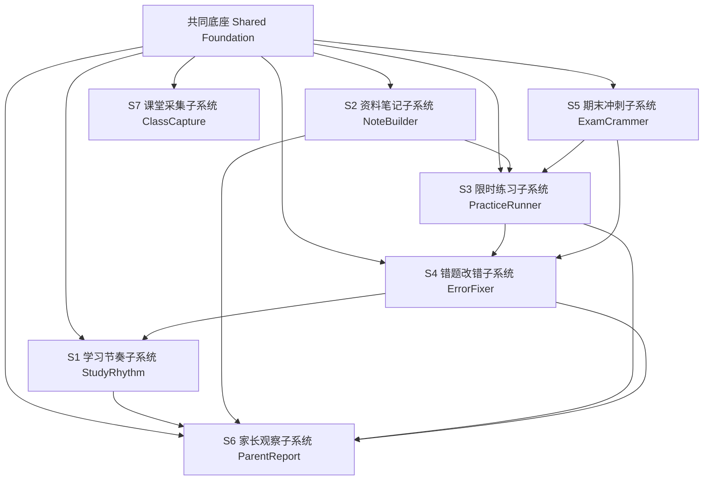
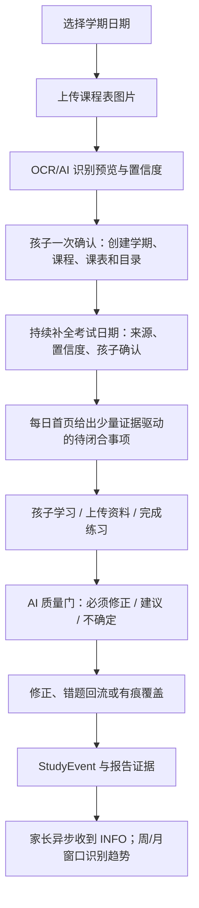
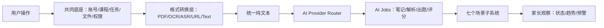
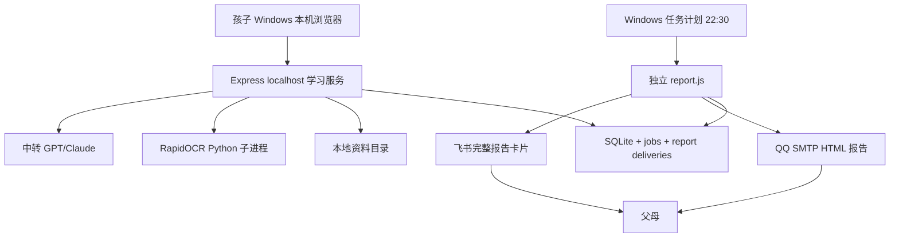

# AI StudyBuddy 总 PRD：共同底座 + 七个场景子系统

**版本**：v1.9
**日期**：2026-07-25
**状态**：Windows 单机产品基线；S1–S6 已完成主线复验并推送；开发机 Windows 原生 + Node 24 部署基线已验证，用户电脑验收未开始；S7-MVP 已完成主线复验并推送 `origin/master`；Phase 3 暂缓
**归档来源**：旧草稿已归档到 `I:\ai-studybuddy-backup\system-design-docs-draft_*.zip`

---

## 1.0 先读这里：系统为何而生、为谁而做、为什么现在这样设计

**为何而生**：大学学习常见的问题不是没有资料，而是课程、考试目标、每天的节奏、资料整理、练习、错题复盘和考前冲刺彼此脱节。AI StudyBuddy 的目标是把这些动作组织成一个学生能长期使用、能看见下一步的本机学习闭环。

**为谁而做**：主用户是使用 Windows 电脑的学生，且她是系统唯一操作者。家长不登录、不查看资料原文或答案，只接收从学生本机主动发送的脱敏日报、周报、月报或考前提醒。

**为什么采用本机、回环和分阶段设计**：学习数据和资料默认留在本机，服务只监听 `127.0.0.1`，避免公网入口、远程家长面板和固定服务器成本；每个场景子系统按独立任务、计划和验收推进，避免“先堆功能、后补边界”。

**现在到哪里**：S1–S6 的既定主线已在 `origin/master` 完成复验；开发机上的 Windows 原生 + Node 24 部署路径已经验证。两者都不等于“任何用户电脑均可安装运行”：目标用户电脑仍需实机验收。S7-MVP 已完成主线复验并推送 `origin/master`；它仅限受控 PCM WAV、本机同步 `whisper.cpp`、可编辑文本和显式 S2 文本资料 handoff，不代表完整 S7、通用静音、G2、T02 主线或用户机验收；Phase 3 仍按用户决定暂缓。

---

## 1. Executive Summary

### 1.1 Problem Statement

大学生进入大学后，学习生活从“有人盯”突然变成“几乎没人管”。学生不一定缺资源，真正缺的是：按课程持续整理资料、限时练习、错题改正、期末冲刺、以及让家长在不侵犯隐私的前提下及时知道孩子是否还在过正常学习生活。

**本次修订补充（异地家庭场景）**：孩子在校园网、手机流量和家中网络之间切换；让父母远程登录孩子电脑会引入公网入口、隧道、宽带、鉴权和隐私负担，不能成为主线。系统把完整学习数据留在孩子本机，由电脑主动向外发送经过筛选的日报、周报、月报和考前提醒。它不是替父母监督，而是给学生一套愿意天天用的学习工具，并给父母一份不过界的安心摘要。长期成本只保留按需 LLM Token 与本机电力，不引入固定服务器或隧道月费。

### 1.2 Proposed Solution

AI StudyBuddy 不再一次性做一个庞大混乱的大系统，而是拆成 **1 个共同底座 + 7 个场景子系统**。每个子系统独立服务一个学生真实场景，先单独跑通，再组合成完整学习闭环。

### 1.3 Success Criteria

MVP 成功标准不是“功能多”，而是“能真实陪一个大学生持续使用”。

| 指标       | MVP 验收标准                                                                           |
| ---------- | -------------------------------------------------------------------------------------- |
| 场景闭环   | 至少跑通：考试/课程目标 → 学习节奏 → 资料笔记 → 限时练习 → 错题改错 → 脱敏家长报告     |
| 本机可用   | 孩子在自己的 Windows 电脑通过浏览器访问 `localhost` 系统；不要求公网入口或家长远程登录 |
| 成本控制   | 月费目标 ≤ 50 元，实际预计 15–30 元（主要为电费 + LLM Token，均为按需产生）            |
| 资料处理   | PDF / 文本 / 图片三类资料能转成统一纯文本并生成结构化笔记                              |
| 存储策略   | 原始音频/视频处理完即删，仅长期保留结构化笔记（文本极小，一学期约 100MB）              |
| 时间约束   | 每个考试目标、练习、复习、备考任务都有截止时间、完成状态、工作量累计                   |
| 错题沉淀   | 客观题错误自动进入错题本，主观题可由 LLM 辅助判断并给出改错建议                        |
| 家长可见性 | 家长只看学习节奏、完成记录、趋势和预警，不看隐私原文、不看完整答案                     |
| AI 边界    | 格式转换不用 LLM；LLM 只做理解、解析、出题/变题、主观评分                              |

---

## 2. Product Split：1 个底座 + 7 个子系统

### 2.1 共同底座（Shared Foundation，不算一个用户场景）

共同底座负责所有子系统共用的能力：本机学生身份、课程/考试目标、知识模块、本地文件存储、格式转换、AI Provider 路由、持久化任务、报告发送、日志和数据安全。

截至 2026-07-21，Phase 1 的 S1/S2/S3/S4/S6 简版、T08 本机配置中心和 T09A–T09E 学生端产品化均已进入 `origin/master`；Phase 2 的 S5 模拟考、临考速背、冲刺计划和考试工作台冲刺区也已完成主线复验并推送。POST-PHASE2 全系统测试、完整 E2E、文档收口与主线复验已完成并推送 `origin/master`；不进入 Phase 3。



### 2.2 七个场景子系统

| 编号 | 子系统命名                        | 学生场景                                  | 一句话边界                                                                 | MVP 优先级     |
| ---- | --------------------------------- | ----------------------------------------- | -------------------------------------------------------------------------- | -------------- |
| S1   | **学习节奏子系统 StudyRhythm**    | 每天/每周知道该学什么、做了多少、是否逾期 | 课程、考试目标、任务、截止时间、工作量、时间线                             | MVP 必做       |
| S2   | **资料笔记子系统 NoteBuilder**    | 下课后把 PDF/图片/文本整理成可复习笔记    | 多格式资料 → 纯文本 → 结构化笔记/重点/导图 → 带来源证据的知识模块          | MVP 必做       |
| S3   | **限时练习子系统 PracticeRunner** | 看完笔记后做限时练习/作业并批改           | 围绕知识模块的练习生成、限时答题、客观题规则批改、主观题 AI 辅助、作答记录 | MVP 必做       |
| S4   | **错题改错子系统 ErrorFixer**     | 把错题变成复习计划，不再只刷题不改错      | 错题入库、错因分类、薄弱点归纳、间隔复习、原题/变题重做                    | MVP 必做       |
| S5   | **期末冲刺子系统 ExamCrammer**    | 考前上传历年真题，生成模拟卷并限时考试    | 考试范围、真题整理、教学解析步骤、变题组卷、模拟考试                       | P1             |
| S6   | **家长观察子系统 ParentReport**   | 家长接收学习摘要，但不登录、不监控细节    | 脱敏日报、周报、月报、考前提醒                                             | MVP 简版       |
| S7   | **课堂采集子系统 ClassCapture**   | 课堂录音/视频/手写笔记作为资料来源        | 音频 ASR、视频抽音轨、课堂素材留存                                         | Phase 1.5 / P2 |

---

## 3. 关键决策

### 3.1 七个子系统是否都需要自己的设计文档？

**结论：需要，但不要一开始都写厚文档。**

对个人开发者，最佳方式是：

1. **一份总 PRD**：说明大系统为什么存在、七个子系统如何组合。
2. **每个子系统一份轻量子 PRD**：只在准备开发该子系统前写，控制在 2-5 页。
3. **共同底座单独一份架构文档**：因为七个子系统都依赖它。

所以不是“一上来写 7 套完整设计文档”，而是：

```text
总 PRD
  ↓
共同底座架构
  ↓
按开发顺序补子系统 PRD：S1 → S2 → S3 → S4 → S6 → S5 → S7
```

### 3.2 一套能用的系统设计最少由几个文档构成？

个人开发最少 **5 份文档** 就够：

| 最小文档      | 用途                            | 本项目对应                                       |
| ------------- | ------------------------------- | ------------------------------------------------ |
| 1. 总 PRD     | 产品目标、用户、场景、范围      | `docs/01-总PRD-产品需求-Product-Requirements.md` |
| 2. 子系统地图 | 七个子系统边界、顺序、依赖      | `docs/02-七子系统地图-Scenario-Systems.md`       |
| 3. 架构文档   | 共同底座、数据流、组件、AI 路由 | `docs/08-共同底座架构-Architecture.md`           |
| 4. 任务清单   | 按阶段拆任务，避免乱做          | `docs/04-开发任务清单-Todo-List.md`              |
| 5. 测试验收   | 每个场景怎么证明能用            | `docs/09-测试验收计划-Test-Plan.md`              |

本项目因为强调开源组件先行和本地目录治理，额外保留：

- `docs/05-开源组件装配-Open-Source-Foundation.md`：成熟开源组件装配清单；
- `docs/06-本地目录治理-Dev-Environment.md`：当前开发机 `H:\ai-studybuddy-*` 目录治理、逻辑目录名与试炼场边界；
- `docs/subsystems/*.md`：按需补每个子系统轻量 PRD。

---

## 4. User Experience & Functionality

### 4.1 User Personas

| 用户       | 角色                            | 目标                                                       | 不希望发生的事                                         |
| ---------- | ------------------------------- | ---------------------------------------------------------- | ------------------------------------------------------ |
| 大学生     | **唯一业务操作者 / 数据拥有者** | 尽早准备、及时完成、由 AI 协助保证质量，并完成每天的小闭环 | 被复杂项目管理压垮、被家长监控隐私、被 AI 替代学习判断 |
| 家长       | **异步脱敏报告接收者**          | 通过邮件和飞书了解孩子是否保持正常学习节奏与考试节点       | 变成查岗工具、看到孩子隐私、因单日波动造成冲突         |
| 本机维护者 | **隐性运维角色**                | 完成安装、Provider/SMTP/飞书/调度配置、备份恢复和诊断      | 介入孩子的日常学习决策或查看不必要的学习原文           |

**主视角原则**：系统属于孩子。孩子是唯一的上传者、操作者和确认者，日常只在自己的 Windows 电脑上使用；AI 只能给出建议、证据和质量检查，不能替孩子编造原因或作最终学习判断。家长不登录系统；S6 只发送脱敏结构化报告，不做监控台、不做惩罚和强提醒轰炸。

**报告边界**：报告可包含课程、任务状态、学习时长、考试节点和基于证据的趋势；不得包含资料原文、笔记正文、原始答案、错题正文或聊天内容。

### 4.2 MVP 主用户流程

#### 学期开始：先确认，再一次创建

1. 孩子先在日历中选择学期起止日期，明确一个学期的边界；
2. 上传课程表图片；OCR/AI 只输出课程、上课时间与置信度预览；
3. 孩子一次确认或修正预览；
4. 系统以一次用户可理解的操作创建学期、课程、课表、长期资料目录和可清空缓存命名空间。

系统不得把未确认的 OCR 结果直接写成正式课程，也不把每门课程拆成独立数据库。同一学期课程在该学期业务库中以 `course_id` 隔离。

#### 每日首页：证据驱动的每日闭环

每日首页不是普通待办清单，也不是 AI 强制排程。它只突出少量当前应闭合的事项：明日准备、今日到期、待修正的质量问题、计划中的错题复习和最合适的下一步。每项闭合遵循：**系统建议 → 孩子确认 → 学习或作答 → AI 质量检查 → 修正/错题回流 → 完成证据**。AI 不可用时，事项进入待质检而不是阻塞孩子继续学习。



#### 考试、补考、重修与归档

考试日期不是一次性初始化数据：孩子可以从课程表、通知图片、文本或手工输入持续补全；每个日期都保留来源、识别置信度、孩子确认状态和变更历史。只有孩子确认且课程匹配的日期，才能驱动正式倒计时、学习计划和家长考前 7/3/1 天提醒。

教学结束日期不等于最终归档日期。学期经历 `ACTIVE → TEACHING_ENDED → FOLLOW_UP → ARCHIVED`：成绩、补考、迟交或申诉未结束时停留在 `FOLLOW_UP`；所有事项完成后默认只读冻结，后续更正必须留痕。补考是原课程的一次新的考试尝试，不另建课程；只有学校安排重复的固定补课时段，才增加临时补考课表。重修是在新学期创建新的课程实例，并链接原失败课程实例；系统可选择性复用历史错题、笔记和薄弱点，而不混淆两次修读记录。

### 4.3 产品闭环的共同对象边界

```text
Semester（学期）
  └─ CourseInstance（本学期的一次课程修读）
       ├─ AssessmentAttempt（正常考试 / 补考等一次考试尝试）
       ├─ Material（资料）
       └─ KnowledgeModule（从资料拆出的可考知识模块）

KnowledgeModule → StudyTask → StudyEvent（带来源、确认和质量状态）
KnowledgeModule → Question → PracticeSession / PracticeAnswer → Mistake → WeakPoint
AssessmentAttempt + Task + StudyEvent → ParentReport（只做脱敏聚合）
```

- `AssessmentAttempt` 记录考试名称、日期、目标、来源、识别置信度、孩子确认状态和变更历史；它只有在孩子确认后才驱动倒计时、计划、模拟考和考前 7/3/1 天提醒。
- `CourseInstance` 表示一次具体修读；补考新增 `AssessmentAttempt`，重修才在新学期新增并关联原课程实例。
- `KnowledgeModule` 是资料、笔记、任务、练习、错题和冲刺之间的共同语言；至少包含标题、课程、重要度、难度、考察内容、来源资料和来源证据。
- `StudyEvent` 是共同证据，而不是只记完成次数；至少能表达来源、发生时间、孩子确认、AI 置信度/质量结论和孩子确认的特例。
- `Question`、`PracticeSession`、`PracticeAnswer`、`Mistake`、`WeakPoint` 属于 S3/S4 的后续业务对象；Phase 0.8 不提前实现它们。
- 家长报告只读取脱敏的课程、考试临近状态、任务/学习事件和趋势；不读取资料正文、笔记正文、答案或错题内容。

### 4.4 Non-Goals（当前不做）

- 不做完整 LMS（不 fork Moodle / Open edX）。
- 不做学校教务系统替代品。
- 不做家长实时监控、定位、聊天审查。
- 不上云服务器、不做微信小程序、不做 Serverless：系统运行在孩子 Windows 本机，避免月费、家庭网络和远程运维复杂度。
- MVP 不依赖多模态 LLM；多模态只作为 OCR/版面失败兜底。
- MVP 不先做视频处理；视频放在 ClassCapture 后续增强。
- 不要求七个子系统同时完成；先跑通 S1/S2/S3/S4/S6 简版。

---

## 5. 子系统需求总览

### S1 学习节奏子系统 StudyRhythm

**目标**：让学生每天知道“我今天该做什么、做了多少、有没有逾期”。

- 以“学期日期 → 课程表图片 → 识别预览 → 孩子确认”的轻量流程建立课程与课表；
- 持续维护考试目标；只有确认日期驱动考前提醒和任务优先级；
- 每个任务有预计时长、截止时间、完成状态和可核对的完成证据；
- 每日首页以明日准备、今日到期、质量待修正、错题复习和下一步行动组织闭环；
- 自动累计资料整理、练习、错题复习和备考等工作量，并形成学生时间线；
- 向家长输出非侵入式进度摘要，不输出学习原文。

### S2 资料笔记子系统 NoteBuilder

**目标**：把学习资料变成可复习的结构化笔记。

- 输入：PDF、文本、Markdown、图片；
- 格式转换：PDF.js / pdf-parse / RapidOCR（PaddleOCR 作为 OCR 备选对比）；
- AI：默认中转 GPT/Claude（Pixel API 已通过 Responses API smoke test），Kimi/Qwen 保留配置位；
- 输出：Markdown 笔记、重点、高频概念、思维导图数据；
- 从资料和笔记形成带来源证据的知识模块，供 S1/S3/S4/S5 引用；
- 展示：react-markdown + KaTeX + Markmap。

### S3 限时练习子系统 PracticeRunner

**目标**：让学生在限定时间内完成练习，而不是只收藏资料。

- 根据笔记生成练习；
- 每题关联课程、知识模块和资料/笔记来源；
- 支持选择题、填空题、简答题；
- 客观题规则批改；
- 主观题 LLM 辅助评分；
- 记录用时、得分区间、完成状态；
- 保存练习场次与逐题作答，确保统计和错题来源可追溯；
- 错题自动进入 S4。

### S4 错题改错子系统 ErrorFixer

**目标**：把“做错了”变成“知道为什么错，并安排重做”。

- 错题自动入库；
- 错题记录错误次数、最近错误、掌握状态与关联知识模块；
- 错因分类：概念不清、审题错误、公式错误、步骤缺失、时间不足；
- 艾宾浩斯/间隔复习排程；
- 原题重做、同类题重做、变题重做；
- 连续掌握后降低复习优先级。

### S5 期末冲刺子系统 ExamCrammer

**目标**：围绕已确认考试，把既有学习事实组织成可执行的考前冲刺闭环。

Phase 2 已实现的 MVP 边界：

- 模拟卷归属当前学期、课程和已确认考试；T02 以现有题库与知识模块证据生成并持久化模拟卷，T03 支持限时作答、提交、客观题批改、成绩和模块分析；
- T04 从知识模块、错题和薄弱点摘要即时生成确定性只读速背卡，不新增卡片表或真实 AI 调用；
- T05 根据考试倒计时、未完成任务、练习表现、错题和薄弱点即时生成未来 7 天只读建议，不持久化 `CramPlan` 或完成状态；
- T06 在考试工作台聚合模拟考、临考速背、冲刺计划和错题回顾入口，并保持未确认考试、窗口外和跨考试切换的安全状态；
- S5 不反写 S3/S4 历史事实，当前也不写 StudyEvent、不扩展 S6 报告内容。

历年真题导入、真实 AI 教学解析/变题、主观题评分、S5 StudyEvent 与 S6 冲刺摘要均属于后续独立增强，不属于已完成 Phase 2。

### S6 家长观察子系统 ParentReport

**目标**：家长不登录孩子系统，通过邮件和飞书收到脱敏日报、周报、月报和考前提醒。

- 输入：经脱敏的 `StudyEvent`、任务状态、学习时长、已确认考试日期和孩子确认的特例；
- 日报为稳定、短小、非评价性的 INFO，即使正常日也发送；
- 周报只呈现与“早准备、及时完成、AI 保质量”目标相悖的重复 SIGNAL，必须带可核对证据、个人基线、特例和置信度；
- 月报以更长观察窗口形成 TREND，只在样本足够时给出趋势或行动建议；
- AI 只能提出异常候选及证据，不能替孩子编原因；孩子确认的合理特例保留事实但不计入负面趋势；
- 邮件发送正式 HTML 报告，飞书发送完整报告卡片；不含资料原文、笔记正文、答案或聊天内容；不做打卡监督、排名和惩罚。

### S7 课堂采集子系统 ClassCapture

**当前 MVP（已完成主线复验并推送 `origin/master`）**：学生在已获老师和相关同学允许的前提下，导入一段受控的 `16 kHz / 单声道 / 16-bit PCM WAV` 本地课堂录音；服务端调用显式配置的本机 `whisper.cpp`，返回可编辑文本；学生确认、修改后显式保存为 S2 文本资料，再按 S2 既有操作生成笔记。

- 不长期保存原始录音；临时文件仅在 `APP_DATA_ROOT/tmp/class-capture/`，成功与失败都清理；
- 不自动调用 Provider 或自动生成笔记；S2 的“生成笔记”仍是学生之后的一次明确操作；
- 明示静音、多人重叠、噪声与低音量可能不准，不宣称通用 no-speech；
- 不支持 MP3/M4A/WebM/视频、FFmpeg 转码、实时录音、说话人分离、后台 Job/Worker、云端上传或课堂监听；
- 旧外置候选与 G2 记录保留为各自事实，不能替代这条产品闭环的代码、测试、主线复验与用户机验收。

---

## 6. AI System Requirements

### 6.1 哪些地方不用 LLM

| 能力          | 工具                                    | 说明                             |
| ------------- | --------------------------------------- | -------------------------------- |
| PDF 提取文本  | PDF.js / pdf-parse                      | 格式转换，不是 AI 理解           |
| 图片/试卷 OCR | RapidOCR（首选）/ PaddleOCR（备选对比） | OCR，不让 LLM 直接看图作为主路径 |
| 音频转文本    | 显式配置的本机 whisper.cpp CLI          | 仅 S7-MVP 受控 PCM WAV；不走 Provider |
| 视频处理      | FFmpeg                                  | 后续能力，不属于 S7-MVP          |
| 网页正文      | Mozilla Readability + jsdom             | 抽正文，不做理解                 |
| 客观题批改    | 规则引擎                                | 标准答案匹配                     |
| 间隔复习      | 规则引擎                                | 日期和优先级计算                 |

### 6.2 哪些地方使用 LLM

默认走**中转渠道的 GPT/Claude**（实测倍率极低，成本优于国产直连），Provider 可替换，不写死模型版本。2026-07-09 已通过 Pixel API `gpt-5.5` + Responses API smoke test；Kimi 当前无 Key，GLM-5.2 已到期，DeepSeek 按用户偏好废弃不用。

| 场景                  | 默认（中转）     | 备选                | 兜底（官方直连）   |
| --------------------- | ---------------- | ------------------- | ------------------ |
| 笔记整理/重点/导图    | GPT/Claude 中转  | Kimi 文本模型       | Kimi/Qwen 官方 API |
| 主观题评分            | GPT/Claude 中转  | Kimi                | Kimi/Qwen 官方 API |
| 教学解析步骤/解题路径 | GPT/Claude 中转  | Kimi（思考+分解）   | Kimi/Qwen 官方 API |
| 变题/组卷             | GPT/Claude 中转  | Kimi                | Kimi/Qwen 官方 API |
| OCR/版面失败          | GPT 视觉（中转） | Kimi 视觉（多模态） | Qwen-VL 官方 API   |

### 6.3 AI 输出原则

- 用户看到的是“教学解析步骤 / 解题路径”，不是模型内部思维链；
- 所有 LLM 输入优先是纯文本；
- AI Provider 可替换，不写死模型版本；**默认走中转渠道（成本最优），官方直连随时可切换作为兜底**，因为中转渠道可能不稳或有变动；
- Kimi/Qwen 保留为后续备选配置位；当前 Phase 0.8 主路径不依赖它们；
- AI 质量结论分为“必须修正、可选建议、不确定需核对”三类：客观可核验的关键错误才阻塞该项完成；不确定或开放题不得由 AI 单方面定论；
- 孩子可以确认已核对并有痕覆盖 AI 判断，系统保留原判断、证据、覆盖原因和时间；
- Provider 全部不可用时，把质量检查记为待质检 Job，孩子可继续学习；恢复后再处理，不把技术故障写成孩子问题；
- 记录模型、token、耗时和失败原因，不记录 API Key 和学生隐私全文。

---

## 7. Technical Specifications（高层）



### 7.1 默认部署形态：孩子 Windows 本机 + 异步家长报告

产品默认运行在孩子自己的 Windows 11 电脑，不提供公网入口、不依赖家庭宽带、隧道、域名或家长远程登录。孩子从桌面快捷方式启动本地 Express 服务，在浏览器访问 `http://127.0.0.1`；家长只接收电脑主动发出的邮件和飞书报告。

| 维度     | 方案                                                                                      |
| -------- | ----------------------------------------------------------------------------------------- |
| 目标设备 | Windows 11、Ryzen 5 5625U、16GB 内存、512GB SSD 是正式支持目标；32GB 是未来新设备推荐配置 |
| 运行方式 | 学习服务按需启动；OCR、AI、报告 Worker 按 Job 运行后退出，不常驻                          |
| 数据库   | 轻量全局索引库 + 每学期一个 SQLite 业务库，均启用 WAL；单 Node 写进程                     |
| 文件     | 本地目录，逻辑 `storage_key` 入库，不保存绝对路径                                         |
| 任务     | SQLite `jobs` 表 + 单进程串行 Worker，替代 Redis/BullMQ                                   |
| 家长报告 | QQ SMTP 邮件 + 飞书自定义机器人 Webhook；电脑只主动出站联网                               |
| 报告时间 | 日报每天 22:30；周报周日 22:30；月报月末 22:30；考前 7/3/1 天均在 22:30                   |
| 补发     | 电脑关机或休眠错过时间后，下次 Windows 登录尽快补发；按周期和渠道去重                     |
| 成本     | LLM Token 为主要可变成本；邮件、飞书和本机存储不引入长期服务月费                          |



### 7.2 存储策略（本次修订新增）

- 原始音频/视频处理完成后立即删除；原始 PDF/图片可留（体积小）；
- 长期只保留结构化笔记、习题、试题、思维导图数据——全是文本，一学期约 100MB；
- `TMP_ROOT` 可随时清空，清空后系统仍能正常运行；
- 生命周期：上传 → 格式转换 → AI 整理 → 学生确认可用 → 删除原始音视频。

### 7.2.1 学期数据隔离与归档

- 全局轻量索引库只保存设置、学生档案、报告目标、学期目录、数据库版本、备份恢复记录和少量跨学期摘要；
- 每学期一个业务 SQLite，保存该学期课程实例、课表、考试尝试、任务、资料索引、笔记、练习/错题后续记录、事件与报告证据；大文件只以 `storage_key` 指向文件系统；
- 当前学期和仍在补考/迟交处理中的 `FOLLOW_UP` 学期可同时被每日首页读取；单个学期库损坏不能影响其他学期；
- 学期最终归档后默认只读，受控更正、完整性检查和恢复都必须留痕。

### 7.3 目录治理

- 主系统源码与文档：仓库根目录；
- 组件试炼场（当前开发机）：`H:\ai-studybuddy-composer\windows-native`；
- 生产数据：由 `APP_DATA_ROOT` 指向 Windows 用户目录，例如 `%LOCALAPPDATA%\AIStudyBuddy`；
- 资料、导出、日志和临时文件均位于 `APP_DATA_ROOT` 下；
- 真实数据不进 git，组件测试资料不使用真实学习内容。

### 7.4 主仓库与验证资产边界

`H:\ai-studybuddy` 只保存正式产品设计和正式实现；`H:\ai-studybuddy-composer\windows-native` 只保存 Phase 0.7 的最小样例、非隐私素材、能力卡与本机测试日志。它们是当前开发机目录，不是普通使用机器的安装前置。验证目录不进入主仓库 workspace，主系统也不得直接 import、复制或运行其中的测试脚本。任何组件进入产品，都必须先以 `04` 任务、`08` Adapter 边界和 `09` 验收证据为准，在 Phase 0.8 重新实现。

## 8. Roadmap

| 阶段      | 目标                                                                                          | 子系统                      |
| --------- | --------------------------------------------------------------------------------------------- | --------------------------- |
| Phase 0   | 文档重建、草稿归档、七子系统命名                                                              | 全局                        |
| Phase 0.5 | 成熟开源组件在当前开发机外部 `H:\ai-studybuddy-composer` 独立调通（MVP 主路径已完成；后续备选项不阻塞） | 共同底座                    |
| Phase 0.7 | Windows 原生轻量底座与异步家长报告验证                                                        | 共同底座 / S6 报告能力      |
| Phase 0.8 | 第一个可运行里程碑：S1 基础 + S2 核心端到端                                                   | S1 + S2                     |
| Phase 1   | 跑通最小学习闭环                                                                              | S1 + S2 + S3 + S4 + S6 简版 |
| Phase 1.5 | 加课堂录音 ASR                                                                                | S7                          |
| Phase 2   | 期末冲刺 MVP：模拟考、速背、冲刺计划与工作台（已完成）                                     | S5                          |
| Phase 3   | 安全、性能与后续产品形态候选（暂缓）                                                        | S6 + 全局                   |

当前完成口径：Phase 1 的功能核心和 T09A–T09E 学生端产品化均已完成；Phase 2-T01–T06 已完成 S5 MVP。Phase 1.5/S7 仍待独立门禁；Phase 3 按用户要求暂缓，且当前产品边界继续保持“家长不登录、无公网入口、无家长 Web 面板”。

---

## 9. Risks

| 风险                        | 应对                                                                                                                                 |
| --------------------------- | ------------------------------------------------------------------------------------------------------------------------------------ |
| 七个子系统仍然太大          | 每次只开发一个子系统；未开发子系统只保留接口位                                                                                       |
| AI 成本失控                 | 默认走中转 GPT/Claude（倍率极低）；Kimi 备选；国产官方直连兜底；缓存 AI 结果                                                         |
| OCR/ASR 运维复杂            | 先在当前开发机外部 `H:\ai-studybuddy-composer` 调通；正式产品按 PDF 文本提取 → OCR → 视觉模型 → 手工校正分级降级，未通过 smoke test 不进主系统 |
| AI 结论误伤或 Provider 故障 | 分级质量门、孩子有痕覆盖、待质检 Job 与 Provider fallback；不把不确定性写成负面评价                                                  |
| 家长端变监控工具            | 强制只显示节奏、数量、趋势，不显示隐私原文；异常必须基于证据、个人基线和孩子确认的特例                                               |
| 文档再次膨胀                | 采用“总 PRD + 轻量子 PRD + 最小 5 文档”制度                                                                                          |
