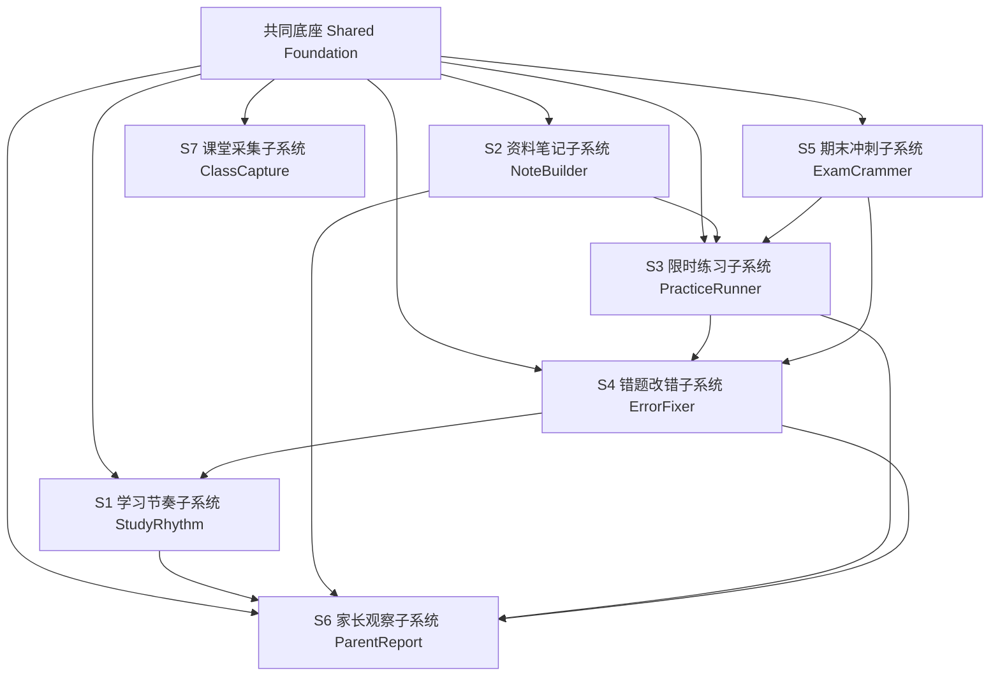
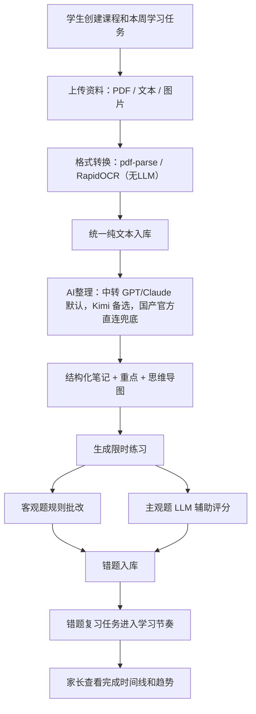
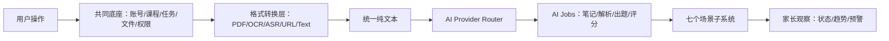
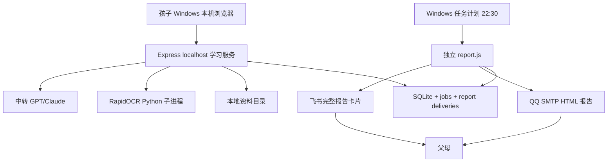

# AI StudyBuddy 总 PRD：共同底座 + 七个场景子系统

**版本**：v1.3
**日期**：2026-07-10（Windows 本机产品形态收紧）
**状态**：新系统设计第一版 PRD
**归档来源**：旧草稿已归档到 `I:\ai-studybuddy-backup\system-design-docs-draft_*.zip`

---

## 1. Executive Summary

### 1.1 Problem Statement

大学生进入大学后，学习生活从“有人盯”突然变成“几乎没人管”。学生不一定缺资源，真正缺的是：按课程持续整理资料、限时练习、错题改正、期末冲刺、以及让家长在不侵犯隐私的前提下及时知道孩子是否还在过正常学习生活。

**本次修订补充（异地家庭场景）**：孩子在校园网、手机流量和家中网络之间切换；让父母远程登录孩子电脑会引入公网入口、隧道、宽带、鉴权和隐私负担，不能成为主线。系统把完整学习数据留在孩子本机，由电脑主动向外发送经过筛选的日报、周报、月报和考前提醒。它不是替父母监督，而是给学生一套愿意天天用的学习工具，并给父母一份不过界的安心摘要。长期成本只保留按需 LLM Token 与本机电力，不引入固定服务器或隧道月费。

### 1.2 Proposed Solution

AI StudyBuddy 不再一次性做一个庞大混乱的大系统，而是拆成 **1 个共同底座 + 7 个场景子系统**。每个子系统独立服务一个学生真实场景，先单独跑通，再组合成完整学习闭环。

### 1.3 Success Criteria

MVP 成功标准不是“功能多”，而是“能真实陪一个大学生持续使用”。

| 指标 | MVP 验收标准 |
|---|---|
| 场景闭环 | 至少跑通：学习节奏 → 资料笔记 → 限时练习 → 错题改错 → 家长观察 |
| 本机可用 | 孩子在自己的 Windows 电脑通过浏览器访问 `localhost` 系统；不要求公网入口或家长远程登录 |
| 成本控制 | 月费目标 ≤ 50 元，实际预计 15–30 元（主要为电费 + LLM Token，均为按需产生） |
| 资料处理 | PDF / 文本 / 图片三类资料能转成统一纯文本并生成结构化笔记 |
| 存储策略 | 原始音频/视频处理完即删，仅长期保留结构化笔记（文本极小，一学期约 100MB） |
| 时间约束 | 每个练习、复习、备考任务都有截止时间、完成状态、工作量累计 |
| 错题沉淀 | 客观题错误自动进入错题本，主观题可由 LLM 辅助判断并给出改错建议 |
| 家长可见性 | 家长只看学习节奏、完成记录、趋势和预警，不看隐私原文、不看完整答案 |
| AI 边界 | 格式转换不用 LLM；LLM 只做理解、解析、出题/变题、主观评分 |

---

## 2. Product Split：1 个底座 + 7 个子系统

### 2.1 共同底座（Shared Foundation，不算一个用户场景）

共同底座负责所有子系统共用的能力：本机学生身份、课程/课次、本地文件存储、格式转换、AI Provider 路由、持久化任务、报告发送、日志和数据安全。



### 2.2 七个场景子系统

| 编号 | 子系统命名 | 学生场景 | 一句话边界 | MVP 优先级 |
|---|---|---|---|---|
| S1 | **学习节奏子系统 StudyRhythm** | 每天/每周知道该学什么、做了多少、是否逾期 | 课程、课次、任务、截止时间、工作量、时间线 | MVP 必做 |
| S2 | **资料笔记子系统 NoteBuilder** | 下课后把 PDF/图片/文本整理成可复习笔记 | 多格式资料 → 纯文本 → 结构化笔记/重点/导图 | MVP 必做 |
| S3 | **限时练习子系统 PracticeRunner** | 看完笔记后做限时练习/作业并批改 | 练习生成、限时答题、客观题规则批改、主观题 AI 辅助 | MVP 必做 |
| S4 | **错题改错子系统 ErrorFixer** | 把错题变成复习计划，不再只刷题不改错 | 错题入库、错因分类、间隔复习、原题/变题重做 | MVP 必做 |
| S5 | **期末冲刺子系统 ExamCrammer** | 考前上传历年真题，生成模拟卷并限时考试 | 真题整理、教学解析步骤、变题组卷、模拟考试 | P1 |
| S6 | **家长观察子系统 ParentReport** | 家长接收学习摘要，但不登录、不监控细节 | 脱敏日报、周报、月报、考前提醒 | MVP 简版 |
| S7 | **课堂采集子系统 ClassCapture** | 课堂录音/视频/手写笔记作为资料来源 | 音频 ASR、视频抽音轨、课堂素材留存 | Phase 1.5 / P2 |

---

## 3. 关键决策

### 3.1 七个子系统是否都需要自己的设计文档？

**结论：需要，但不要一开始都写厚文档。**

对个人开发者，最佳方式是：

1. **一份总 PRD**：说明大系统为什么存在、七个子系统如何组合。
2. **每个子系统一份轻量子 PRD**：只在准备开发该子系统前写，控制在 2-5 页。
3. **共同底座单独一份架构文档**：因为七个子系统都依赖它。

所以不是“一上来写 7 套完整设计文档”，而是：

```text
总 PRD
  ↓
共同底座架构
  ↓
按开发顺序补子系统 PRD：S1 → S2 → S3 → S4 → S6 → S5 → S7
```

### 3.2 一套能用的系统设计最少由几个文档构成？

个人开发最少 **5 份文档** 就够：

| 最小文档 | 用途 | 本项目对应 |
|---|---|---|
| 1. 总 PRD | 产品目标、用户、场景、范围 | `docs/01-总PRD-产品需求-Product-Requirements.md` |
| 2. 子系统地图 | 七个子系统边界、顺序、依赖 | `docs/02-七子系统地图-Scenario-Systems.md` |
| 3. 架构文档 | 共同底座、数据流、组件、AI 路由 | `docs/08-共同底座架构-Architecture.md` |
| 4. 任务清单 | 按阶段拆任务，避免乱做 | `docs/04-开发任务清单-Todo-List.md` |
| 5. 测试验收 | 每个场景怎么证明能用 | `docs/09-测试验收计划-Test-Plan.md` |

本项目因为强调开源组件先行和本地目录治理，额外保留：

- `docs/05-开源组件装配-Open-Source-Foundation.md`：成熟开源组件装配清单；
- `docs/06-本地目录治理-Dev-Environment.md`：`I:\ai-studybuddy-*` 七目录与试炼场边界；
- `docs/subsystems/*.md`：按需补每个子系统轻量 PRD。

---

## 4. User Experience & Functionality

### 4.1 User Personas

| 用户 | 角色 | 目标 | 不希望发生的事 |
|---|---|---|---|
| 大学生 | **主用户 / 唯一操作者 / 拥有者** | 轻量记录课程资料、完成练习、修正错题、期末能冲刺；这套系统是她自己的工具 | 被系统压垮、被家长监控隐私、操作太重 |
| 家长 | **报告接收者（第二用户）** | 通过邮件和飞书收到学习节奏、趋势和考前提醒 | 变成查岗工具、看到孩子隐私、因为分数制造冲突 |
| 个人开发者/维护者 | 建设者 | 用成熟开源组件快速组装可用系统 | 一开始做成巨型工程，维护不了 |

**主视角原则**：系统属于学生。她是唯一的上传者、操作者、使用者，日常只在自己的 Windows 电脑上使用。家长不登录系统；S6 只发送脱敏结构化报告，不做监控台、不做惩罚和强提醒轰炸。报告只含课程名、任务标题、完成/逾期、时长、趋势和考前提醒，不含资料原文、笔记正文、答案或聊天内容。

### 4.2 MVP 主用户流程



### 4.3 Non-Goals（当前不做）

- 不做完整 LMS（不 fork Moodle / Open edX）。
- 不做学校教务系统替代品。
- 不做家长实时监控、定位、聊天审查。
- 不上云服务器、不做微信小程序、不做 Serverless：系统运行在孩子 Windows 本机，避免月费、家庭网络和远程运维复杂度。
- MVP 不依赖多模态 LLM；多模态只作为 OCR/版面失败兜底。
- MVP 不先做视频处理；视频放在 ClassCapture 后续增强。
- 不要求七个子系统同时完成；先跑通 S1/S2/S3/S4/S6 简版。

---

## 5. 子系统需求总览

### S1 学习节奏子系统 StudyRhythm

**目标**：让学生每天知道“我今天该做什么、做了多少、有没有逾期”。

- 创建课程、课次、学习任务；
- 每个任务有预计时长、截止时间、完成状态；
- 自动累计工作量：资料整理次数、练习次数、错题复习次数、备考任务；
- 形成学生时间线；
- 向家长输出非侵入式进度摘要。

### S2 资料笔记子系统 NoteBuilder

**目标**：把学习资料变成可复习的结构化笔记。

- 输入：PDF、文本、Markdown、图片；
- 格式转换：PDF.js / pdf-parse / RapidOCR（PaddleOCR 作为 OCR 备选对比）；
- AI：默认中转 GPT/Claude（Pixel API 已通过 Responses API smoke test），Kimi/Qwen 保留配置位；
- 输出：Markdown 笔记、重点、高频概念、思维导图数据；
- 展示：react-markdown + KaTeX + Markmap。

### S3 限时练习子系统 PracticeRunner

**目标**：让学生在限定时间内完成练习，而不是只收藏资料。

- 根据笔记生成练习；
- 支持选择题、填空题、简答题；
- 客观题规则批改；
- 主观题 LLM 辅助评分；
- 记录用时、得分区间、完成状态；
- 错题自动进入 S4。

### S4 错题改错子系统 ErrorFixer

**目标**：把“做错了”变成“知道为什么错，并安排重做”。

- 错题自动入库；
- 错因分类：概念不清、审题错误、公式错误、步骤缺失、时间不足；
- 艾宾浩斯/间隔复习排程；
- 原题重做、同类题重做、变题重做；
- 连续掌握后降低复习优先级。

### S5 期末冲刺子系统 ExamCrammer

**目标**：考前用历年真题组织冲刺训练。

- 上传历年真题 PDF/图片/文本；
- 题目结构化；
- 生成“教学解析步骤 / 解题路径”；
- 根据真题变题组卷；
- 限时模拟考试；
- 模拟错题进入 S4。

### S6 家长观察子系统 ParentReport

**目标**：家长不登录孩子系统，通过邮件和飞书收到脱敏日报、周报、月报和考前提醒。

- 输入：`StudyEvent`、任务状态、学习时长和考试日期；
- 输出：22:30 的结构化日报、周报、月报与考前 7/3/1 天提醒；
- 邮件发送正式 HTML 报告，飞书发送完整报告卡片；
- 只含课程名、任务标题、完成/逾期、时长和趋势；
- 不含资料原文、笔记正文、答案或聊天内容；不做打卡监督、排名和惩罚。

### S7 课堂采集子系统 ClassCapture

**目标**：把课堂现场变成 NoteBuilder 的资料来源。

- 课堂录音；
- 音频 ASR：SenseVoice / FunASR（本地 CPU 运行，免费；转写慢时走异步队列，不阻塞）；
- 视频抽音轨：FFmpeg → ASR；
- 手写笔记拍照：RapidOCR（PaddleOCR 备选对比）；
- 课堂资料自动进入 S2；
- **原始音视频处理完成后即删除，仅保留结构化笔记**（存储极小，隐私也更干净）。

---

## 6. AI System Requirements

### 6.1 哪些地方不用 LLM

| 能力 | 工具 | 说明 |
|---|---|---|
| PDF 提取文本 | PDF.js / pdf-parse | 格式转换，不是 AI 理解 |
| 图片/试卷 OCR | RapidOCR（首选）/ PaddleOCR（备选对比） | OCR，不让 LLM 直接看图作为主路径 |
| 音频转文本 | SenseVoice / FunASR | ASR，Phase 1.5 |
| 视频处理 | FFmpeg | 抽音轨后走 ASR |
| 网页正文 | Mozilla Readability + jsdom | 抽正文，不做理解 |
| 客观题批改 | 规则引擎 | 标准答案匹配 |
| 间隔复习 | 规则引擎 | 日期和优先级计算 |

### 6.2 哪些地方使用 LLM

默认走**中转渠道的 GPT/Claude**（实测倍率极低，成本优于国产直连），Provider 可替换，不写死模型版本。2026-07-09 已通过 Pixel API `gpt-5.5` + Responses API smoke test；Kimi 当前无 Key，GLM-5.2 已到期，DeepSeek 按用户偏好废弃不用。

| 场景 | 默认（中转） | 备选 | 兜底（官方直连） |
|---|---|---|---|
| 笔记整理/重点/导图 | GPT/Claude 中转 | Kimi 文本模型 | Kimi/Qwen 官方 API |
| 主观题评分 | GPT/Claude 中转 | Kimi | Kimi/Qwen 官方 API |
| 教学解析步骤/解题路径 | GPT/Claude 中转 | Kimi（思考+分解） | Kimi/Qwen 官方 API |
| 变题/组卷 | GPT/Claude 中转 | Kimi | Kimi/Qwen 官方 API |
| OCR/版面失败 | GPT 视觉（中转） | Kimi 视觉（多模态） | Qwen-VL 官方 API |

### 6.3 AI 输出原则

- 用户看到的是“教学解析步骤 / 解题路径”，不是模型内部思维链；
- 所有 LLM 输入优先是纯文本；
- AI Provider 可替换，不写死模型版本；**默认走中转渠道（成本最优），官方直连随时可切换作为兜底**，因为中转渠道可能不稳或有变动；
- Kimi/Qwen 保留为后续备选配置位；当前 Phase 0.8 主路径不依赖它们；
- 记录模型、token、耗时和失败原因，不记录 API Key 和学生隐私全文。

---

## 7. Technical Specifications（高层）



### 7.1 默认部署形态：孩子 Windows 本机 + 异步家长报告

产品默认运行在孩子自己的 Windows 11 电脑，不提供公网入口、不依赖家庭宽带、隧道、域名或家长远程登录。孩子从桌面快捷方式启动本地 Express 服务，在浏览器访问 `http://127.0.0.1`；家长只接收电脑主动发出的邮件和飞书报告。

| 维度 | 方案 |
|---|---|
| 目标设备 | Windows 11、Ryzen 5 5625U、16GB 内存、512GB SSD 是正式支持目标；32GB 是未来新设备推荐配置 |
| 运行方式 | 学习服务按需启动；OCR、AI、报告 Worker 按 Job 运行后退出，不常驻 |
| 数据库 | SQLite 单文件，启用 WAL；单 Node 写进程 |
| 文件 | 本地目录，逻辑 `storage_key` 入库，不保存绝对路径 |
| 任务 | SQLite `jobs` 表 + 单进程串行 Worker，替代 Redis/BullMQ |
| 家长报告 | QQ SMTP 邮件 + 飞书自定义机器人 Webhook；电脑只主动出站联网 |
| 报告时间 | 日报每天 22:30；周报周日 22:30；月报月末 22:30；考前 7/3/1 天均在 22:30 |
| 补发 | 电脑关机或休眠错过时间后，下次 Windows 登录尽快补发；按周期和渠道去重 |
| 成本 | LLM Token 为主要可变成本；邮件、飞书和本机存储不引入长期服务月费 |



### 7.2 存储策略（本次修订新增）

- 原始音频/视频处理完成后立即删除；原始 PDF/图片可留（体积小）；
- 长期只保留结构化笔记、习题、试题、思维导图数据——全是文本，一学期约 100MB；
- `TMP_ROOT` 可随时清空，清空后系统仍能正常运行；
- 生命周期：上传 → 格式转换 → AI 整理 → 学生确认可用 → 删除原始音视频。

### 7.3 目录治理

- 主系统源码与文档：仓库根目录；
- 组件试炼场：`I:\ai-studybuddy-composer\windows-native`；
- 生产数据：由 `APP_DATA_ROOT` 指向 Windows 用户目录，例如 `%LOCALAPPDATA%\AIStudyBuddy`；
- 资料、导出、日志和临时文件均位于 `APP_DATA_ROOT` 下；
- 真实数据不进 git，组件测试资料不使用真实学习内容。

### 7.4 主仓库与验证资产边界

`I:\ai-studybuddy` 只保存正式产品设计和正式实现；`I:\ai-studybuddy-composer\windows-native` 只保存 Phase 0.7 的最小样例、非隐私素材、能力卡与本机测试日志。验证目录不进入主仓库 workspace，主系统也不得直接 import、复制或运行其中的测试脚本。任何组件进入产品，都必须先以 `04` 任务、`08` Adapter 边界和 `09` 验收证据为准，在 Phase 0.8 重新实现。

## 8. Roadmap

| 阶段 | 目标 | 子系统 |
|---|---|---|
| Phase 0 | 文档重建、草稿归档、七子系统命名 | 全局 |
| Phase 0.5 | 成熟开源组件在外部 `I:\ai-studybuddy-composer` 独立调通（MVP 主路径已完成；后续备选项不阻塞） | 共同底座 |
| Phase 0.7 | Windows 原生轻量底座与异步家长报告验证 | 共同底座 / S6 报告能力 |
| Phase 0.8 | 第一个可运行里程碑：S1 基础 + S2 核心端到端 | S1 + S2 |
| Phase 1 | 跑通最小学习闭环 | S1 + S2 + S3 + S4 + S6 简版 |
| Phase 1.5 | 加课堂录音 ASR | S7 |
| Phase 2 | 加期末真题冲刺 | S5 |
| Phase 3 | 打磨家长端、预警、数据留存、安全 | S6 + 全局 |

---

## 9. Risks

| 风险 | 应对 |
|---|---|
| 七个子系统仍然太大 | 每次只开发一个子系统；未开发子系统只保留接口位 |
| AI 成本失控 | 默认走中转 GPT/Claude（倍率极低）；Kimi 备选；国产官方直连兜底；缓存 AI 结果 |
| OCR/ASR 运维复杂 | 先在外部 `I:\ai-studybuddy-composer` 调通；未通过 smoke test 不进主系统 |
| 家长端变监控工具 | 强制只显示节奏、数量、趋势，不显示隐私原文 |
| 文档再次膨胀 | 采用“总 PRD + 轻量子 PRD + 最小 5 文档”制度 |
