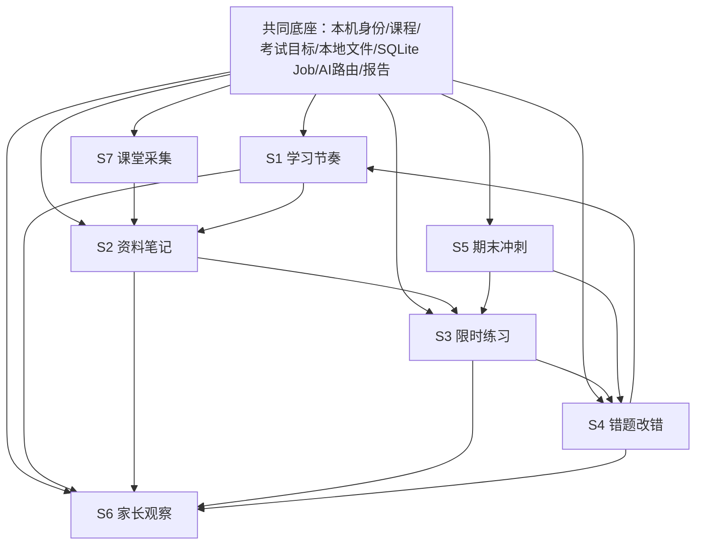

# AI StudyBuddy 七个场景子系统地图

**版本**：v1.9
**日期**：2026-07-25
**用途**：这是七个子系统拆分的单一事实来源。开发时先看本文件，确认当前做的是哪一个场景，不要把所有功能混成一锅。

---

## 1. 拆分原则

AI StudyBuddy 的开发方式：

```text
一个共同底座
  + 七个场景子系统
  + 每次只完成一个子系统的最小闭环
  + 最后组合成一个大系统
```

判断一个功能属于哪个子系统，只问一句：

> 学生是在什么场景下使用它？

**主视角**：系统属于学生，她是唯一操作者。S1–S5、S7 都是她的工具；S6 是给家长的**异步报告通道**，保持简版，不升级为核心、不做监控。判断功能归属时，凡是“家长登录或操作系统”的需求都要警惕——家长只接收报告，不操作。

---

## 2. 七个子系统总表

| 编号 | 子系统                  | 场景              | 学生动作                               | 系统输出                                 | 主要开源组件                                                          | AI 使用点                                                           |
| ---- | ----------------------- | ----------------- | -------------------------------------- | ---------------------------------------- | --------------------------------------------------------------------- | ------------------------------------------------------------------- |
| S1   | 学习节奏 StudyRhythm    | 每日/每周学习安排 | 建课程、考试目标、课次、任务、截止时间 | 时间线、工作量、逾期提醒、考期任务优先级 | SQLite、持久化 Job Worker                                             | 一般不用；后续可生成复习建议                                        |
| S2   | 资料笔记 NoteBuilder    | 课后整理资料      | 上传 PDF/文本/图片                     | 笔记、重点、导图、带来源证据的知识模块   | pdf-parse、RapidOCR（PaddleOCR 备选）、react-markdown、KaTeX、Markmap | 默认中转 GPT/Claude（Pixel API/Responses 已测），Kimi/Qwen 后续备选 |
| S3   | 限时练习 PracticeRunner | 学完后练习        | 围绕知识模块做限时题、提交答案         | 批改结果、解析、逐题作答与练习记录       | 规则引擎、SQLite                                                      | 主观题评分、题目生成                                                |
| S4   | 错题改错 ErrorFixer     | 复盘错题          | 查看错因、重做                         | 错题本、薄弱点、复习排程、变题           | 规则引擎、SQLite Job Worker                                           | 错因分类、改错建议、变题                                            |
| S5   | 期末冲刺 ExamCrammer    | 考前冲刺          | 按考试范围上传真题、限时模拟           | 真题解析、模拟卷、冲刺计划、模考结果     | PDF/OCR、计时器、题库                                                 | 教学解析、变题组卷、难题走中转/官方兜底                             |
| S6   | 家长观察 ParentReport   | 家长接收节奏报告  | 阅读邮件/飞书报告                      | 日报、周报、月报、考前提醒               | QQ SMTP、飞书 Webhook                                                 | 可选润色总结，失败不阻塞发送                                        |
| S7   | 课堂采集 ClassCapture   | 上课后本机整理    | 已获允许的受控 PCM WAV                 | 可编辑转写文本、S2 文本资料              | 显式配置的本机 whisper.cpp；S2 资料页                              | 不走云端；质量受静音/重叠/噪声/低音量影响                           |

---

### S6 输出边界（当前主线）

S6 读取 `StudyEvent`、任务状态和考试日期的脱敏统计，输出邮件 HTML 报告和飞书卡片。S6 不提供家长登录 API、远程网页面板、资料原文、笔记正文、答案或聊天记录；它也不要求孩子电脑提供公网入口。

### 当前实现与下一门禁

- S1、S2、S3、S4、S5、S6 简版均已实现；S5 的 Phase 2-T01–T06 已完成主线复验并推送。
- S7-MVP 已合入本机 `master` 并完成主线复验，待推送 `origin/master`：限定为受控 PCM WAV → 同步本机 `whisper.cpp` → 可编辑文本 → 显式保存为 S2 文本资料。旧 T02/T04 候选能力 `PARTIAL`、T03 Composer smoke `PASS` 只保留为外部历史事实，不构成完整 S7、通用静音、G2、T02 主线、用户机安装或课堂产品闭环完成。
- T08 已完成跨子系统的本机配置中心，但它属于共同底座，不新增第八个场景子系统。
- T09A–T09E 与 Phase 2 S5 均已完成、通过主线复验并推送 `origin/master`，但不改变 S1–S7 的业务所有权。POST-PHASE2 全系统验证、完整 E2E、文档对齐与主线复验已完成并推送 `origin/master`；Phase 3 暂缓，S7 继续等待独立门禁。

---

## 3. 跨子系统共同业务对象

| 对象                                              | 归属与创建时机                               | 被哪些子系统使用                   | 不承担什么                             |
| ------------------------------------------------- | -------------------------------------------- | ---------------------------------- | -------------------------------------- |
| `Course`                                          | S1 创建；Phase 0.8 最小对象                  | S1–S6                              | 不把一次考试或一份资料混成课程         |
| `Exam`                                            | S1 管理；Phase 0.8 建最小对象                | S1 计划、S5 模考、S6 考前提醒      | 不是家长面板或外部日历同步             |
| `Material`                                        | S2 创建；Phase 0.8 最小对象                  | S2、S3、S5                         | 业务表不保存绝对路径或完整隐私内容副本 |
| `KnowledgeModule`                                 | S2 从资料/笔记形成；Phase 0.8 先建立最小对象 | S1 任务、S3 练习、S4 错题、S5 冲刺 | 不等同于任意 AI 长文本笔记             |
| `StudyTask` / `StudyEvent`                        | S1 创建并记录                                | S1–S6                              | 不保存资料原文、完整答案或聊天正文     |
| `Question` / `PracticeSession` / `PracticeAnswer` | S3 开工后创建                                | S3、S4、S5、S6 聚合                | Phase 0.8 不提前落表                   |
| `Mistake` / `WeakPoint`                           | S4 开工后创建                                | S1、S4、S5、S6 聚合                | 不把单次错误直接当成永久薄弱点         |

对象流固定为：`Course → Exam / Material → KnowledgeModule → StudyTask → StudyEvent`；练习侧为 `KnowledgeModule → Question → PracticeSession / PracticeAnswer → Mistake → WeakPoint → 下一轮 StudyTask`。S6 只读取这些对象的脱敏聚合结果。

---

## 4. 子系统依赖关系



---

## 5. 开发顺序

### 4.1 个人开发推荐顺序

| 顺序 | 做什么                 | 原因                                           |
| ---- | ---------------------- | ---------------------------------------------- |
| 0    | 共同底座               | 没有账号/课程/文件/任务，七个系统都无法落地    |
| 1    | S1 学习节奏 + 考试目标 | 所有学习动作都要落到时间线、工作量和考试日期   |
| 2    | S2 资料笔记 + 知识模块 | 上传资料后形成可复习、可计划、可练习的共同对象 |
| 3    | S3 限时练习            | 从“看资料”进入“做题”                           |
| 4    | S4 错题改错            | 形成学习闭环                                   |
| 5    | S6 家长报告简版        | 家长收到“有没有在做”的异步报告                 |
| 6    | S5 期末冲刺            | 更复杂，等题库和错题稳定后做                   |
| 7    | S7 课堂采集            | ASR/视频运维重，后做                           |

### 4.2 MVP 只做哪些

MVP 不是七个都做完。MVP 做：

```text
S1 学习节奏
  + S2 资料笔记
  + S3 限时练习
  + S4 错题改错
  + S6 家长观察简版
```

S5、S7 先留接口，不进入第一轮开发主线。

---

## 6. 每个子系统的轻量设计文档模板

每个子系统真正开工前，只需要一份 2-5 页轻量 PRD：

```text
1. 子系统一句话目标
2. 使用场景
3. 用户动作流程
4. 输入/输出
5. 需要的开源组件
6. 真正需要 AI 的地方
7. 数据对象
8. 页面/API
9. 验收标准
10. 不做什么
```

---

## 7. 子系统命名约定

| 编号 | 中文名         | 英文代号       | 代码包建议                 |
| ---- | -------------- | -------------- | -------------------------- |
| S1   | 学习节奏子系统 | StudyRhythm    | `packages/study-rhythm`    |
| S2   | 资料笔记子系统 | NoteBuilder    | `packages/note-builder`    |
| S3   | 限时练习子系统 | PracticeRunner | `packages/practice-runner` |
| S4   | 错题改错子系统 | ErrorFixer     | `packages/error-fixer`     |
| S5   | 期末冲刺子系统 | ExamCrammer    | `packages/exam-crammer`    |
| S6   | 家长观察子系统 | ParentReport   | `packages/parent-report`   |
| S7   | 课堂采集子系统 | ClassCapture   | `packages/class-capture`   |

---

## 8. 防止再次变乱的规则

- 新功能必须先归到 S1-S7 之一；归不进去就暂不做。
- 每个 PR 只允许主攻一个子系统。
- 共同底座只放跨子系统能力，不放具体业务页面。
- Exam 与 KnowledgeModule 是跨子系统共同对象；新增字段前先确认是否应由它们承载，禁止复制出多个互不一致的
- 子系统未写轻量 PRD，不进入开发。
- 任何实现任务必须先在 `docs/04` 登记，再创建 `.plans/` 独立计划并取得用户批准；完成后回填 `docs/04` 证据。
- 开源组件未在当前开发机 `H:\ai-studybuddy-composer` smoke test 通过，不进入主系统。
