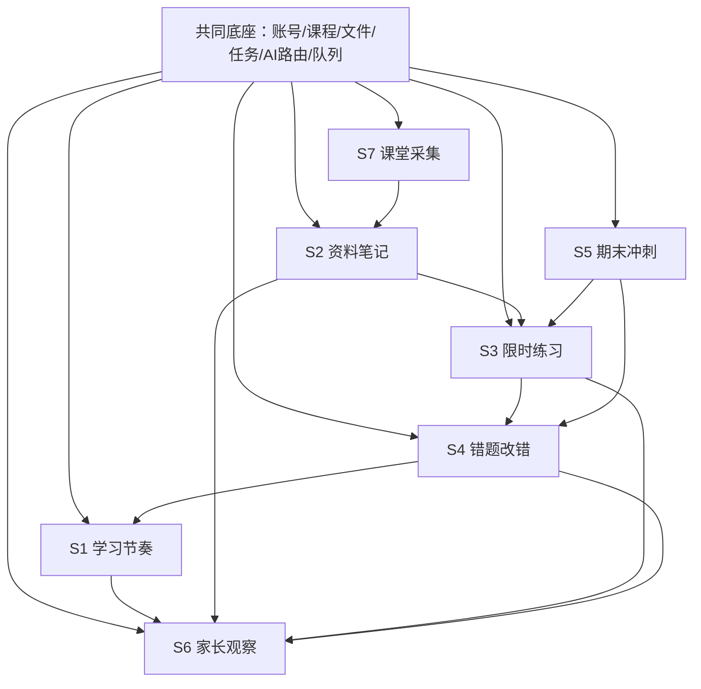

# AI StudyBuddy 七个场景子系统地图

**版本**：v1.2
**日期**：2026-07-09（Phase 0.5 完成交割后同步）
**用途**：这是七个子系统拆分的单一事实来源。开发时先看本文件，确认当前做的是哪一个场景，不要把所有功能混成一锅。

---

## 1. 拆分原则

AI StudyBuddy 的开发方式：

```text
一个共同底座
  + 七个场景子系统
  + 每次只完成一个子系统的最小闭环
  + 最后组合成一个大系统
```

判断一个功能属于哪个子系统，只问一句：

> 学生是在什么场景下使用它？

**主视角**：系统属于学生，她是唯一操作者。S1–S5、S7 都是她的工具；S6 是给家长的**只读旁观窗**，保持简版，不升级为核心、不做监控。判断功能归属时，凡是“家长操作”的需求都要警惕——家长只读，不操作。

---

## 2. 七个子系统总表

| 编号 | 子系统 | 场景 | 学生动作 | 系统输出 | 主要开源组件 | AI 使用点 |
|---|---|---|---|---|---|---|
| S1 | 学习节奏 StudyRhythm | 每日/每周学习安排 | 建课程、课次、任务、截止时间 | 时间线、工作量、逾期提醒 | BullMQ、PostgreSQL、Redis | 一般不用；后续可生成复习建议 |
| S2 | 资料笔记 NoteBuilder | 课后整理资料 | 上传 PDF/文本/图片 | 笔记、重点、导图 | pdf-parse、RapidOCR（PaddleOCR 备选）、react-markdown、KaTeX、Markmap | 默认中转 GPT/Claude（Pixel API/Responses 已测），Kimi/Qwen 后续备选 |
| S3 | 限时练习 PracticeRunner | 学完后练习 | 做限时题、提交答案 | 批改结果、解析、完成记录 | 规则引擎、PostgreSQL | 主观题评分、题目生成 |
| S4 | 错题改错 ErrorFixer | 复盘错题 | 查看错因、重做 | 错题本、复习排程、变题 | 规则引擎、BullMQ | 错因分类、改错建议、变题 |
| S5 | 期末冲刺 ExamCrammer | 考前冲刺 | 上传真题、限时模拟 | 真题解析、模拟卷、冲刺计划 | PDF/OCR、计时器、题库 | 教学解析、变题组卷、难题走中转/官方兜底 |
| S6 | 家长观察 ParentWindow | 家长查看节奏 | 打开只读旁观窗 | 完成状态、趋势、预警 | Web/PWA、图表库、Server酱/Bark 推送 | 可选生成周报摘要 |
| S7 | 课堂采集 ClassCapture | 上课现场 | 录音/视频/拍笔记 | 转写文本、课堂素材 | SenseVoice、FunASR、FFmpeg、RapidOCR/PaddleOCR | 默认不用；失败兜底可用视觉模型 |

---

## 3. 子系统依赖关系



---

## 4. 开发顺序

### 4.1 个人开发推荐顺序

| 顺序 | 做什么 | 原因 |
|---|---|---|
| 0 | 共同底座 | 没有账号/课程/文件/任务，七个系统都无法落地 |
| 1 | S1 学习节奏 | 所有学习动作都要落到时间线和工作量 |
| 2 | S2 资料笔记 | 最容易展示价值：上传资料就有笔记 |
| 3 | S3 限时练习 | 从“看资料”进入“做题” |
| 4 | S4 错题改错 | 形成学习闭环 |
| 5 | S6 家长观察简版 | 家长看到“有没有在做” |
| 6 | S5 期末冲刺 | 更复杂，等题库和错题稳定后做 |
| 7 | S7 课堂采集 | ASR/视频运维重，后做 |

### 4.2 MVP 只做哪些

MVP 不是七个都做完。MVP 做：

```text
S1 学习节奏
  + S2 资料笔记
  + S3 限时练习
  + S4 错题改错
  + S6 家长观察简版
```

S5、S7 先留接口，不进入第一轮开发主线。

---

## 5. 每个子系统的轻量设计文档模板

每个子系统真正开工前，只需要一份 2-5 页轻量 PRD：

```text
1. 子系统一句话目标
2. 使用场景
3. 用户动作流程
4. 输入/输出
5. 需要的开源组件
6. 真正需要 AI 的地方
7. 数据对象
8. 页面/API
9. 验收标准
10. 不做什么
```

---

## 6. 子系统命名约定

| 编号 | 中文名 | 英文代号 | 代码包建议 |
|---|---|---|---|
| S1 | 学习节奏子系统 | StudyRhythm | `packages/study-rhythm` |
| S2 | 资料笔记子系统 | NoteBuilder | `packages/note-builder` |
| S3 | 限时练习子系统 | PracticeRunner | `packages/practice-runner` |
| S4 | 错题改错子系统 | ErrorFixer | `packages/error-fixer` |
| S5 | 期末冲刺子系统 | ExamCrammer | `packages/exam-crammer` |
| S6 | 家长观察子系统 | ParentWindow | `packages/parent-window` |
| S7 | 课堂采集子系统 | ClassCapture | `packages/class-capture` |

---

## 7. 防止再次变乱的规则

- 新功能必须先归到 S1-S7 之一；归不进去就暂不做。
- 每个 PR 只允许主攻一个子系统。
- 共同底座只放跨子系统能力，不放具体业务页面。
- 子系统未写轻量 PRD，不进入开发。
- 开源组件未在 `G:\ai-studybuddy-composer` smoke test 通过，不进入主系统。
