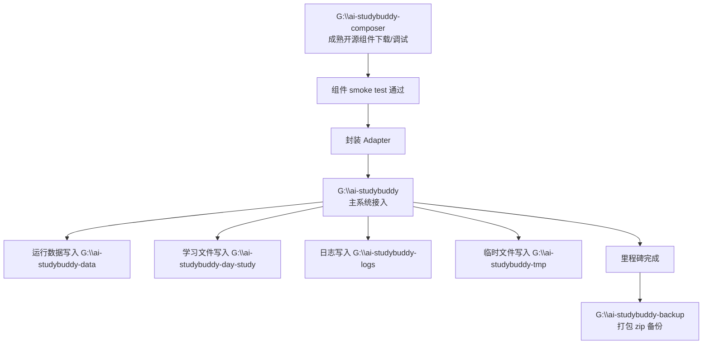

# AI StudyBuddy 本地目录与组件装配开发规范

**版本**：v0.01
**状态**：已确认
**日期**：2026-07-07
**用途**：定义本项目本地目录职责、开源组件先行调试流程、运行数据隔离、日志、临时文件和备份规则。本文是本地开发环境与目录治理的单一事实来源（SoT）。

## 一、总原则：分解 → 调试 → 组合 → 固化 → 备份

AI StudyBuddy 不是先写一个大而全系统，再临时寻找外部能力；而是把系统能力拆成可验证组件，先独立调通，再通过 Adapter 组装。

```text
成熟开源组件下载
  → 本地/容器独立调通
  → 最小输入输出样例验证
  → 形成组件能力卡
  → 封装为本项目 Adapter
  → 写 smoke test
  → 接入 FormatConverter / Renderer / Worker / Provider
  → 组合成完整学习闭环
  → 里程碑 zip 备份
```

硬规则：

- `G:\ai-studybuddy` 是主系统源码和文档目录，不做乱试验。
- `G:\ai-studybuddy-composer` 是成熟开源组件试炼场，组件未 smoke test 通过，不得接入主系统。
- 业务代码不得硬编码 `G:\...` 绝对路径，必须读取环境变量。
- 运行数据、学习文件、日志、临时文件、备份分目录隔离。
- `tmp` 可随时清空，系统不得长期依赖其中任何文件。
- `logs` 不得保存完整 API Key、学生隐私全文、完整题目答案。
- `data`、`day-study`、`backup`、`composer` 不进入主 repo。

## 二、本地目录职责

| 目录 | 角色 | 放什么 | 不放什么 |
|---|---|---|---|
| `G:\ai-studybuddy` | 主系统工程 | 源码、设计文档、正式 Adapter、数据库 schema、Docker Compose | 组件原仓库、大型测试素材、真实运行数据、长期日志 |
| `G:\ai-studybuddy-composer` | 组件试炼场 | PaddleOCR、SenseVoice、PDF.js、Markmap、MinIO、BullMQ、AI Provider 最小样例 | 主系统业务代码、真实学习数据 |
| `G:\ai-studybuddy-backup` | 里程碑备份 | 每个阶段完成后的 zip 包、`COMMIT.txt` | 未压缩源码散落文件、运行日志 |
| `G:\ai-studybuddy-data` | 数据库持久化 | PostgreSQL、Redis、pgvector 数据目录 | 源码、日志、学习文件原件 |
| `G:\ai-studybuddy-day-study` | 学习文件存储 | MinIO 对象存储后端目录、PDF、图片、音频、导出文件 | 数据库文件、临时切片 |
| `G:\ai-studybuddy-logs` | 日志中心 | 后端、worker、组件、AI Provider 的运行日志 | 学生隐私全文、完整答案、API Key |
| `G:\ai-studybuddy-tmp` | 临时工作区 | OCR 中间图片、PDF 拆页、ASR 切片、视频音轨、调试 JSON | 任何业务长期依赖文件 |

## 三、目录流转图



## 四、`COMPOSER_ROOT` 建议结构

```text
G:\ai-studybuddy-composer
  ├── reference
  │   ├── kaobuddy
  │   ├── miaowtest
  │   └── exam-porridge
  ├── asr
  │   ├── SenseVoice
  │   └── FunASR
  ├── ocr
  │   └── PaddleOCR
  ├── pdf
  │   ├── pdfjs
  │   └── pdf-parse-demo
  ├── video
  │   └── ffmpeg-test
  ├── webpage
  │   └── readability-test
  ├── mindmap
  │   └── markmap-test
  ├── markdown
  │   ├── react-markdown-test
  │   └── katex-test
  ├── storage
  │   └── minio-test
  ├── queue
  │   └── bullmq-test
  ├── db
  │   └── pgvector-test
  ├── ai-provider
  │   ├── kimi-test
  │   ├── qwen-test
  │   ├── vision-fallback-test
  │   └── gpt-test
  └── README.md
```

每个组件目录至少保留：

- `README.md`：安装方式、启动方式、测试命令、输入输出样例；
- `samples/`：最小测试输入；
- `output/`：最小测试输出示例，可定期清理；
- `smoke-test.*`：最小可运行测试脚本；
- `COMPONENT-CARD.md`：组件能力卡。

## 五、环境变量规范

`.env.example` 与部署文档必须包含以下变量。代码只读取环境变量，不写死本机路径。

```env
APP_ROOT=G:\ai-studybuddy
COMPOSER_ROOT=G:\ai-studybuddy-composer
DATA_ROOT=G:\ai-studybuddy-data
STUDY_FILE_ROOT=G:\ai-studybuddy-day-study
LOG_ROOT=G:\ai-studybuddy-logs
TMP_ROOT=G:\ai-studybuddy-tmp
BACKUP_ROOT=G:\ai-studybuddy-backup
```

跨平台实现时，Windows 路径只作为默认示例；服务内部统一使用配置读取和 `path` 工具拼接。

## 六、运行数据目录建议

```text
G:\ai-studybuddy-data
  ├── dev
  │   ├── postgres
  │   └── redis
  └── prod-family
      ├── postgres
      └── redis
```

规则：

- 开发数据和家庭真实学习数据必须隔离。
- 数据库持久化目录不进 git。
- 执行危险迁移前，先备份数据库和主系统 zip。

## 七、学习文件存储目录建议

```text
G:\ai-studybuddy-day-study
  └── minio
      ├── raw-materials
      ├── converted-text
      ├── notes
      ├── exams
      └── exports
```

应用通过 MinIO/S3 API 访问学习文件，不在业务代码里直接拼本地文件路径。

## 八、日志目录建议

```text
G:\ai-studybuddy-logs
  ├── backend
  │   ├── app.log
  │   ├── error.log
  │   └── access.log
  ├── worker
  │   ├── format-converter.log
  │   ├── ai-jobs.log
  │   └── queue.log
  ├── components
  │   ├── paddleocr.log
  │   ├── sensevoice.log
  │   ├── pdf.log
  │   └── markmap.log
  └── ai-provider
      ├── kimi.log
      ├── qwen.log
      └── gpt.log
```

日志只记录任务状态、耗时、错误码、模型名、token 消耗、摘要级追踪 ID。不得长期保存学生隐私原文、完整试卷答案、完整 API Key。

## 九、临时目录规则

```text
G:\ai-studybuddy-tmp
  ├── pdf-pages
  ├── ocr-images
  ├── audio-chunks
  ├── video-audio
  └── ai-debug
```

规则：

- `TMP_ROOT` 中任何文件都可被定时清理。
- OCR、ASR、PDF、视频等中间文件必须写入 `TMP_ROOT`。
- 系统清空 `TMP_ROOT` 后必须仍可正常运行，只允许重跑转换任务。

## 十、备份规则

每个里程碑完成后，将主系统文档和代码打包到 `BACKUP_ROOT`。

建议命名：

```text
2026-07-07_phase0_docs-baseline_commit-xxxx.zip
2026-07-10_phase0.5_components-pdf-ocr-markmap_commit-xxxx.zip
2026-07-15_phase1_material-to-note_commit-xxxx.zip
2026-07-22_phase1_practice-errorbook_commit-xxxx.zip
```

每个 zip 包内必须包含 `COMMIT.txt`：

```text
备份时间：
阶段名称：
Git Commit：
本阶段完成内容：
未完成风险：
恢复方式：
```

备份触发点：

- 每个 Phase 完成；
- 重大架构调整前；
- 接入大型组件前；
- 数据库 schema 重大迁移前。

## 十一、主系统接入门槛

一个组件从 `COMPOSER_ROOT` 进入 `APP_ROOT` 前必须满足：

1. License 可接受；
2. 安装方式可重复；
3. 最小输入输出样例跑通；
4. 有组件能力卡；
5. 有 smoke test；
6. Adapter 只暴露统一输入输出；
7. 日志、临时文件、运行数据路径符合本规范。
