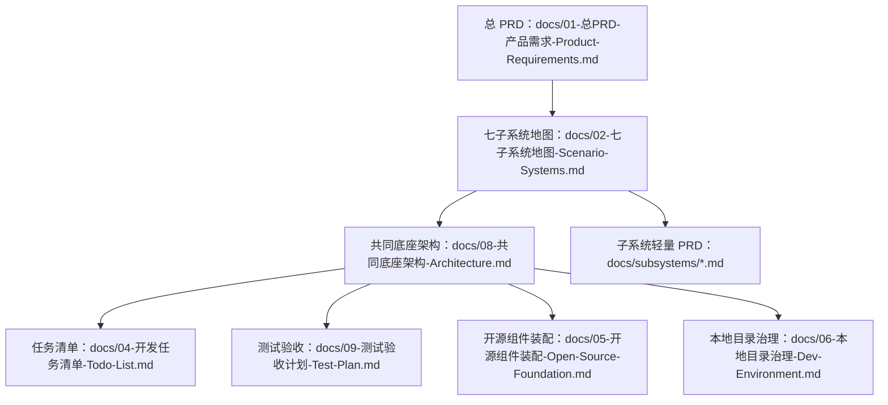

# AI StudyBuddy 系统设计文档策略

**版本**：v0.01
**日期**：2026-07-07
**用途**：回答两个问题：七个子系统是否都要设计文档？个人开发一套能用的系统设计最少需要几份文档？

---

## 1. 结论先说

### 1.1 七个子系统是否都需要自己的设计文档？

**需要，但不是现在一次性写 7 套厚文档。**

个人开发最怕文档变成负担。正确做法：

- 现在只写总 PRD 和七子系统地图；
- 当前准备开发哪个子系统，就给哪个子系统写一份轻量 PRD；
- 子系统轻量 PRD 控制在 2-5 页；
- 不开发的子系统只保留边界和接口位。

### 1.2 一套能用的系统设计最少由几份文档构成？

个人开发最少 **5 份文档**：

| # | 文档 | 解决的问题 |
|---|---|---|
| 1 | 总 PRD | 为什么做、给谁用、做哪些场景、不做哪些 |
| 2 | 子系统地图 | 七个系统怎么切、先做哪个、依赖什么 |
| 3 | 架构文档 | 共同底座、数据流、AI 路由、开源组件怎么接 |
| 4 | 任务清单 | 每一步做什么，避免想到哪做到哪 |
| 5 | 测试验收 | 怎么证明这个系统真的能用 |

本项目额外保留两份工程治理文档：

- `05-开源组件装配-Open-Source-Foundation.md`：开源组件先行装配；
- `06-本地目录治理-Dev-Environment.md`：`G:\ai-studybuddy-*` 目录治理。

---

## 2. 文档分层



---

## 3. 子系统文档什么时候写？

| 子系统 | 是否现在写详细文档 | 原因 |
|---|---|---|
| S1 学习节奏 | 是，第一批 | 所有学习记录都依赖它 |
| S2 资料笔记 | 是，第一批 | MVP 价值展示最快 |
| S3 限时练习 | 第二批 | 等笔记输出稳定后接 |
| S4 错题改错 | 第二批 | 依赖练习结果 |
| S6 家长观察 | 第二批简版 | 先只做时间线和数量 |
| S5 期末冲刺 | 后写 | 真题解析/变题复杂 |
| S7 课堂采集 | 后写 | ASR/视频组件运维重 |

---

## 4. 子系统轻量 PRD 模板

```markdown
# Sx 子系统名 PRD

## 1. 一句话目标
## 2. 使用场景
## 3. 用户动作流程
## 4. 输入与输出
## 5. 开源组件
## 6. AI 使用点
## 7. 数据对象
## 8. 页面与 API
## 9. 验收标准
## 10. 非目标
```

---

## 5. 旧草稿处理规则

旧草稿文档已经归档为：

```text
G:\ai-studybuddy-backup\system-design-docs-draft_*.zip
```

后续原则：

- 旧草稿只作为参考，不再作为当前开发 SoT；
- 当前 SoT 从 `docs/01-总PRD-产品需求-Product-Requirements.md`、`docs/02-七子系统地图-Scenario-Systems.md` 开始重建；
- 旧架构、旧测试、旧任务文档如果与七子系统路线冲突，以新 PRD 为准；
- 每完成一个重建阶段，再打一个新的 zip 备份。

---

## 6. 共同底座文档的触发判断

`08-共同底座架构-Architecture.md` 不提前写厚文档，但 S1 开工很容易触发它。只要准备定义以下任一内容，就应先创建 08 文档的 2-3 页最小版：

- `users`、`courses`、`study_tasks`、`study_events` 等跨子系统基础数据结构；
- 数据库连接、迁移目录、环境变量读取；
- 统一 API 响应格式；
- MinIO、BullMQ、AI Provider、FormatConverter 等共同底座接口。

原则：08 只写“当前要用的共同底座”，不要恢复旧版 1487 行大架构。

---

## 7. 第一个可运行里程碑

完整 Phase 1 仍然偏大，因此增加 Phase 0.8：

```text
学生创建课程
  → 上传 PDF/图片/文本
  → 格式转换为纯文本
  → DeepSeek 生成结构化笔记 + 重点 + 思维导图
  → 前端能看到笔记和导图
```

这个里程碑只覆盖 S1 基础 + S2 核心，不做练习、错题、家长面板、音频 ASR、期末真题。它的目的不是功能完整，而是尽早看到核心价值，验证技术路线。

---

## 8. 渐进式 Schema 策略

旧版一次性设计 20+ 张表，个人开发负担太重。新版采用渐进式 Schema：

| 阶段 | 只新增当前需要的表 |
|---|---|
| S1 | `users`、`courses`、`study_tasks`、`study_events` |
| S2 | `materials`、`normalized_texts`、`structured_notes`、`mind_maps` |
| S3 | `practices`、`questions`、`answers`、`grading_results` |
| S4 | `error_items`、`review_schedules`、`error_fix_logs` |
| S6 | `parent_bindings`、`parent_timeline_views` |

原则：子系统不开工，不提前建它的表；跨子系统字段先放共同底座，业务字段留给对应子系统。

---

## 9. 旧稿精华搬运规则

旧稿不能恢复为当前文档，但允许在触发时摘取精华并重写：

| 旧稿内容 | 何时参考 |
|---|---|
| AI Provider Registry | S2 AI 笔记、S3 评分、S5 难题解析开工时 |
| 格式转换 Pipeline | S2 NoteBuilder 开工时 |
| 错题艾宾浩斯复习机制 | S4 ErrorFixer 开工时 |
| 原始素材清理策略 | S2/S7 涉及文件存储清理时 |
| AI Key 混合策略 | 开始做真实家庭长期试用和成本控制时 |

搬运方式：只搬思路，不搬旧文档结构；只写进当前触发的 2-5 页轻量文档或 08/09/10 等规范文档。
