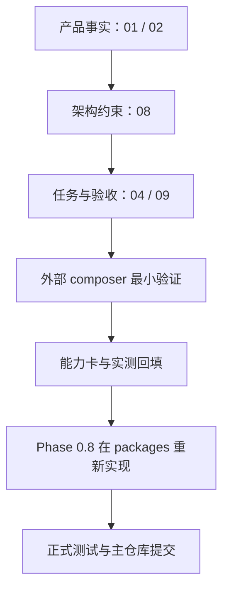

# AI StudyBuddy 系统设计文档策略

**版本**：v0.02
**日期**：2026-07-10
**用途**：规定有效设计文档、外部验证资料和历史备份之间的关系，避免个人开发时把草稿、测试样例和产品事实混在一起。

---

## 一、结论

个人开发不需要一次性写厚文档，但每个会影响产品边界、数据、安全或接入方式的决定必须落到已有编号 SoT 文档。

| 文档层         | 位置                 | 解决的问题                           |
| -------------- | -------------------- | ------------------------------------ |
| 产品事实       | `docs/01`、`docs/02` | 给谁用、做什么、不做什么、子系统边界 |
| 实现约束       | `docs/08`            | 默认架构、Adapter、数据流、安全边界  |
| 执行与证据     | `docs/04`、`docs/09` | 下一步任务、完成门槛、实测结果       |
| 组件与目录治理 | `docs/05`、`docs/06` | 怎么验证组件、代码/数据/试炼场放哪里 |
| 轻量子系统 PRD | `docs/subsystems/`   | 某一个子系统开工前的最小设计         |

`docs/00-文档索引-Index.md` 是所有有效文档的入口。未在索引登记的草稿、聊天记录、截图或试验说明都不是产品 SoT。

## 二、产品与验证资料分层



`I:\ai-studybuddy-composer` 可以保存实验过程，但它不是 `I:\ai-studybuddy` 的子目录、不是主仓库 workspace、也不是正式实现来源。试炼场验证通过不等于产品已经接入；只有回填并重新实现后，才可进入产品代码。

## 三、子系统文档触发规则

| 子系统      | 当前文档状态    | 触发条件                                                             |
| ----------- | --------------- | -------------------------------------------------------------------- |
| S1 学习节奏 | 已有 `03-S1...` | Phase 0.8 实现课程、任务、StudyEvent 前                              |
| S2 资料笔记 | 未创建          | Phase 0.8 开始正式上传/转换/笔记前                                   |
| S3、S4      | 未创建          | S2 MVP 稳定后                                                        |
| S6 家长观察 | 未创建          | Phase 1 准备正式发送报告前；名称为 `ParentReport`，不做家长 Web 面板 |
| S5、S7      | 未创建          | 对应阶段触发时                                                       |

轻量 PRD 只写当前闭环需要的目标、输入输出、数据对象、API/页面、验收与非目标。没有触发条件，不创建空文档。

## 四、当前 Phase 的文档职责

- Phase 0.7：`04` 跟踪 Windows 原生验证，`08` 定义 SQLite/本地文件/Job/报告架构，`09` 记录真实结果；不在 `packages/` 接入。
- Phase 0.8：在 Phase 0.7 门槛全部通过后，创建所需 S2 PRD，并在主仓库正式实现 Adapter、API 和前端。
- Phase 1：S3/S4/S6 的轻量 PRD 在开发动作真正开始前创建；家长只接收脱敏邮件和飞书报告。

## 五、历史与备份规则

旧草稿只保存在 `I:\ai-studybuddy-backup`，仅可作为思路参考，不能整包恢复到 `docs/`。Phase 0.5 的 Docker/PostgreSQL/MinIO/Redis 验证也是历史能力结论：保留其证据，但不能覆盖当前 Windows 单机默认栈。

每次文档变更后必须运行：

```powershell
powershell -ExecutionPolicy Bypass -File scripts\check-docs-governance.ps1
git diff --check
```

提交时只暂存本次涉及的编号文档；任何未跟踪草稿、试炼场依赖、密钥和输出都必须显式排除。
