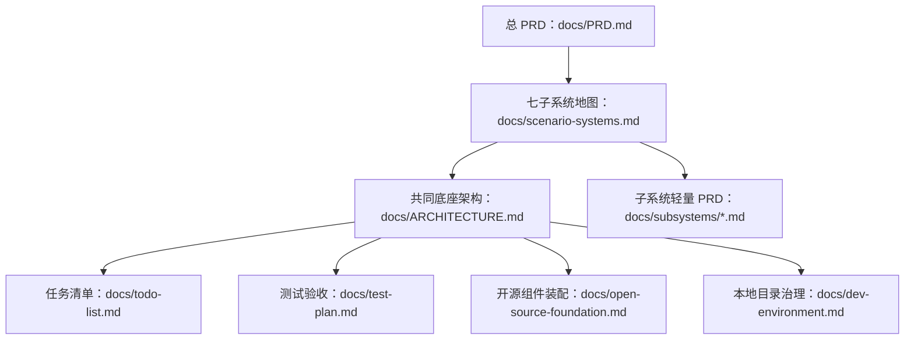

# AI StudyBuddy 系统设计文档策略

**版本**：v1.0
**日期**：2026-07-07
**用途**：回答两个问题：七个子系统是否都要设计文档？个人开发一套能用的系统设计最少需要几份文档？

---

## 1. 结论先说

### 1.1 七个子系统是否都需要自己的设计文档？

**需要，但不是现在一次性写 7 套厚文档。**

个人开发最怕文档变成负担。正确做法：

- 现在只写总 PRD 和七子系统地图；
- 当前准备开发哪个子系统，就给哪个子系统写一份轻量 PRD；
- 子系统轻量 PRD 控制在 2-5 页；
- 不开发的子系统只保留边界和接口位。

### 1.2 一套能用的系统设计最少由几份文档构成？

个人开发最少 **5 份文档**：

| # | 文档 | 解决的问题 |
|---|---|---|
| 1 | 总 PRD | 为什么做、给谁用、做哪些场景、不做哪些 |
| 2 | 子系统地图 | 七个系统怎么切、先做哪个、依赖什么 |
| 3 | 架构文档 | 共同底座、数据流、AI 路由、开源组件怎么接 |
| 4 | 任务清单 | 每一步做什么，避免想到哪做到哪 |
| 5 | 测试验收 | 怎么证明这个系统真的能用 |

本项目额外保留两份工程治理文档：

- `open-source-foundation.md`：开源组件先行装配；
- `dev-environment.md`：`G:\ai-studybuddy-*` 目录治理。

---

## 2. 文档分层



---

## 3. 子系统文档什么时候写？

| 子系统 | 是否现在写详细文档 | 原因 |
|---|---|---|
| S1 学习节奏 | 是，第一批 | 所有学习记录都依赖它 |
| S2 资料笔记 | 是，第一批 | MVP 价值展示最快 |
| S3 限时练习 | 第二批 | 等笔记输出稳定后接 |
| S4 错题改错 | 第二批 | 依赖练习结果 |
| S6 家长观察 | 第二批简版 | 先只做时间线和数量 |
| S5 期末冲刺 | 后写 | 真题解析/变题复杂 |
| S7 课堂采集 | 后写 | ASR/视频组件运维重 |

---

## 4. 子系统轻量 PRD 模板

```markdown
# Sx 子系统名 PRD

## 1. 一句话目标
## 2. 使用场景
## 3. 用户动作流程
## 4. 输入与输出
## 5. 开源组件
## 6. AI 使用点
## 7. 数据对象
## 8. 页面与 API
## 9. 验收标准
## 10. 非目标
```

---

## 5. 旧草稿处理规则

旧草稿文档已经归档为：

```text
G:\ai-studybuddy-backup\system-design-docs-draft_*.zip
```

后续原则：

- 旧草稿只作为参考，不再作为当前开发 SoT；
- 当前 SoT 从 `docs/PRD.md`、`docs/scenario-systems.md` 开始重建；
- 旧架构、旧测试、旧任务文档如果与七子系统路线冲突，以新 PRD 为准；
- 每完成一个重建阶段，再打一个新的 zip 备份。
