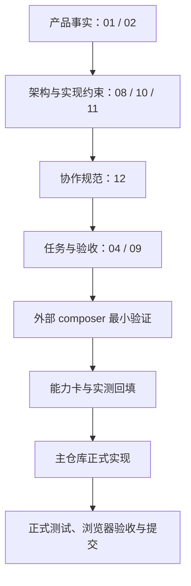

# AI StudyBuddy 系统设计文档策略

**版本**：v0.03
**日期**：2026-07-15
**用途**：规定有效设计文档、外部验证资料和历史备份之间的关系，避免个人开发时把草稿、测试样例和产品事实混在一起。

---

## 一、结论

个人开发不需要一次性写厚文档，但每个会影响产品边界、数据、安全、协作或接入方式的决定必须落到已有编号 SoT 文档。

| 文档层 | 位置 | 解决的问题 |
| ------ | ---- | ---------- |
| 产品事实 | `docs/01`、`docs/02` | 给谁用、做什么、不做什么、子系统边界 |
| 实现约束 | `docs/08`、`docs/10`、`docs/11` | 架构、Adapter、后端、前端、数据流、安全边界 |
| 协作规范 | `docs/12` | 16 步工作流、分支/worktree、多 Agent、验证、隐私和提交规则 |
| 执行与证据 | `docs/04`、`docs/09` | 下一步任务、完成门槛、实测结果 |
| 组件与目录治理 | `docs/05`、`docs/06` | 怎么验证组件、代码/数据/试炼场放哪里 |
| 轻量子系统 PRD | `docs/subsystems/` | 某一个子系统开工前的最小设计 |

`docs/00-文档索引-Index.md` 是所有有效文档的入口。未在索引登记的草稿、聊天记录、截图、外部项目说明或试验 README 都不是产品 SoT。

## 二、产品与验证资料分层



`I:\ai-studybuddy-composer` 可以保存实验过程，但它不是 `I:\ai-studybuddy` 的子目录、不是主仓库 workspace、也不是正式实现来源。试炼场验证通过不等于产品已经接入；只有回填并重新实现后，才可进入产品代码。

## 三、子系统文档触发规则

| 子系统 | 当前文档状态 | 触发条件 |
| ------ | ------------ | -------- |
| S1 学习节奏 | 已有 `03-S1...`，MVP 已实现 | Phase 0.8 实现课程、任务、StudyEvent 前 |
| S2 资料笔记 | 已有 `03-S2...`，MVP 已实现 | Phase 0.8 开始正式上传/转换/笔记前 |
| S3 限时练习 | 未创建，触发条件已满足 | S2 MVP 完成后；等待 Phase 1-T03 计划批准后创建 |
| S4 错题改错 | 未创建 | S3 MVP 完成后 |
| S6 家长观察 | 未创建 | Phase 1 后期准备正式发送报告前；名称为 `ParentReport`，不做家长 Web 面板 |
| S5 期末冲刺 | 未创建 | Phase 2 触发 |
| S7 课堂采集 | 未创建 | Phase 1.5 触发 |

轻量 PRD 只写当前闭环需要的目标、输入输出、数据对象、API/页面、验收与非目标。没有触发条件，不创建空文档。

## 四、当前 Phase 的文档职责

- Phase 0.8：已完成。S1/S2 PRD、共同底座、后端规范、前端规范、测试验收和任务清单均已形成有效 SoT。
- Phase 1-T00：先更新 `CLAUDE.md`、`AGENTS.md`、`docs/00`、`docs/04`、`docs/07`，并创建 `docs/12`，修正协作基线。
- Phase 1-T10/T11/T02：不新建子系统 PRD，先补齐 S2/S1 闭环与 Provider 健康熔断。
- Phase 1-T03：创建 S3 轻量 PRD 并实现最小限时练习。
- Phase 1-T04：S3 MVP 验收后才创建 S4 PRD 与错题改错。
- Phase 1 后期：准备正式家长报告前再创建 S6 PRD；家长只接收脱敏邮件和飞书报告。

## 五、历史与备份规则

旧草稿只保存在仓库外备份目录，仅可作为思路参考，不能整包恢复到 `docs/`。Phase 0.5 的 Docker/PostgreSQL/MinIO/Redis 验证也是历史能力结论：保留其证据，但不能覆盖当前 Windows 单机默认栈。

无明确许可证的参考项目只能抽象为产品和流程原则，不得复制源码、视觉、图片、长段文案或品牌资产。

每次文档变更后必须运行：

```powershell
powershell -ExecutionPolicy Bypass -File scripts/check-docs-governance.ps1
git diff --check
```

提交时只暂存本次涉及的编号文档；任何未跟踪草稿、试炼场依赖、密钥和输出都必须显式排除。
