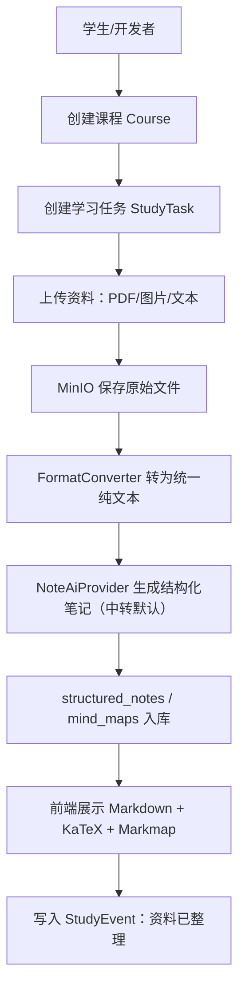

# AI StudyBuddy 共同底座架构 Architecture

**版本**：v0.01
**日期**：2026-07-07  
**状态**：最小共同底座，仅服务 Phase 0.5A 和 Phase 0.8  
**原则**：只写当前要用的底座，不恢复旧版大架构。

---

## 1. 本文档解决什么问题

本文档只定义 Phase 0.8 需要的最小共同底座：

```text
学生创建课程
  → 上传 PDF/图片/文本
  → 格式转换为纯文本
  → LLM（中转 GPT/Claude 默认）生成结构化笔记 + 重点 + 思维导图
  → 前端看到笔记和导图
```

暂不设计：练习、错题、家长面板、音频 ASR、视频、期末真题、完整权限体系。

---

## 2. Phase 0.8 最小系统路径



---

## 3. 最小共同数据模型

采用渐进式 Schema。Phase 0.8 只需要这些表/对象：

| 对象 | 用途 | 关键字段 |
|---|---|---|
| `users` | 最小学生身份 | `id`、`name`、`role`、`created_at` |
| `courses` | 课程 | `id`、`student_id`、`name`、`term`、`created_at` |
| `study_tasks` | 课次/学习任务 | `id`、`course_id`、`title`、`status`、`deadline` |
| `study_events` | 学习时间线事件 | `id`、`student_id`、`course_id`、`task_id`、`event_type`、`created_at` |
| `materials` | 上传资料记录 | `id`、`task_id`、`file_type`、`object_key`、`status` |
| `normalized_texts` | 格式转换后的纯文本 | `id`、`material_id`、`text`、`metadata` |
| `structured_notes` | AI 结构化笔记 | `id`、`task_id`、`markdown`、`highlights`、`model` |
| `mind_maps` | 思维导图数据 | `id`、`note_id`、`format`、`data` |

公共字段默认包含：`id`、`created_at`、`updated_at`。不要提前创建 S3/S4/S5/S6/S7 的业务表。

---

## 4. 最小组件关系

| 能力 | 组件 | 接入边界 |
|---|---|---|
| 数据库 | PostgreSQL + pgvector | 先只做业务表；向量能力预留，不强依赖 |
| 文件存储 | MinIO | 原始 PDF/图片/文本通过 S3 API 存取 |
| 异步任务 | BullMQ + Redis | 格式转换和 AI Job 可异步；Phase 0.8 可先同步跑通再异步化 |
| PDF 转文本 | PDF.js / pdf-parse | 输入 PDF，输出纯文本 |
| 图片 OCR | PaddleOCR + PP-OCRv6 | 输入图片，输出纯文本 |
| 文本直入 | TextConverter | Markdown/纯文本直接入库 |
| AI 整理 | NoteAiProvider（中转 GPT/Claude 默认，Kimi 备选，官方兜底） | 输入纯文本，输出结构化 JSON/Markdown |
| 展示 | react-markdown + KaTeX + Markmap | 渲染笔记、公式、思维导图 |

---

## 5. Adapter 边界

主系统不直接依赖组件内部命令。组件统一通过 Adapter 暴露输入输出。

```ts
type ConverterResult = {
  ok: boolean
  sourceType: 'pdf' | 'image' | 'text'
  text?: string
  metadata?: Record<string, unknown>
  warnings?: string[]
  error?: string
}
```

Phase 0.8 只需要：

- `PdfConverter`
- `OcrConverter`
- `TextConverter`
- `NoteAiProvider`

`AudioConverter`、`VideoConverter`、`UrlConverter` 暂不进入主线。

---

## 6. AI Provider 路由原则

默认走**中转渠道的 GPT/Claude**（实测倍率极低，成本优于国产直连），中转不可用时切 Kimi，最终兜底回国产官方直连。Provider 可替换，不写死模型版本。

| 场景 | 默认（中转） | 备选 | 兜底（官方直连） |
|---|---|---|---|
| 结构化笔记 | GPT/Claude 中转 | Kimi | Kimi/Qwen 官方 API |
| 重点高亮 | GPT/Claude 中转 | Kimi | Kimi/Qwen 官方 API |
| 思维导图数据 | GPT/Claude 中转 | Kimi | Kimi/Qwen 官方 API |
| OCR/版面失败兜底 | GPT 视觉（中转） | Kimi 视觉 | Qwen-VL 官方 API |

- 中转渠道成本最优但可能不稳或有变动，故官方直连始终作为随时可切换的兜底，保证系统可用；
- 笔记、重点、导图三项尽量合并一次调用，降低 token 消耗；
- Qwen 保留配置位持续跟踪。

最小接口约定：

```ts
type AiTaskType = 'note_generation' | 'practice_grading' | 'error_analysis' | 'question_generation'

type AiRequest = {
  taskType: AiTaskType
  inputText: string
  language?: 'zh' | 'en'
  options?: Record<string, unknown>
}

type AiResponse = {
  content: string
  provider: string
  model: string
  tokenUsed: number
  latencyMs: number
  fallbackUsed: boolean
}
```

日志允许记录 `provider`、`model`、`tokenUsed`、`latencyMs`、失败原因；不记录 API Key 和学生隐私全文。

---

## 7. 数据库和迁移约定

| 约定项 | 规则 |
|---|---|
| 主键 | 全部使用 UUID |
| 时间字段 | 使用 `timestamptz`，避免本地时区混乱 |
| 公共字段 | 默认包含 `created_at`、`updated_at` |
| 迁移策略 | 渐进式 Schema；子系统未开工，不提前建表 |
| 迁移目录 | 建议 `packages/backend/drizzle/migrations/` 或同等后端迁移目录 |
| 迁移命名 | `0001_init_users_courses.sql` 这种序号 + 描述格式 |
| 跨子系统字段 | 放共同底座；业务字段留给对应子系统 |

Phase 0.8 第一批只落 S1/S2 必需表：`users`、`courses`、`study_tasks`、`study_events`、`materials`、`normalized_texts`、`structured_notes`、`mind_maps`。

---

## 8. 统一 API 响应格式

成功响应：

```json
{
  "success": true,
  "data": {},
  "meta": {
    "page": 1,
    "pageSize": 20,
    "total": 100
  }
}
```

失败响应：

```json
{
  "success": false,
  "error": {
    "code": "VALIDATION_ERROR",
    "message": "截止时间不能早于今天"
  }
}
```

HTTP 状态码约定：

| 状态码 | 含义 |
|---|---|
| 200 | 查询 / 更新成功 |
| 201 | 创建成功 |
| 400 | 参数错误 |
| 401 | 未登录 |
| 403 | 无权访问 |
| 404 | 资源不存在 |
| 500 | 服务端错误 |

---

## 9. 格式转换层接口约定

格式转换全部输出统一纯文本，不把 LLM 当作主转换路径。

```ts
type ConvertInput = {
  sourceType: 'pdf' | 'image' | 'text' | 'markdown' | 'url'
  storageKey?: string
  rawText?: string
}

type ConvertOutput = {
  text: string
  converter: string
  metadata: {
    pageCount?: number
    charCount: number
    hasFormula: boolean
    hasTable: boolean
  }
}
```

PDF、图片等耗时转换优先放到 BullMQ Job；Phase 0.8 可先同步跑通，再异步化。

---

## 10. 部署形态与远程接入（前瞻参考）

> 本节记录已定的部署方向，供开工时不至于抓瞎。**详细安装步骤等 `13-部署运维指南` 触发时再写**；此处只定形态与工具选型。

### 10.1 整体形态

重算力留在家用主机，外网通过免费隧道接入。不上云服务器、不做小程序、不做 Serverless。

| 维度 | 方案 |
|---|---|
| 主机 | 家中闲置 i7 笔记本（16G/2T）当常用主机；笔记本自带电池 = 免费 UPS；重活兜底用 Maxtang FP650（8 核/32G） |
| 运行 | **按需开机**：孩子要用时才开，不 7×24 空转 |
| 自助唤醒 | 智能插座（首选）或 WoL（有公网 IP 时加分项）——孩子自己点亮，不用等家长 |
| 外网接入 | 免费隧道（主机主动外连，中国移动家宽无公网 IP 也可用） |
| 鉴权 | **开机即对外可达，因此必须登录鉴权，绝不裸奔**；学生 owner，家长只读 |
| 算力 | OCR/ASR/PDF 全部本地免费跑；重活走 BullMQ 异步，worker 并发 1–2 |

### 10.2 隧道怎么建（工具选型）

家宽多在运营商 NAT 后面（无公网 IP），无法直接端口转发。解决办法是用**由主机主动向外建立连接**的隧道工具，外网请求经隧道服务商回到家里。三个候选，从易到难：

| 工具 | 原理 | 适合 | 成本 | 备注 |
|---|---|---|---|---|
| **Cloudflare Tunnel** | 主机跑 `cloudflared` 主动外连 Cloudflare，分配一个子域名 | 首选试点 | 免费 | 免公网 IP、自带 HTTPS；大陆访问偶有绕境外、可能不稳，需实测 |
| **frp** | 自己有一台有公网 IP 的小服务器当中转，主机跑 `frpc` 连它 | 想要国内稳定 | 需一台廉价 VPS（与"不上云"权衡） | 最可控但要维护中转端 |
| **花生壳等内网穿透** | 商业内网穿透服务 | 图省事 | 免费档限速/限流量 | 免费档够轻量用，超了要付费 |

**推荐路径**：先试 Cloudflare Tunnel（零成本、零硬件），实测大陆访问稳不稳；不稳再退 frp 或花生壳。选定后在 `13-部署运维` 写具体配置。

### 10.3 待实测项（影响最终选型）

- Cloudflare Tunnel 在孩子所在校园网访问是否稳定、够快；
- SenseVoice 在主机上转 40 分钟音频的真实耗时（决定云 ASR 要不要花钱）；
- 智能插座 + 笔记本"通电自启 / 合盖不休眠"能否稳定实现自助唤醒。

---

## 11. 环境变量最小清单

`.env.local` 不提交真实值，只提交 `.env.example` 的变量名。

```env
DATABASE_URL=
REDIS_URL=
MINIO_ENDPOINT=
MINIO_ACCESS_KEY=
MINIO_SECRET_KEY=
STORAGE_BUCKET=ai-studybuddy

# AI 路由：默认中转，Kimi 备选，官方直连兜底
AI_PROVIDER_DEFAULT=relay
RELAY_BASE_URL=
RELAY_API_KEY=
KIMI_API_KEY=
QWEN_API_KEY=
OPENAI_API_KEY=

# 远程接入（隧道，具体值待选型后填）
TUNNEL_PROVIDER=
TUNNEL_TOKEN=

DATA_ROOT=G:\ai-studybuddy-data
LOG_ROOT=G:\ai-studybuddy-logs
TMP_ROOT=G:\ai-studybuddy-tmp
```

未来业务代码不得硬编码 `G:\...` 路径，必须通过环境变量读取。API Key 和隧道 token 绝不写进日志。

---

## 12. 非目标

本文档不设计：

- 登录注册完整体系；
- 家长绑定和隐私策略细节；
- 练习题、错题本、期末真题；
- 音频 ASR、视频处理；
- 完整 API 清单；
- 20+ 张表的一次性数据库设计。

需要这些能力时，按子系统触发条件创建或扩展对应文档。
