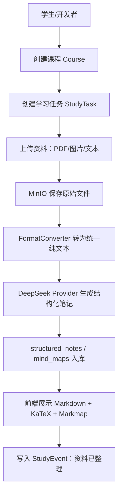

# AI StudyBuddy 共同底座架构 Architecture

**版本**：v0.1-minimal  
**日期**：2026-07-07  
**状态**：最小共同底座，仅服务 Phase 0.5A 和 Phase 0.8  
**原则**：只写当前要用的底座，不恢复旧版大架构。

---

## 1. 本文档解决什么问题

本文档只定义 Phase 0.8 需要的最小共同底座：

```text
学生创建课程
  → 上传 PDF/图片/文本
  → 格式转换为纯文本
  → DeepSeek 生成结构化笔记 + 重点 + 思维导图
  → 前端看到笔记和导图
```

暂不设计：练习、错题、家长面板、音频 ASR、视频、期末真题、完整权限体系。

---

## 2. Phase 0.8 最小系统路径



---

## 3. 最小共同数据模型

采用渐进式 Schema。Phase 0.8 只需要这些表/对象：

| 对象 | 用途 | 关键字段 |
|---|---|---|
| `users` | 最小学生身份 | `id`、`name`、`role`、`created_at` |
| `courses` | 课程 | `id`、`student_id`、`name`、`term`、`created_at` |
| `study_tasks` | 课次/学习任务 | `id`、`course_id`、`title`、`status`、`deadline` |
| `study_events` | 学习时间线事件 | `id`、`student_id`、`course_id`、`task_id`、`event_type`、`created_at` |
| `materials` | 上传资料记录 | `id`、`task_id`、`file_type`、`object_key`、`status` |
| `normalized_texts` | 格式转换后的纯文本 | `id`、`material_id`、`text`、`metadata` |
| `structured_notes` | AI 结构化笔记 | `id`、`task_id`、`markdown`、`highlights`、`model` |
| `mind_maps` | 思维导图数据 | `id`、`note_id`、`format`、`data` |

公共字段默认包含：`id`、`created_at`、`updated_at`。不要提前创建 S3/S4/S5/S6/S7 的业务表。

---

## 4. 最小组件关系

| 能力 | 组件 | 接入边界 |
|---|---|---|
| 数据库 | PostgreSQL + pgvector | 先只做业务表；向量能力预留，不强依赖 |
| 文件存储 | MinIO | 原始 PDF/图片/文本通过 S3 API 存取 |
| 异步任务 | BullMQ + Redis | 格式转换和 AI Job 可异步；Phase 0.8 可先同步跑通再异步化 |
| PDF 转文本 | PDF.js / pdf-parse | 输入 PDF，输出纯文本 |
| 图片 OCR | PaddleOCR + PP-OCRv6 | 输入图片，输出纯文本 |
| 文本直入 | TextConverter | Markdown/纯文本直接入库 |
| AI 整理 | DeepSeek Provider | 输入纯文本，输出结构化 JSON/Markdown |
| 展示 | react-markdown + KaTeX + Markmap | 渲染笔记、公式、思维导图 |

---

## 5. Adapter 边界

主系统不直接依赖组件内部命令。组件统一通过 Adapter 暴露输入输出。

```ts
type ConverterResult = {
  ok: boolean
  sourceType: 'pdf' | 'image' | 'text'
  text?: string
  metadata?: Record<string, unknown>
  warnings?: string[]
  error?: string
}
```

Phase 0.8 只需要：

- `PdfConverter`
- `OcrConverter`
- `TextConverter`
- `NoteAiProvider`

`AudioConverter`、`VideoConverter`、`UrlConverter` 暂不进入主线。

---

## 6. AI Provider 路由原则

Phase 0.8 默认只接 DeepSeek 文本模型：

| 场景 | 默认 | 备注 |
|---|---|---|
| 结构化笔记 | DeepSeek | 输入必须是纯文本 |
| 重点高亮 | DeepSeek | 与笔记生成合并一次调用 |
| 思维导图数据 | DeepSeek | 与笔记生成合并一次调用 |

Qwen、Kimi、GPT 暂只保留配置位，不在 Phase 0.8 强依赖。GPT 只作为后续最难推理兜底，不属于开源组件。

---

## 7. 非目标

本文档不设计：

- 登录注册完整体系；
- 家长绑定和隐私策略细节；
- 练习题、错题本、期末真题；
- 音频 ASR、视频处理；
- 完整 API 清单；
- 20+ 张表的一次性数据库设计。

需要这些能力时，按子系统触发条件创建或扩展对应文档。
