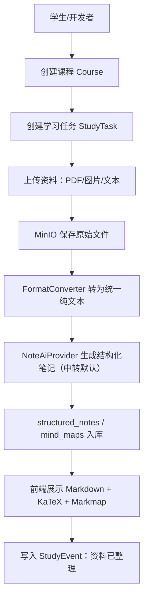

# AI StudyBuddy 共同底座架构 Architecture

**版本**：v1.2
**日期**：2026-07-09
**状态**：Phase 0.6/0.8 开工前共同底座基线
**原则**：只写当前要用的底座，不恢复旧版大架构。

---

## 1. 本文档解决什么问题

本文档只定义 Phase 0.6/0.8 需要的最小共同底座：

```text
学生创建课程
  → 上传 PDF/图片/文本
  → 格式转换为纯文本
  → LLM（中转 GPT/Claude 默认）生成结构化笔记 + 重点 + 思维导图
  → 前端看到笔记和导图
```

暂不设计：练习、错题、家长面板、音频 ASR、视频、期末真题、完整权限体系。

---

## 2. Phase 0.8 最小系统路径



---

## 3. 最小共同数据模型

采用渐进式 Schema。Phase 0.8 只需要这些表/对象：

| 对象 | 用途 | 关键字段 |
|---|---|---|
| `users` | 最小学生身份 | `id`、`name`、`role`、`created_at` |
| `courses` | 课程 | `id`、`student_id`、`name`、`term`、`created_at` |
| `study_tasks` | 课次/学习任务 | `id`、`course_id`、`title`、`status`、`deadline` |
| `study_events` | 学习时间线事件 | `id`、`student_id`、`course_id`、`task_id`、`event_type`、`created_at` |
| `materials` | 上传资料记录 | `id`、`task_id`、`file_type`、`object_key`、`status` |
| `normalized_texts` | 格式转换后的纯文本 | `id`、`material_id`、`text`、`metadata` |
| `structured_notes` | AI 结构化笔记 | `id`、`task_id`、`markdown`、`highlights`、`model` |
| `mind_maps` | 思维导图数据 | `id`、`note_id`、`format`、`data` |

公共字段默认包含：`id`、`created_at`、`updated_at`。不要提前创建 S3/S4/S5/S6/S7 的业务表。

---

## 4. 最小组件关系

| 能力 | 组件 | 接入边界 |
|---|---|---|
| 数据库 | PostgreSQL + pgvector | 先只做业务表；向量能力预留，不强依赖 |
| 文件存储 | MinIO | 原始 PDF/图片/文本通过 S3 API 存取 |
| 异步任务 | BullMQ + Redis | 格式转换和 AI Job 可异步；Phase 0.8 可先同步跑通再异步化 |
| PDF 转文本 | PDF.js / pdf-parse | 输入 PDF，输出纯文本 |
| 图片 OCR | RapidOCR（首选）/ PaddleOCR（备选对比） | 输入图片，输出纯文本；RapidOCR 已通过本机批量 smoke test |
| 文本直入 | TextConverter | Markdown/纯文本直接入库 |
| AI 整理 | NoteAiProvider（中转 GPT/Claude 默认；Kimi/Qwen 后续备选） | 输入纯文本，输出结构化 JSON/Markdown；Pixel API / Responses API 已通过 smoke test |
| 展示 | react-markdown + KaTeX + Markmap | 渲染笔记、公式、思维导图 |

---

## 5. Phase 0.5 Smoke Test 结论

截至 2026-07-09，Phase 0.5 已完成。Phase 0.8 需要的 MVP 主路径底座已齐备：

| 能力 | 结论 | 主系统接入判断 |
|---|---|---|
| PDF 文本提取 | pdf-parse 已通过文字型中文 PDF；扫描版 PDF 进入 OCR 路径 | 可封装 `PdfConverter` |
| 图片 OCR | RapidOCR 批量 22 张书页通过，平均 1.94s/页；PaddleOCR 未对比 | `OcrConverter` 先接 RapidOCR，PaddleOCR 不阻塞 |
| Markdown/公式展示 | react-markdown + KaTeX 浏览器验证通过 | 可进入前端笔记页 |
| 思维导图 | Markmap Node + 浏览器验证通过 | 可进入前端导图页 |
| 队列 | BullMQ + Redis 失败重试与 completed 生命周期通过 | OCR/AI 重任务可异步 |
| 对象存储 | MinIO 上传、下载、presigned URL、控制台登录通过 | 可封装 `StorageAdapter` |
| 数据库 | PostgreSQL 16.14 + pgvector 0.8.5 CRUD、向量搜索、IVFFlat 通过 | 可进入迁移设计 |
| AI Provider | Pixel API / `gpt-5.5` / Responses API 通过；总 tokens 988，11.9s | 可封装 `NoteAiProvider` |

PaddleOCR、Kimi、Qwen、ASR、FFmpeg、Readability 均为后续触发项，不是 Phase 0.8 主路径阻塞项。

Phase 0.5 未覆盖免费隧道 / 内网穿透。外网访问是 PRD 已确认的产品形态要求，独立进入 Phase 0.6 做选型与 smoke test；Phase 0.6 不改变 0.5 组件完成结论，但会成为 Phase 0.8 前的接入风险收口项。

---

## 6. Adapter 边界

主系统不直接依赖组件内部命令。组件统一通过 Adapter 暴露输入输出。

```ts
type ConverterResult = {
  ok: boolean
  sourceType: 'pdf' | 'image' | 'text'
  text?: string
  metadata?: Record<string, unknown>
  warnings?: string[]
  error?: string
}
```

Phase 0.8 只需要：

- `PdfConverter`
- `OcrConverter`（先接 RapidOCR，PaddleOCR 作为可替换实现）
- `TextConverter`
- `NoteAiProvider`

`AudioConverter`、`VideoConverter`、`UrlConverter` 暂不进入主线。

---

## 7. AI Provider 路由原则

默认走**中转渠道的 GPT/Claude**（实测倍率极低，成本优于国产直连）。2026-07-09 本机 smoke test 已确认 Pixel API `gpt-5.5` 通过 OpenAI Responses API 可用；Provider 可替换，不写死模型版本。

| 场景 | 默认（中转） | 备选 | 兜底（官方直连） |
|---|---|---|---|
| 结构化笔记 | Pixel API 中转 GPT/Claude | Kimi（当前无 Key） | Qwen 官方 API（后续备选） |
| 重点高亮 | Pixel API 中转 GPT/Claude | Kimi（当前无 Key） | Qwen 官方 API（后续备选） |
| 思维导图数据 | Pixel API 中转 GPT/Claude | Kimi（当前无 Key） | Qwen 官方 API（后续备选） |
| OCR/版面失败兜底 | GPT 视觉（中转，待测） | Kimi 视觉（当前无 Key） | Qwen-VL 官方 API（后续备选） |

- Phase 0.8 主路径只依赖已测通的 Pixel API 中转；Kimi/Qwen 保留配置位，不作为当前阻塞项；
- DeepSeek 按用户偏好废弃不用；GLM-5.2 已到期，不进入当前 Provider 列表；
- 笔记、重点、导图三项尽量合并一次调用，降低 token 消耗；
- cc-switch 导出的 provider 可作为本地测试来源；主系统实现时仍应通过环境变量或 Provider Registry 读取，不把 Key 写入仓库。

最小接口约定：

```ts
type AiTaskType = 'note_generation' | 'practice_grading' | 'error_analysis' | 'question_generation'

type AiRequest = {
  taskType: AiTaskType
  inputText: string
  language?: 'zh' | 'en'
  options?: Record<string, unknown>
}

type AiResponse = {
  content: string
  provider: string
  model: string
  tokenUsed: number
  latencyMs: number
  fallbackUsed: boolean
}
```

日志允许记录 `provider`、`model`、`tokenUsed`、`latencyMs`、失败原因；不记录 API Key 和学生隐私全文。

---

## 8. 数据库和迁移约定

| 约定项 | 规则 |
|---|---|
| 主键 | 全部使用 UUID |
| 时间字段 | 使用 `timestamptz`，避免本地时区混乱 |
| 公共字段 | 默认包含 `created_at`、`updated_at` |
| 迁移策略 | 渐进式 Schema；子系统未开工，不提前建表 |
| 迁移目录 | 建议 `packages/backend/drizzle/migrations/` 或同等后端迁移目录 |
| 迁移命名 | `0001_init_users_courses.sql` 这种序号 + 描述格式 |
| 跨子系统字段 | 放共同底座；业务字段留给对应子系统 |

Phase 0.8 第一批只落 S1/S2 必需表：`users`、`courses`、`study_tasks`、`study_events`、`materials`、`normalized_texts`、`structured_notes`、`mind_maps`。

---

## 9. 统一 API 响应格式

成功响应：

```json
{
  "success": true,
  "data": {},
  "meta": {
    "page": 1,
    "pageSize": 20,
    "total": 100
  }
}
```

失败响应：

```json
{
  "success": false,
  "error": {
    "code": "VALIDATION_ERROR",
    "message": "截止时间不能早于今天"
  }
}
```

HTTP 状态码约定：

| 状态码 | 含义 |
|---|---|
| 200 | 查询 / 更新成功 |
| 201 | 创建成功 |
| 400 | 参数错误 |
| 401 | 未登录 |
| 403 | 无权访问 |
| 404 | 资源不存在 |
| 500 | 服务端错误 |

---

## 10. 格式转换层接口约定

格式转换全部输出统一纯文本，不把 LLM 当作主转换路径。

```ts
type ConvertInput = {
  sourceType: 'pdf' | 'image' | 'text' | 'markdown' | 'url'
  storageKey?: string
  rawText?: string
}

type ConvertOutput = {
  text: string
  converter: string
  metadata: {
    pageCount?: number
    charCount: number
    hasFormula: boolean
    hasTable: boolean
  }
}
```

PDF、图片等耗时转换优先放到 BullMQ Job。Phase 0.8 可先让文字型 PDF / 纯文本同步跑通；图片 OCR、扫描版 PDF 和 AI 整理默认按异步任务设计，避免在线请求长时间占用。

---

## 11. Phase 0.6 / Phase 0.8 开工前置清单

### 11.1 Phase 0.6 隧道验证前置清单

进入 Phase 0.6 前，按以下顺序收口：

1. 不创建 `13-部署运维指南-Deployment.md`，只在现有文档中记录最小选型、测试步骤和结论；
2. 准备一个不含学生隐私和密钥的本地最小 Web 服务；
3. 对比 Cloudflare Tunnel、Tailscale Funnel/Serve、frp、ngrok 等候选方案，选出 Phase 0.8 试用默认方案和备选；
4. 只把公网入口转发到 Web 服务端口，不暴露 MinIO、PostgreSQL、Redis、Docker Desktop、调试端口和管理控制台；
5. 从非同一局域网网络完成访问验证，并记录连接稳定性、重启恢复步骤和安全边界；
6. 将 smoke test 结果回填到 `docs/09-测试验收计划-Test-Plan.md`。

### 11.2 Phase 0.8 主系统开工前置清单

进入主系统实现前，按以下顺序收口：

1. 完成 Phase 0.6 隧道验证，明确 Phase 0.8 试用默认接入方案；
2. 初始化主系统工程结构：`packages/shared`、`packages/backend`、`packages/frontend` 或同等分层；
3. 创建 `.env.example`，只放变量名，不放真实 Key；
4. 先实现 PostgreSQL 迁移和最小数据表：`users`、`courses`、`study_tasks`、`study_events`、`materials`、`normalized_texts`、`structured_notes`、`mind_maps`；
5. 封装 `StorageAdapter` 对接 MinIO；
6. 封装 `PdfConverter`、`OcrConverter`、`TextConverter`，统一返回纯文本；
7. 封装 `NoteAiProvider`，默认走 Pixel API Responses；记录 provider、model、token、latency，不记录隐私全文；
8. 接入 BullMQ：扫描版 PDF、图片 OCR、AI 整理走 Job；文字型 PDF 可先同步跑通；
9. 做最小前端：课程列表、资料上传、笔记展示、Markmap 导图；
10. 端到端验证：创建课程 → 上传 PDF/图片/文本 → 转纯文本 → AI 笔记 → 前端展示 → 写入 StudyEvent；
11. 进入 S2 核心 API 开发前，按索引触发并创建 S2 轻量 PRD；不要提前创建 S3/S4/S5/S6/S7 的业务表。

`docs/10-后端开发规范-Backend-Guidelines.md` 还不到创建时机；等开始写第一个后端服务 / Adapter / API / Worker 前再创建。

---

## 12. 部署形态演化（前瞻设计）

> 本节只记录架构方向，避免 Phase 0.8 工程初始化时走死。详细安装命令、隧道配置、备份恢复、真实运维流程等 `13-部署运维指南` 触发后再写。

### 12.1 三个版本

AI StudyBuddy 的部署形态按成熟度演化，不把当前试用方式误当作最终产品方式。

| 版本 | 形态 | 使用者体验 | 适用阶段 |
|---|---|---|---|
| 基础版 / 试用版 | 家中小主机运行 Docker + 后端 + 前端，孩子用浏览器访问 | 孩子只看学习界面；开发者维护后端、日志、API、Docker 服务 | Phase 0.8 到 Phase 1，方便开发、调试、试错 |
| 简化版 / 学生本机版 | 系统主要部署在孩子电脑；父母通过飞书或 Email 收每日学习报告 | 孩子是学习主体，本机使用；父母异步看摘要，不需要实时盯后台 | 家庭长期稳定使用 |
| Pro 版 | 云端 API、云数据库、对象存储、多设备同步、家长端 | 多账号、多地点、多设备；成本和隐私复杂度上升 | 远期产品化或多家庭使用 |

当前阶段实现的是基础版，但工程结构必须能自然迁移到简化版和 Pro 版。

### 12.2 基础版：小主机 + Docker + 浏览器

基础版用于开发和试用。孩子不需要知道 Docker、数据库、对象存储、AI Provider，只通过浏览器操作学习生活。

```text
孩子电脑 / 平板
  → 浏览器访问前端页面
  → 调用后端 API

家中小主机 / 开发机
  → Docker: PostgreSQL + Redis + MinIO
  → Backend API: 资料处理、AI 调用、队列、数据保存
  → Frontend: 学习界面

开发者
  → 维护服务状态、日志、API 可用性
  → 观察学习事件和系统健康
```

基础版可以使用局域网访问，也可以临时使用隧道。隧道只是试用阶段的接入手段，不应成为成熟家庭使用的唯一依赖。Phase 0.6 只验证免费隧道 / 内网穿透的最小可行性和安全边界；不把隧道配置写死到业务代码。

### 12.3 简化版：孩子本机使用 + 父母异步报告

成熟家庭使用时，孩子才是学习主体。优先考虑把系统放到孩子自己的电脑上，减少 24 小时小主机、内网穿透和远程访问不稳定带来的复杂度。

```text
孩子电脑
  → 本地前端 / 本地后端 / 本地 Docker 或轻量本地服务
  → 完成学习资料上传、笔记、导图、练习、错题复习

日报任务
  → 汇总当天 StudyEvent、任务完成、逾期、资料整理结果
  → 发送飞书或 Email 给父母

父母
  → 每日/每周看摘要、趋势和预警
  → 不需要实时进入孩子学习系统
```

简化版的关键不是实时监控，而是把学习结果以低打扰方式送达父母。S6 家长观察在早期可优先做日报/周报，不急着做常驻看板。

### 12.4 Pro 版：云端多用户

Pro 版只在多设备、多地点、多家庭或商业化需求出现后再考虑。它会引入云 API、云数据库、云对象存储、账号体系、备份、告警和成本控制。

Pro 版不影响 Phase 0.8 的实现，但要求当前代码不要把本地路径、端口、主机地址、Provider Key 写死。

### 12.5 对 Phase 0.8 工程的要求

为了支持三种部署形态，Phase 0.8 必须遵守：

- 前后端分离：`frontend` 只通过 `BACKEND_URL` 调 API；
- 配置外置：`DATABASE_URL`、`REDIS_URL`、`MINIO_*`、`AI_*`、`REPORT_*` 都走环境变量；
- 后端无状态：业务状态进入 PostgreSQL / MinIO / Redis，不依赖单次进程内存；
- 文件存储抽象：主系统只依赖 `StorageAdapter`，以后可从 MinIO 换到 S3 兼容服务；
- 报告接口预留：`StudyEvent` 作为日报/周报的数据来源，Phase 1 后再实现飞书 / Email；
- 家长视角异步优先：先做报告摘要，再考虑实时看板；
- 外网接入配置化：`TUNNEL_PROVIDER` / `PUBLIC_APP_URL` / `APP_BASE_URL` 只作为接入配置，业务代码不得依赖某个隧道厂商。

### 12.6 暂不做

- 不在 Phase 0.8 编写完整部署运维指南；
- 不在 Phase 0.8 实现飞书 / Email 日报；
- 不在 Phase 0.8 引入云部署；
- 不把隧道当作长期唯一访问方案；
- 不让孩子端看到后台运维、日志、数据库、密钥配置。

---

## 13. 环境变量最小清单

`.env.local` 不提交真实值，只提交 `.env.example` 的变量名。

```env
DATABASE_URL=
REDIS_URL=
MINIO_ENDPOINT=
MINIO_ACCESS_KEY=
MINIO_SECRET_KEY=
STORAGE_BUCKET=ai-studybuddy

# AI 路由：默认中转，Kimi 备选，官方直连兜底
AI_PROVIDER_DEFAULT=relay
RELAY_BASE_URL=
RELAY_API_KEY=
RELAY_MODEL=
RELAY_WIRE_API=responses
KIMI_API_KEY=
QWEN_API_KEY=
OPENAI_API_KEY=

# 远程接入（Phase 0.6 选型后填，真实 token 不提交）
TUNNEL_PROVIDER=
TUNNEL_TOKEN=
PUBLIC_APP_URL=
APP_BASE_URL=

DATA_ROOT=G:\ai-studybuddy-data
LOG_ROOT=G:\ai-studybuddy-logs
TMP_ROOT=G:\ai-studybuddy-tmp
```

未来业务代码不得硬编码 `G:\...` 路径，必须通过环境变量读取。API Key 和隧道 token 绝不写进日志。

---

## 14. 非目标

本文档不设计：

- 登录注册完整体系；
- 家长绑定和隐私策略细节；
- 练习题、错题本、期末真题；
- 音频 ASR、视频处理；
- 完整 API 清单；
- 20+ 张表的一次性数据库设计。

需要这些能力时，按子系统触发条件创建或扩展对应文档。
