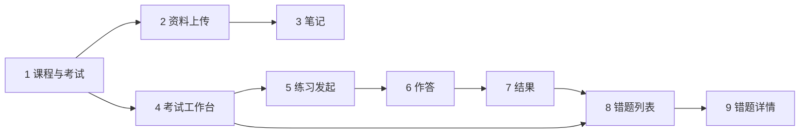

# AI StudyBuddy 前端信息架构与界面范围研究

**版本**：v0.6
**日期**：2026-07-20
**用途**：基于现有总 PRD、七子系统地图、各子系统 PRD 与当前 `packages/frontend` 路由，研究学生端信息架构、页面范围与后续界面优先级。
**范围**：研究文档，不替代子系统 PRD、独立实施计划或用户批准，不实现代码、不改变当前门禁。

---

## 0. 仓库审阅结论

本研究稿可以吸收进主系统，但应吸收的是信息架构原则和候选需求，不应把“页面数量”直接变成开发目标。

### 立即吸收的原则

- 保持“考试工作台是学习闭环枢纽”，练习、错题、任务和后续时间线从考试上下文进入。
- 保持现有 14 个路由页（13 个学习业务页 + 1 个设置页）的职责边界，不为追求页面数量重复拆分笔记、薄弱点或练习历史。
- S6 在当前阶段继续使用邮件和飞书异步报告，不新增家长登录、家长 Web 面板或公网入口。
- Phase 1-T07 已将当前课程最近 8 条学习时间线活动嵌入考试工作台；T08 已实现 `/settings` 本机配置中心；T09A–T09E 已完成学期选择、每日首页、课程课表/考试目标、全局导航、练习历史与学期归档。当前没有新的已批准信息架构实施任务。
- 学期创建、选择、切换和刷新恢复已替代“手工输入学期 UUID”的开发期交互。

### 需要独立门禁后再吸收的候选项

- T09B 每日学习首页与 T09E 练习历史/归档已按独立计划落地；后续增强仍需新任务门禁，不在本研究文档中直接扩展。
- 系统设置入口已由 T08 实现；后续只在独立任务中扩展非敏感偏好，不把 T09 页面重构混入配置中心。
- 前端视觉升级：应基于现有路由渐进实施，遵循 `docs/11-前端开发规范-Frontend-Guidelines.md`，并单独计划浏览器验收。

### 不吸收的做法

- 不把具体页面数量作为里程碑验收指标；验收应以用户闭环和任务门禁为准。
- 不在浏览器、前端日志或 `localStorage` 保存 API Key、SMTP 密码、飞书 Webhook 等秘密。
- 不因为需要配置能力就立即新增后端管理台、家长面板或 Phase 3 功能。
- 不因本研究文档继续扩展 S5、S7 或任何尚未批准的学生端页面。
- 不把“配置已填写”当作“连接可用”：AI 必须完成最小请求测试，SMTP 必须完成连接验证并提供显式测试邮件，飞书必须完成固定测试卡片发送。

---

## 1. 意图摘要

- 产品形态：**学生 Windows 本机浏览器**访问 `localhost`；后端 Express 只监听本机 API。
- 用户分工：**学生是唯一业务操作者**；家长只收邮件/飞书脱敏报告，**MVP 不需要家长登录界面**。
- 运维分工：T08 已提供统一设置入口，敏感凭据由后端 Windows 当前用户加密存储并脱敏展示；`.env.local` 只保留为开发/恢复 fallback。
- 问题拆成三档回答：
  1. **已实现**有几个学生端界面
  2. **跑通 MVP 学习闭环**最少几个界面
  3. **按 PRD 理想完整度**还缺哪些界面

**一句话结论（推荐口径）**：

| 口径 | 学生端图形界面数 | 说明 |
| ---- | ---------------- | ---- |
| 当前代码已有 | **14 个路由页 + 1 个应用壳** | 13 个学习业务页 + `/settings` 配置中心 |
| MVP 学习闭环最少 | **8–9 个** | 与当前实现基本重合；S6 不需要学生/家长 Web 页 |
| 带设置入口的当前形态 | **13 个业务页 + 1 个设置入口** | T08/M03/Post-M03 已完善安全存储、脱敏摘要与敏感输入显隐 |
| Phase 1 学生端 MVP | **14 个** | T09A–T09E 已补齐学期、首页、导航、练习历史与归档 |
| 家长端 Web 面板 | **0（MVP）** | Phase 3 才考虑；当前只发报告 |

后端本身**不需要**独立图形运维台。`/settings` 是学生本机设置页，不是远程管理后台；邮件 HTML 报告不算产品“界面页”。

---

## 2. 系统边界（为何不是「七个子系统 = 七个界面」）

```text
共同底座（无独立业务 UI）
  + S1 学习节奏  → 学生页
  + S2 资料笔记  → 学生页
  + S3 限时练习  → 学生页
  + S4 错题改错  → 学生页
  + S6 家长观察  → 异步渠道输出（邮件/飞书），MVP 无 Web 页
  + S5 期末冲刺  → 未触发，不计入 MVP 最少集
  + S7 课堂采集  → 未触发，不计入 MVP 最少集
```

信息架构原则（`docs/04` Phase 1）：页面围绕**一个考试项目工作台**组织：

```text
总览 → 资料 → 计划 → 练习 → 查漏补缺 →（预留）冲刺
```

而不是「每个数据库对象一个顶栏菜单」。

---

## 3. 当前已实现（事实基线）

来源：`packages/frontend/src/app.tsx` + `pages/*`。

| # | 路由 | 页面职责 | 子系统 |
| - | ---- | -------- | ------ |
| 壳 | App Shell | 全局导航、当前学期恢复、stale/current/404 状态 | 共同底座 |
| 1 | `/` | 当前学期每日学习首页与确定性下一步 | S1 |
| 2 | `/semesters` | 学期创建、选择、切换与非当前学期归档 | S1 |
| 3 | `/semesters/:semesterId/practice-history` | 指定学期练习历史列表与筛选 | S3 / S1 归档上下文 |
| 4 | `/semesters/:semesterId/practice-history/:sessionId` | 持久化练习结果只读查看 | S3 / S1 归档上下文 |
| 5 | `/courses` | 课程列表、创建课程/考试、考试确认入口 | S1 |
| 6 | `/materials` | 资料上传、处理状态、人工补文 | S2 |
| 7 | `/notes/:noteId` | 笔记 Markdown/KaTeX、导图、知识模块 | S2 |
| 8 | `/exams/:examId` | 单考试工作台（倒计时、任务、近期活动、练习/查漏入口） | S1 枢纽 |
| 9 | `/exams/:examId/practice` | 练习发起 | S3 |
| 10 | `/practice-sessions/:sessionId` | 限时作答 | S3 |
| 11 | `/practice-sessions/:sessionId/result` | 批改结果 | S3 |
| 12 | `/exams/:examId/mistakes` | 错题列表 + 薄弱点区块 | S4 |
| 13 | `/mistakes/:mistakeId` | 错题详情、错因确认、原题重做 | S4 |
| 14 | `/settings` | 运行状态、AI Provider、QQ SMTP、飞书 Webhook 配置与连接测试 | 共同底座 |

应用壳提供统一全局导航和当前学期恢复；练习与错题仍从**考试工作台**进入，练习历史从学期管理进入。

**已实现学生端图形界面 = 14 个路由页（+ 1 壳）。**

S6：`ParentReportService` 与 T06B 渠道投递均已完成，**无对应前端路由**——符合 PRD“家长不登录、不操作本机页面”。

---

## 4. MVP 闭环：最少界面怎么数

### 4.1 必须闭环的学生动作

```text
建课/确认考试 → 上传资料 → 看笔记/知识模块
  → 从考试工作台发起练习 → 作答 → 看结果
  → 进错题本 → 确认错因/重做
  →（后端）生成脱敏家长报告（无学生操作页）
```

### 4.2 最少界面集合（不可再合并而不伤闭环）

| # | 界面 | 能否合并？ | 理由 |
| - | ---- | ---------- | ---- |
| 1 | 课程与考试 | 否 | 创建与确认考试是入口 |
| 2 | 资料上传与状态 | 否 | 异步 Job、补文、轮询状态独立 |
| 3 | 笔记与知识模块 | 否 | 读笔记/导图/模块，与上传态不同 |
| 4 | 考试工作台 | **强烈建议保留** | Phase 1 枢纽；倒计时 + 任务 + 分区入口 |
| 5 | 练习发起 | 可与工作台「练习区」同页，但需独立 URL 状态 | 选模块/参数/生成中 |
| 6 | 练习作答 | 否 | 限时、草稿、提交，全屏专注 |
| 7 | 练习结果 | 否 | 批改详情与作答态分离 |
| 8 | 错题列表 | 否 | 筛选、薄弱点、待复盘 |
| 9 | 错题详情/改错 | 否 | 错因、重做、证据时间线 |
| 已实现 | 系统配置中心/首次配置提示 | Phase 1-T08 已完成，计为 1 个设置页 | AI、SMTP、飞书分别测试；普通设置与秘密分离；敏感凭据只由后端保存和使用 |

**结论 A — MVP 学习闭环最少学生界面：8–9 个。**
当前仓库已有 13 个学习业务路由和 1 个 `/settings` 设置页。若强行把「练习发起」嵌进工作台且不单独路由，学习业务路由可算 **8**，但实现与验收成本更高，不推荐再砍。

**结论 B — 统一配置中心已由 Phase 1-T08 完成；它的完成标准不是“多一个页面”，而是配置保存、后端安全存储、连接测试、状态门禁和失败降级全部可验收。**

### 4.3 明确不计入「最少图形界面」的部分

| 能力 | 为何不算独立 GUI |
| ---- | ---------------- |
| 后端 API / Worker / SQLite | 无界面服务 |
| S6 日报/周报/月报/考前提醒 | 渠道产出（邮件 HTML / 飞书卡片），非本机 Web 页 |
| 纯后端内部开关 | 可继续留在配置文件 / 环境变量 / 日志里 |
| 家长邮箱、飞书 Webhook、API Key、模型选择、连通性测试 | 可由统一设置入口承载，但秘密必须由后端安全处理，并经过独立门禁 |

### 4.5 本机配置中心的产品边界

首次启动可以进入配置中心，后端不因缺少 AI Key、SMTP 或飞书配置而无法启动。磁盘持久态只有“未配置”和“验证通过”；“测试中/本次测试失败”是页面瞬时状态，失败候选不会落盘。

前端只提交一次性输入并读取脱敏状态，不读取完整秘密。普通设置可以保存为全局配置；API Key、SMTP 授权码和飞书 Webhook URL 必须由后端保存到 Windows 当前用户可解密的加密存储，不能写入 `localStorage`、前端日志、报告正文或 API 响应。

保存和测试流程固定为：输入 → 后端内存测试 → 测试成功后原子保存/激活。AI 测试发送最小请求；SMTP 同时提供连接验证和显式测试邮件；飞书发送固定测试卡片；测试内容不得包含学生资料、笔记、题目、答案或真实学习报告。

配置门禁按能力隔离：AI 未验证时，规则功能可用但 AI 依赖功能必须明确提示；SMTP 失败不阻断飞书；飞书失败不阻断 SMTP；双渠道不可用时仍生成并保留本机脱敏报告，不自动发送。

### 4.4 阶段-界面映射表（研发排期版）

> 下面按**累计交付**写法：每个阶段结束时，前端应该已经具备哪些可见图形界面。

| 阶段 | 该阶段应交付的界面 | 累计界面数 | 排期说明 |
| ---- | ------------------ | ---------- | -------- |
| Phase 0.5 | 无正式业务 GUI | 0 | 先把外部组件能力验证清楚，不进产品页。 |
| Phase 0.7 | 无正式业务 GUI | 0 | 继续验证本机底座、家长报告通道和运维可用性。 |
| Phase 0.8 | 课程与考试、资料上传、笔记与知识模块、考试工作台 | 4 | 先跑通最小学习闭环的“看、传、读、总览”四页。 |
| Phase 1 功能核心（至 T08） | 练习发起、作答、结果、错题列表、详情/改错、设置中心 | 10 | 已补齐“练、判、改”和本机配置闭环。 |
| Phase 1 学生端产品化（T09A–T09E） | 学期管理、每日首页、全局导航、练习历史与归档查看 | 14 | 已完成主线集成、复验并推送 `origin/master`。 |
| Phase 1.5 | 录音上传/转写页 | 15 | 只在 S7 触发时加入，面向课堂录音输入链路。 |
| Phase 2 | 模拟考、临考速背、冲刺计划 | 16–18 | 进入考试冲刺后补足高频复习与模拟训练入口。 |
| Phase 3 | 设置与安全能力；家长面板仍需重新决策 | 以获批计划为准 | 设置入口、安全存储和家长面板不是同一任务，不应打包实施。 |

**排期口径建议：**
- 如果目标是“功能核心能运行”，T08 时点的 10 页已覆盖 S1–S4 和配置中心。
- 如果目标是“学生端可交付 MVP”，当前 14 页已完成 T09A–T09E 学期、首页、导航、练习历史与归档闭环。
- 如果目标是“按 PRD 补全”，再往 Phase 1.5 / Phase 2 延展。

---

## 5. 按 PRD 的「完整理想」页面清单（对照缺口）

### 5.1 各子系统 PRD 草案页 vs 现状

| 子系统 | PRD 草案界面 | 当前代码 | 缺口 |
| ------ | ------------ | -------- | ---- |
| S1 | 学期开始向导 | ✅ `/semesters` | — |
| S1 | 每日学习首页 | ✅ `/` | — |
| S1 | 课程与课表 | ✅ `/courses` | — |
| S1 | 考试目标 | ✅ `/courses` + 考试工作台 | — |
| S1 | 学习时间线 | ✅ 工作台“近期学习活动”（T07，无独立路由） | — |
| S1 | 学期归档 | ✅ `/semesters`，归档后只读 | — |
| S1 | 考试工作台 | ✅ `/exams/:examId` | — |
| S2 | 资料上传 | ✅ | — |
| S2 | 笔记 + 导图 + 知识模块 | ✅ 合成一页 | PRD 可拆但一页足够 |
| S3 | 练习发起 / 作答 / 结果 | ✅ | — |
| S3 | 练习历史 | ✅ 两个学期上下文只读路由 | — |
| S4 | 错题列表 / 详情改错 / 薄弱点 | ✅（薄弱点在列表区） | — |
| S4 | 工作台「查漏补缺」 | ✅ 入口 | — |
| S6 | 前端页 | ❌ 且 **MVP 明确不做** | 正确为空 |
| S5 | 模拟考 / 速背 / 冲刺 | 未触发 | 不计 MVP |
| S7 | 录音上传与转写 | 未触发 | 不计 MVP |

### 5.2 完整理想 MVP 学生端粗算

T09A–T09E 已将学期向导、每日首页、完整课程课表/考试目标、全局导航、练习历史与学期归档纳入当前 14 个路由。T07 的近期学习时间线继续嵌入考试工作台，不单独增加路由。

因此当前 Phase 1 学生端 MVP 的事实口径是 **14 个独立路由 + 1 个应用壳**；任何新增独立页面都属于后续获批任务，而不是本研究稿自动产生的缺口。

---

## 6. 推荐数字（给研发 / 评审直接用）

### 6.1 对外一句话

> **当前已有 14 个本机 Web 路由，T09A–T09E 学生端产品化已完成；家长端仍为 0 个 Web 界面。**

### 6.2 分层数字

| 层级 | 图形界面数 | 清单 |
| ---- | ---------- | ---- |
| L0 后端服务 | 0 | API + Worker |
| L1 当前已实现 | 14 | 见 §3 |
| L2 MVP 闭环下限 | 8–9 | 见 §4.2 |
| L3 当前设置形态 | 13 + 1 个设置入口 | T08/M03/Post-M03 已实现 |
| L4 Phase 1 学生 MVP | 14 | T09A–T09E 已完成；近期时间线嵌入工作台 |
| L5 Phase 2（+S5） | L4 + 2–4 | 模拟考、速背、冲刺区 |
| L6 Phase 3 家长面板 | +1–3 | 登录、报告历史、仪表盘（非当前主线） |

### 6.3 依赖关系（砍页时不能砍错）



缺 **4 工作台** 会让练习/错题入口散乱；缺 **6/7** 无法验收限时练习；缺 **8/9** 无法验收改错闭环。

---

## 7. 与「前后端各配几个」的澄清

| 端 | 最少图形界面 | 说明 |
| -- | ------------ | ---- |
| **前端（当前学生 Web）** | **14** | 已实现 13 个学习业务路由页和 1 个设置页 |
| **后端** | **0** | 无管理后台需求；健康检查可用 curl/日志 |
| **家长渠道** | **0 Web 页** | 邮件/飞书；HTML 报告模板 ≠ 产品页面 |
| **运维/本机维护者** | **0 独立后台** | 使用学生本机 `/settings` 与脚本，无远程管理台 |

不要理解为「前端 7 个 + 后端 7 个」。正确是：**一套本机 Web 前端服务全部学生场景，后端纯 API。**

---

## 8. 开放问题 / TODO

- [x] **默认首页**：T09B 已将 `/` 实现为当前学期每日学习首页。
- [x] **学期 ID 壳下一步**：T09A 已用 `/semesters` 学期创建/选择替换手输 UUID，并由后端 current 恢复。
- [x] **练习历史**：T09E 已提供学期上下文的独立列表与结果只读路由。
- [ ] **薄弱点**：是否从错题列表拆成独立页？（当前合页可接受）
- [x] **系统配置页结构**：采用一个配置中心，分为 AI Provider、家长通知渠道、运行状态三个分区；秘密不回显，测试按 Provider/SMTP/飞书分别执行。
- [ ] **Phase 3 家长面板**是否仍坚持「不登录」主线，还是允许只读报告站？（当前文档倾向不做）

---

## 9. 后续使用方式

1. Phase 1-T07 已完成：学习时间线以考试工作台“近期学习活动”落地，不新增独立时间线路由。
2. Phase 1-T08/M03/Post-M03 已完成：`/settings` 提供运行状态、Provider/通知渠道配置、安全摘要与敏感输入显隐。
3. Phase 1-T09A–T09E 已完成：学期、每日首页、课程课表/考试目标、全局学生旅程、练习历史与归档均已进入 `origin/master`。
4. 当前没有新的已批准信息架构实施任务；不为 S6 单独创建家长 Web 面板，除非未来明确批准 Phase 3 范围。

---

## 10. 依据文档

- `docs/01-总PRD-产品需求-Product-Requirements.md`
- `docs/02-七子系统地图-Scenario-Systems.md`
- `docs/04-开发任务清单-Todo-List.md`
- `docs/11-前端开发规范-Frontend-Guidelines.md`
- `docs/subsystems/03-S1…S4`、`06-S6-…`
- `packages/frontend/src/app.tsx`
