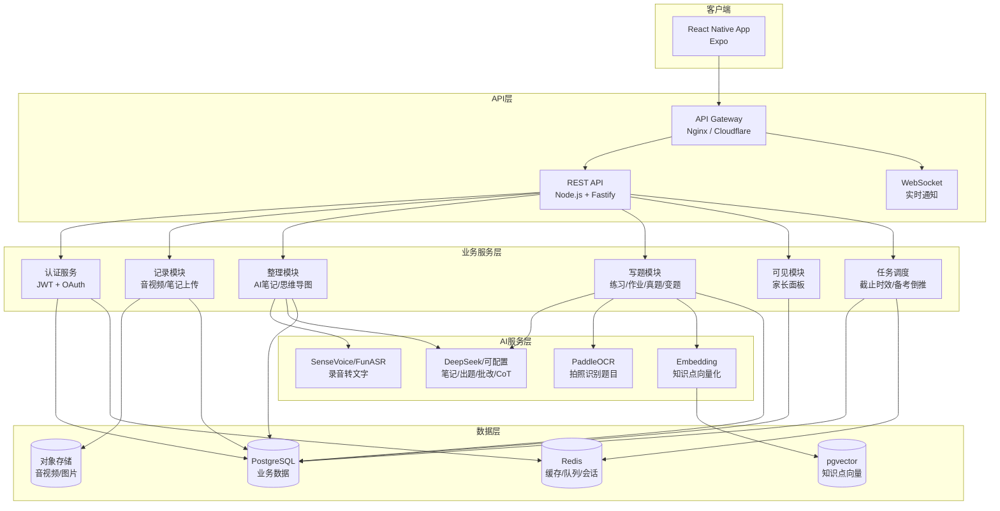
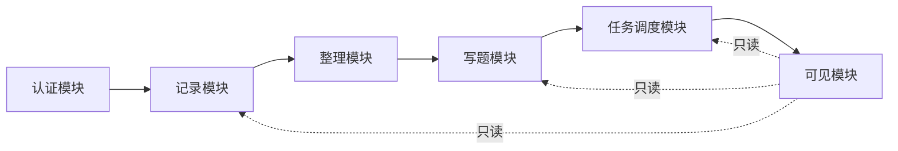
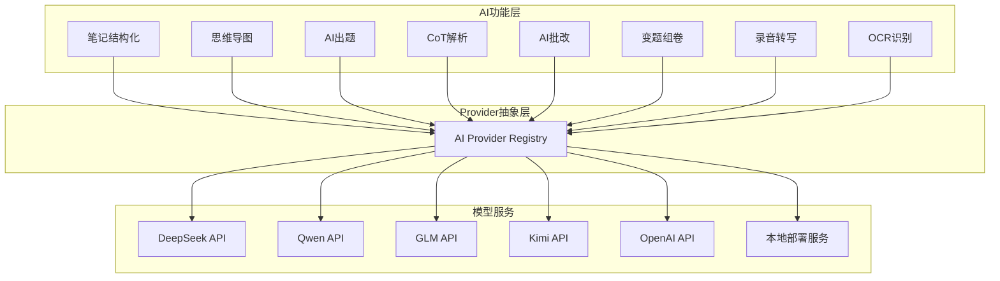
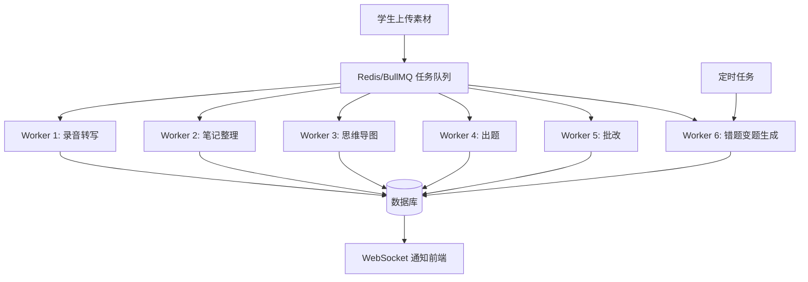

# AI StudyBuddy 技术架构文档

**版本**：v1.0
**日期**：2026-07-06
**状态**：初版

---

## 一、系统总览



---

## 二、技术栈选型

| 层级 | 技术 | 选型理由 |
|------|------|----------|
| 移动端 | React Native + Expo | 跨平台，一套代码iOS/Android，生态成熟，热更新 |
| 后端框架 | Node.js + Fastify | 高性能，TypeScript全栈统一，插件体系简洁 |
| 数据库 | PostgreSQL + pgvector | 关系型主库 + 向量扩展，一套搞定业务数据和知识点检索 |
| ORM | Drizzle ORM | 类型安全，迁移友好，与TypeScript深度集成 |
| 缓存/队列 | Redis + BullMQ | AI任务异步队列，录音转写/笔记整理后台处理 |
| 对象存储 | MinIO（自部署）/ AWS S3 | 音视频、图片、PDF等大文件存储 |
| 录音转写 | SenseVoice-Small / FunASR（阿里开源，自部署） | 中文CER 3%（Whisper是5%），CPU可跑，免费 |
| LLM | DeepSeek V4系列（可配置替换） | 性价比极高，支持OpenAI兼容API，用户可自接入 |
| OCR | PaddleOCR v6（百度开源，自部署） | 中文识别97.3%，开源免费 |
| 部署 | Docker + Docker Compose | 一键部署全栈服务，开发和生产一致 |
| CI/CD | GitHub Actions | 自动测试、构建、部署 |

---

## 三、模块拆分

### 3.1 模块总览



### 3.2 认证模块（auth）

**职责**：用户注册、登录、家庭空间绑定、权限控制

| 功能 | 说明 |
|------|------|
| 注册/登录 | 手机号 + 验证码，或邮箱密码 |
| 家庭空间 | 学生创建空间，生成邀请码，家长扫码加入 |
| 角色权限 | student（读写）/ parent（只读） |
| Token | JWT，access token 15min + refresh token 7d |

**关键表**：`users`, `family_spaces`, `space_members`

### 3.3 记录模块（record）

**职责**：课堂素材的采集、上传、存储管理

| 功能 | 说明 |
|------|------|
| 录音 | 前端录音，分段上传（避免大文件一次传），后台合并 |
| 视频 | 可选，支持摄像头和屏幕录制 |
| 笔记 | 富文本编辑器，支持手写识别、图片插入 |
| 链接保存 | URL → 抓取标题+摘要 → 存入资料库 |
| 课次管理 | 按课程/日期组织素材，一个课次对应多个素材 |

**关键表**：`courses`, `sessions`（课次）, `recordings`, `notes`, `links`

> 说明：图片类附件（手写笔记原图等）不建独立 `attachments` 表，作为 JSONB 字段挂在归属表上（如 `notes.raw_images`），减少表数量、避免过度建表。

### 3.4 整理模块（organize）

**职责**：调用AI服务，将原始素材转化为结构化学习材料

**分类层级**：所有整理结果按 **课程（学科）→ 课次（日期）→ 整理产物** 三级归档。课程是顶层分类，一个课程对应一个学科。AI整理时注入课程上下文（课程名、课次主题），让输出更精准。

| 功能 | 说明 |
|------|------|
| 录音转写 | SenseVoice/FunASR → 带时间戳的文字稿 |
| 结构化笔记 | LLM基于转写+手写笔记+课程上下文，生成章节化Markdown文档 |
| 思维导图 | LLM提取知识点层级，输出Mermaid/JSON格式思维导图 |
| 重点高亮 | LLM标注核心定义、公式、高频考点 |
| 课程整合 | 将录音/笔记/链接聚合到同一课次视图 |
| 跨课次串联 | 同课程多课次笔记可生成“章节总复习”思维导图（进阶） |

**关键表**：`transcripts`, `structured_notes`, `mind_maps`

> 说明：`highlights`（重点高亮）不建独立表，是 `structured_notes.highlights` 字段（JSONB），与结构化笔记同源同生命周期。

**异步流程**：素材上传 → 写入Redis队列 → Worker消费 → 调用AI → 结果写回DB → 通知前端完成

### 3.5 写题模块（quiz）

**职责**：题目生成、练习管理、作业跟踪、AI批改、CoT解析、错题本间隔复习（艾宾浩斯曲线）

| 子模块 | 说明 |
|--------|------|
| 平时练习（daily） | 基于笔记内容AI出题，48小时时效 |
| 老师作业（homework） | 学生录入+拍照OCR，记录截止时间，AI批改 |
| 真题解析（past-exam） | 上传真题，CoT八步解析重生成 |
| 变题组卷（mock-exam） | 基于真题分布变题，限时考试，自动批改 |
| 批改引擎（grader） | 统一入口：所有提交都走AI批改+CoT解析 |
| 错题本（error-book） | 所有错题自动沉淀，艾宾浩斯间隔复习、原题重做+AI变题练习、考前优先推送 |

**关键表**：`questions`, `question_sets`, `submissions`, `grading_results`, `homework`, `past_exams`, `mock_exams`, `mock_exam_sessions`, `error_questions`, `error_reviews`, `error_review_schedules`

### 3.6 任务调度模块（task）

**职责**：截止时间管理、备考计划倒推、超时预警

| 功能 | 说明 |
|------|------|
| 任务注册 | 所有类型的任务统一注册，带截止时间 |
| 状态流转 | pending → in_progress → submitted → graded / overdue |
| 备考倒推 | 考试日期 - 2个月 → 自动分配每日任务量 |
| 超时检测 | 定时扫描，超时任务标记overdue，推送提醒 |

**关键表**：`tasks`, `exam_schedules`, `study_plans`

### 3.7 可见模块（visibility）

**职责**：家长只读面板，任务完成时间线展示

| 功能 | 说明 |
|------|------|
| 时间线 | 任务名 + 截止时间 + 实际完成时间 + 状态，统一列表 |
| 状态过滤 | 今天/本周/本月，及时/迟交/未提交 |
| 进度趋势 | 完成任务数量的时间曲线（孩子有没有在坚持） |
| 备考看板 | 备考任务分配表 + 当前完成进度 |
| 鼓励点赞 | 家长对已完成任务点赞，学生端展示“爸爸/妈妈给你点了个赞” |

**权限控制**：家长只能调用GET接口，看不到题目内容、答案、分数，只看到完成状态和时间戳

---

## 四、数据库设计

### 4.1 核心表结构

```sql
-- ==============================
-- 认证与家庭空间
-- ==============================

CREATE TABLE users (
    id UUID PRIMARY KEY DEFAULT gen_random_uuid(),
    phone VARCHAR(20) UNIQUE,
    email VARCHAR(255) UNIQUE,
    password_hash VARCHAR(255),
    display_name VARCHAR(100) NOT NULL,
    avatar_url TEXT,
    role VARCHAR(20) NOT NULL DEFAULT 'student', -- student | parent
    created_at TIMESTAMPTZ DEFAULT NOW(),
    updated_at TIMESTAMPTZ DEFAULT NOW()
);

CREATE TABLE family_spaces (
    id UUID PRIMARY KEY DEFAULT gen_random_uuid(),
    name VARCHAR(100) NOT NULL,           -- 如"张家学习空间"
    invite_code VARCHAR(8) UNIQUE NOT NULL, -- 家长扫码用的邀请码
    created_by UUID REFERENCES users(id),
    created_at TIMESTAMPTZ DEFAULT NOW()
);

CREATE TABLE space_members (
    id UUID PRIMARY KEY DEFAULT gen_random_uuid(),
    space_id UUID REFERENCES family_spaces(id) ON DELETE CASCADE,
    user_id UUID REFERENCES users(id) ON DELETE CASCADE,
    role VARCHAR(20) NOT NULL, -- student | parent
    joined_at TIMESTAMPTZ DEFAULT NOW(),
    UNIQUE(space_id, user_id)
);

-- ==============================
-- 课程与课次
-- ==============================

CREATE TABLE courses (
    id UUID PRIMARY KEY DEFAULT gen_random_uuid(),
    space_id UUID REFERENCES family_spaces(id),
    user_id UUID REFERENCES users(id),  -- 所属学生
    name VARCHAR(200) NOT NULL,         -- 如"高等数学(下)"
    teacher VARCHAR(100),
    semester VARCHAR(50),               -- 如"2026春"
    schedule JSONB,                     -- 上课时间 {"weekday":1,"period":"1-2","time":"08:00"}
    created_at TIMESTAMPTZ DEFAULT NOW()
);

CREATE TABLE sessions (  -- 课次：一次上课 = 一个session
    id UUID PRIMARY KEY DEFAULT gen_random_uuid(),
    course_id UUID REFERENCES courses(id) ON DELETE CASCADE,
    date DATE NOT NULL,
    topic VARCHAR(300),                 -- 本课次主题
    status VARCHAR(20) DEFAULT 'recording', -- recording | uploaded | processing | done
    created_at TIMESTAMPTZ DEFAULT NOW()
);

-- ==============================
-- 记录素材
-- ==============================

CREATE TABLE recordings (
    id UUID PRIMARY KEY DEFAULT gen_random_uuid(),
    session_id UUID REFERENCES sessions(id) ON DELETE CASCADE,
    type VARCHAR(20) NOT NULL, -- audio | video | screen
    file_url TEXT NOT NULL,    -- S3/MinIO 路径
    duration_sec INT,
    file_size_bytes BIGINT,
    status VARCHAR(20) DEFAULT 'uploaded', -- uploaded | transcribing | done | failed
    created_at TIMESTAMPTZ DEFAULT NOW()
);

CREATE TABLE transcripts (
    id UUID PRIMARY KEY DEFAULT gen_random_uuid(),
    recording_id UUID REFERENCES recordings(id) ON DELETE CASCADE,
    text TEXT NOT NULL,          -- 完整转写文本
    segments JSONB,              -- [{start:0,end:10,text:"..."},...] 带时间戳分段
    language VARCHAR(10) DEFAULT 'zh',
    created_at TIMESTAMPTZ DEFAULT NOW()
);

CREATE TABLE notes (
    id UUID PRIMARY KEY DEFAULT gen_random_uuid(),
    session_id UUID REFERENCES sessions(id) ON DELETE CASCADE,
    content TEXT NOT NULL,       -- 手写识别后的文本
    raw_images JSONB,            -- 手写原图URL列表
    created_at TIMESTAMPTZ DEFAULT NOW(),
    updated_at TIMESTAMPTZ DEFAULT NOW()
);

CREATE TABLE links (
    id UUID PRIMARY KEY DEFAULT gen_random_uuid(),
    session_id UUID REFERENCES sessions(id) ON DELETE CASCADE,
    url TEXT NOT NULL,
    title VARCHAR(300),          -- 自动抓取的标题
    summary TEXT,                -- 自动抓取的摘要
    created_at TIMESTAMPTZ DEFAULT NOW()
);

-- ==============================
-- AI整理结果
-- ==============================

CREATE TABLE structured_notes (
    id UUID PRIMARY KEY DEFAULT gen_random_uuid(),
    session_id UUID REFERENCES sessions(id) ON DELETE CASCADE,
    content TEXT NOT NULL,       -- Markdown格式的结构化笔记
    highlights JSONB,            -- [{text:"...",type:"definition|formula|key_point"},...]
    status VARCHAR(20) DEFAULT 'pending', -- pending | processing | done | failed
    model_used VARCHAR(100),
    created_at TIMESTAMPTZ DEFAULT NOW(),
    updated_at TIMESTAMPTZ DEFAULT NOW()
);

CREATE TABLE mind_maps (
    id UUID PRIMARY KEY DEFAULT gen_random_uuid(),
    session_id UUID REFERENCES sessions(id) ON DELETE CASCADE,
    content JSONB NOT NULL,      -- 树形结构 {title,children:[{title,children:[...]}]}
    mermaid TEXT,                -- Mermaid格式，方便前端渲染
    model_used VARCHAR(100),
    created_at TIMESTAMPTZ DEFAULT NOW()
);

-- ==============================
-- 题库与题目
-- ==============================

CREATE TABLE questions (
    id UUID PRIMARY KEY DEFAULT gen_random_uuid(),
    course_id UUID REFERENCES courses(id),
    session_id UUID REFERENCES sessions(id), -- 来源课次（可为null，如真题）
    type VARCHAR(30) NOT NULL,   -- choice | fill | short_answer
    content TEXT NOT NULL,       -- 题目内容（Markdown/LaTeX）
    options JSONB,               -- 选择题选项 [{key:"A",text:"..."},...]
    answer TEXT,                 -- 标准答案
    explanation TEXT,            -- AI生成的CoT解析
    difficulty VARCHAR(10),      -- easy | medium | hard
    knowledge_points JSONB,      -- 关联知识点列表
    source VARCHAR(50),          -- ai_generated | homework | past_exam | mock
    source_ref UUID,             -- 来源ID（如past_exam.id）
    embedding VECTOR(1536),      -- 知识点向量，用于相似题检索
    created_at TIMESTAMPTZ DEFAULT NOW()
);

CREATE TABLE question_sets (  -- 题组：练习/作业/真题卷/模拟卷
    id UUID PRIMARY KEY DEFAULT gen_random_uuid(),
    course_id UUID REFERENCES courses(id),
    type VARCHAR(30) NOT NULL,   -- daily_practice | homework | past_exam | mock_exam
    title VARCHAR(200) NOT NULL,
    questions JSONB NOT NULL,    -- [{question_id, order},...]
    deadline TIMESTAMPTZ,        -- 截止时间
    duration_min INT,            -- 限时考试时长（分钟），null表示不限时
    total_score INT,
    created_at TIMESTAMPTZ DEFAULT NOW()
);

-- ==============================
-- 作业（老师布置）
-- ==============================

CREATE TABLE homework (
    id UUID PRIMARY KEY DEFAULT gen_random_uuid(),
    course_id UUID REFERENCES courses(id),
    user_id UUID REFERENCES users(id),
    title VARCHAR(200) NOT NULL,
    content TEXT NOT NULL,           -- 作业内容（手动输入或OCR结果）
    source_images JSONB,             -- 拍照原图URL列表
    deadline TIMESTAMPTZ NOT NULL,   -- 截止时间，必填
    question_set_id UUID REFERENCES question_sets(id), -- AI批改后关联的题组
    created_at TIMESTAMPTZ DEFAULT NOW()
);

-- ==============================
-- 提交与批改
-- ==============================

CREATE TABLE submissions (
    id UUID PRIMARY KEY DEFAULT gen_random_uuid(),
    user_id UUID REFERENCES users(id),
    question_set_id UUID REFERENCES question_sets(id),
    homework_id UUID REFERENCES homework(id), -- 关联作业（可选）
    answers JSONB NOT NULL,       -- [{question_id, answer_text, selected_option},...]
    status VARCHAR(20) DEFAULT 'submitted', -- submitted | grading | graded | overdue
    submitted_at TIMESTAMPTZ DEFAULT NOW(),
    time_spent_sec INT            -- 答题耗时（秒）
);

CREATE TABLE grading_results (
    id UUID PRIMARY KEY DEFAULT gen_random_uuid(),
    submission_id UUID REFERENCES submissions(id) ON DELETE CASCADE,
    total_score DECIMAL(5,2),
    max_score DECIMAL(5,2),
    details JSONB NOT NULL,      -- [{question_id,is_correct,score,cot_explanation},...]
    weak_points JSONB,           -- AI识别的薄弱知识点
    model_used VARCHAR(100),
    graded_at TIMESTAMPTZ DEFAULT NOW()
);

-- ==============================
-- 真题与模拟卷
-- ==============================

CREATE TABLE past_exams (
    id UUID PRIMARY KEY DEFAULT gen_random_uuid(),
    course_id UUID REFERENCES courses(id),
    user_id UUID REFERENCES users(id),
    title VARCHAR(200) NOT NULL,     -- 如"高数2025秋季期末真题"
    year INT,
    semester VARCHAR(20),
    raw_images JSONB,                -- 真题原图
    question_set_id UUID REFERENCES question_sets(id), -- CoT解析后的题组
    status VARCHAR(20) DEFAULT 'uploaded', -- uploaded | parsing | parsed | failed
    created_at TIMESTAMPTZ DEFAULT NOW()
);

CREATE TABLE mock_exams (
    id UUID PRIMARY KEY DEFAULT gen_random_uuid(),
    course_id UUID REFERENCES courses(id),
    user_id UUID REFERENCES users(id),
    past_exam_id UUID REFERENCES past_exams(id), -- 基于哪套真题变题
    question_set_id UUID REFERENCES question_sets(id),
    config JSONB NOT NULL,           -- {difficulty_ratio:{easy:0.3,medium:0.5,hard:0.2},type_ratio:{...}}
    status VARCHAR(20) DEFAULT 'generating', -- generating | ready | in_progress | completed
    created_at TIMESTAMPTZ DEFAULT NOW()
);

CREATE TABLE mock_exam_sessions ( -- 限时考试会话
    id UUID PRIMARY KEY DEFAULT gen_random_uuid(),
    mock_exam_id UUID REFERENCES mock_exams(id),
    user_id UUID REFERENCES users(id),
    started_at TIMESTAMPTZ NOT NULL,
    deadline_at TIMESTAMPTZ NOT NULL, -- 开始时间 + duration
    auto_submitted BOOLEAN DEFAULT FALSE,
    submission_id UUID REFERENCES submissions(id),
    created_at TIMESTAMPTZ DEFAULT NOW()
);

-- ==============================
-- 任务与备考调度
-- ==============================

CREATE TABLE tasks (
    id UUID PRIMARY KEY DEFAULT gen_random_uuid(),
    space_id UUID REFERENCES family_spaces(id),
    user_id UUID REFERENCES users(id),    -- 所属学生
    type VARCHAR(30) NOT NULL,            -- recording_upload | daily_practice | homework | past_exam | mock_exam
    title VARCHAR(200) NOT NULL,
    ref_id UUID,                          -- 关联的session_id/question_set_id/homework_id等
    deadline TIMESTAMPTZ NOT NULL,
    status VARCHAR(20) DEFAULT 'pending', -- pending | in_progress | submitted | graded | overdue | skipped
    completed_at TIMESTAMPTZ,
    created_at TIMESTAMPTZ DEFAULT NOW()
);

CREATE TABLE exam_schedules (
    id UUID PRIMARY KEY DEFAULT gen_random_uuid(),
    course_id UUID REFERENCES courses(id),
    user_id UUID REFERENCES users(id),
    exam_date DATE NOT NULL,
    exam_type VARCHAR(30),         -- midterm | final | quiz | other
    title VARCHAR(200),
    alert_at DATE,                 -- 预警期起点 = exam_date - 60天，触发真题上传+CoT解析
    sprint_at DATE,                -- 冲刺期起点 = exam_date - 30天，触发集中刷变题模拟卷
    created_at TIMESTAMPTZ DEFAULT NOW()
);

CREATE TABLE study_plans (
    id UUID PRIMARY KEY DEFAULT gen_random_uuid(),
    exam_schedule_id UUID REFERENCES exam_schedules(id),
    user_id UUID REFERENCES users(id),
    start_date DATE NOT NULL,      -- 备考开始日期（= alert_at，预警期起点）
    sprint_date DATE NOT NULL,     -- 冲刺期起点（= sprint_at），从这天起任务重心转向变题模拟卷
    end_date DATE NOT NULL,        -- 考试日期
    phase VARCHAR(20) DEFAULT 'alert', -- alert（预警期，真题解析为主）| sprint（冲刺期，变题模拟卷为主），按当前日期与 sprint_date 比较得出，可由定时任务每日刷新
    daily_tasks JSONB,             -- 每天分配的任务量 {past_exams_per_day, mocks_per_day}，两阶段比例不同（预警期真题为主，冲刺期变题为主）
    status VARCHAR(20) DEFAULT 'active',
    created_at TIMESTAMPTZ DEFAULT NOW()
);

-- ==============================
-- 家长鼓励
-- ==============================

CREATE TABLE encouragements (
    id UUID PRIMARY KEY DEFAULT gen_random_uuid(),
    space_id UUID REFERENCES family_spaces(id),
    task_id UUID REFERENCES tasks(id) ON DELETE CASCADE,
    from_user UUID REFERENCES users(id),  -- 家长
    to_user UUID REFERENCES users(id),    -- 学生
    created_at TIMESTAMPTZ DEFAULT NOW(),
    UNIQUE(task_id, from_user)            -- 每个家长对每个任务只能点一次赞
);

-- ==============================
-- 错题本
-- ==============================

CREATE TABLE error_questions (
    id UUID PRIMARY KEY DEFAULT gen_random_uuid(),
    user_id UUID REFERENCES users(id) ON DELETE CASCADE,
    question_id UUID REFERENCES questions(id),
    submission_id UUID REFERENCES submissions(id),
    course_id UUID REFERENCES courses(id),           -- 所属学科（课程），方便按科目筛选
    source_type VARCHAR(30) NOT NULL,     -- daily_practice | homework | past_exam | mock_exam
    source_ref UUID,                      -- 来源ID（question_set_id/homework_id等）
    student_answer TEXT,                  -- 学生的答案
    correct_answer TEXT,                  -- 正确答案
    cot_explanation TEXT,                 -- CoT解析
    error_type VARCHAR(30),               -- knowledge_gap | misread | calculation | misunderstanding | unable
    knowledge_points JSONB,               -- 涉及的知识点
    status VARCHAR(20) DEFAULT 'unresolved', -- unresolved | reviewing | mastered
    -- 艾宾浩斯间隔复习字段
    review_stage INT DEFAULT 0,           -- 当前复习轮次（0=未复习，1-6对应六轮）
    consecutive_correct INT DEFAULT 0,    -- 连续做对次数（≥3则掌握）
    next_review_date DATE,                -- 下次复习日期（系统自动计算）
    current_interval_days INT DEFAULT 1,  -- 当前复习间隔（天）
    mastered_at TIMESTAMPTZ,              -- 掌握时间
    created_at TIMESTAMPTZ DEFAULT NOW(),
    updated_at TIMESTAMPTZ DEFAULT NOW()
);

CREATE TABLE error_reviews (            -- 错题复习记录
    id UUID PRIMARY KEY DEFAULT gen_random_uuid(),
    error_question_id UUID REFERENCES error_questions(id) ON DELETE CASCADE,
    user_id UUID REFERENCES users(id),
    review_stage INT NOT NULL,           -- 第几轮复习
    review_type VARCHAR(20) NOT NULL,     -- original（原题重做）| variation（变题练习）
    variation_question_id UUID REFERENCES questions(id), -- 变题关联的题目（仅review_type=variation时）
    retry_answer TEXT,                    -- 重做时的答案
    is_correct BOOLEAN NOT NULL,          -- 这次做对了吗
    created_at TIMESTAMPTZ DEFAULT NOW()
);

CREATE TABLE error_review_schedules (   -- 每日复习排程（系统自动生成）
    id UUID PRIMARY KEY DEFAULT gen_random_uuid(),
    user_id UUID REFERENCES users(id) ON DELETE CASCADE,
    error_question_id UUID REFERENCES error_questions(id) ON DELETE CASCADE,
    scheduled_date DATE NOT NULL,         -- 计划复习日期
    review_type VARCHAR(20) NOT NULL,     -- original | variation
    status VARCHAR(20) DEFAULT 'pending', -- pending | completed | skipped
    completed_at TIMESTAMPTZ,
    created_at TIMESTAMPTZ DEFAULT NOW()
);
```

### 4.2 索引策略

```sql
-- 高频查询索引
CREATE INDEX idx_sessions_course_date ON sessions(course_id, date DESC);
CREATE INDEX idx_tasks_user_status ON tasks(user_id, status, deadline);
CREATE INDEX idx_tasks_space_deadline ON tasks(space_id, deadline);
CREATE INDEX idx_submissions_user_set ON submissions(user_id, question_set_id);
CREATE INDEX idx_questions_course_type ON questions(course_id, source);
CREATE INDEX idx_questions_embedding ON questions USING ivfflat (embedding vector_cosine_ops);
CREATE INDEX idx_family_spaces_invite ON family_spaces(invite_code);
CREATE INDEX idx_space_members_space ON space_members(space_id);
CREATE INDEX idx_exam_schedules_date ON exam_schedules(user_id, exam_date);
CREATE INDEX idx_encouragements_task ON encouragements(task_id);
CREATE INDEX idx_encouragements_to_user ON encouragements(to_user, created_at DESC);
CREATE INDEX idx_error_questions_user_status ON error_questions(user_id, status, created_at DESC);
CREATE INDEX idx_error_questions_knowledge ON error_questions(user_id) WHERE status != 'mastered';
CREATE INDEX idx_error_questions_course ON error_questions(user_id, course_id, status);
CREATE INDEX idx_error_questions_review_date ON error_questions(user_id, next_review_date) WHERE status != 'mastered';
CREATE INDEX idx_error_review_schedules_user_date ON error_review_schedules(user_id, scheduled_date, status);
```

---

## 五、API 设计

RESTful风格，统一前缀 `/api/v1`

### 5.1 认证 API

```
POST   /api/v1/auth/register          注册（手机号/邮箱）
POST   /api/v1/auth/login             登录
POST   /api/v1/auth/refresh           刷新Token
POST   /api/v1/auth/sms/send          发送验证码
```

### 5.2 家庭空间 API

```
POST   /api/v1/spaces                 创建家庭空间
POST   /api/v1/spaces/join            加入空间（邀请码）
GET    /api/v1/spaces/:id             获取空间详情
GET    /api/v1/spaces/:id/members     获取成员列表
```

### 5.3 课程与课次 API

```
POST   /api/v1/courses                创建课程
GET    /api/v1/courses                获取我的课程列表
GET    /api/v1/courses/:id            获取课程详情
PATCH  /api/v1/courses/:id            更新课程
DELETE /api/v1/courses/:id            删除课程

POST   /api/v1/courses/:id/sessions          创建课次
GET    /api/v1/courses/:id/sessions          获取课次列表
GET    /api/v1/sessions/:id                  获取课次详情（含所有素材）
```

### 5.4 记录 API

```
POST   /api/v1/sessions/:id/recordings       上传录音/视频（分片上传）
GET    /api/v1/sessions/:id/recordings       获取课次录音列表

POST   /api/v1/sessions/:id/notes            保存笔记
PATCH  /api/v1/notes/:id                     更新笔记

POST   /api/v1/sessions/:id/links            保存链接
GET    /api/v1/sessions/:id/links            获取课次链接列表
```

### 5.5 整理 API（触发AI处理）

```
POST   /api/v1/sessions/:id/organize         触发AI整理（转写+笔记+思维导图）
GET    /api/v1/sessions/:id/organize/status  查询整理进度
GET    /api/v1/sessions/:id/structured-note  获取结构化笔记
GET    /api/v1/sessions/:id/mind-map         获取思维导图
GET    /api/v1/sessions/:id/highlights       获取重点高亮
```

### 5.6 写题 API

```
-- 平时练习
POST   /api/v1/courses/:id/generate-practice 基于课次生成练习题
GET    /api/v1/question-sets/:id              获取题组详情

-- 作业
POST   /api/v1/homework                       创建作业（手动/拍照）
GET    /api/v1/homework                       获取作业列表
GET    /api/v1/homework/:id                   获取作业详情

-- 提交与批改
POST   /api/v1/question-sets/:id/submit       提交答案
GET    /api/v1/submissions/:id                获取提交详情
GET    /api/v1/submissions/:id/grading        获取批改结果（含CoT解析）

-- 真题
POST   /api/v1/past-exams                     上传真题
GET    /api/v1/past-exams                     获取真题列表
POST   /api/v1/past-exams/:id/parse           触发CoT解析
GET    /api/v1/past-exams/:id/parse/status    查询解析进度

-- 变题模拟卷
POST   /api/v1/mock-exams                     生成变题模拟卷
GET    /api/v1/mock-exams                     获取模拟卷列表
POST   /api/v1/mock-exams/:id/start           开始限时考试
POST   /api/v1/mock-exams/:id/auto-submit     超时自动提交
```

### 5.7 任务与备考 API

```
GET    /api/v1/tasks                          获取我的任务列表（支持筛选）
PATCH  /api/v1/tasks/:id                      更新任务状态

POST   /api/v1/exam-schedules                 录入考试时间
GET    /api/v1/exam-schedules                 获取考试日程
POST   /api/v1/exam-schedules/:id/plan        生成备考计划
GET    /api/v1/study-plans/:id                获取备考计划详情
```

### 5.8 错题本 API

```
GET    /api/v1/error-questions                       获取错题列表（支持科目/错因/状态筛选）
GET    /api/v1/error-questions/:id                   获取错题详情
POST   /api/v1/error-questions/:id/retry             重做错题（原题）
POST   /api/v1/error-questions/:id/variation         生成并作答变题
GET    /api/v1/error-questions/stats                  错题统计（按科目/知识点/错因分布）
GET    /api/v1/error-questions/review-today           获取今日待复习错题（艾宾浩斯队列）
GET    /api/v1/error-questions/review-schedule        获取复习日历（未来7天排程）
POST   /api/v1/error-questions/review-plan            生成错题复习计划
```

### 5.9 家长可见 API

```
GET    /api/v1/spaces/:id/timeline            任务完成时间线（家长主接口）
GET    /api/v1/spaces/:id/timeline/today      今日任务状态
GET    /api/v1/spaces/:id/timeline/week       本周任务状态
GET    /api/v1/spaces/:id/progress            进度趋势数据
GET    /api/v1/spaces/:id/exam-prep/:eid      备考进度看板
POST   /api/v1/tasks/:id/encourage            家长点赞鼓励
GET    /api/v1/tasks/:id/encouragements       获取某任务的鼓励列表
GET    /api/v1/users/me/encouragements        获取我收到的所有鼓励
```

> 所有 `/spaces/:id/timeline` 和 `/spaces/:id/progress` 接口，**只返回完成状态和时间戳**，不返回题目内容、答案、分数。

### 5.10 通用响应格式

```json
// 成功
{
    "code": 0,
    "message": "ok",
    "data": { ... }
}

// 失败
{
    "code": 40001,
    "message": "具体错误信息",
    "data": null
}

// 分页
{
    "code": 0,
    "message": "ok",
    "data": {
        "items": [...],
        "total": 100,
        "page": 1,
        "page_size": 20
    }
}
```

---

## 六、AI Provider 配置架构

### 6.1 设计原则

系统的每个AI功能可独立配置不同的模型，通过统一的 Provider 抽象层实现：



### 6.2 Provider 抽象层代码结构

```typescript
// ai/provider-registry.ts

// AI功能枚举
type AIFunction =
  | 'note_structuring'   // 笔记结构化
  | 'mindmap_generation' // 思维导图
  | 'highlight'          // 重点高亮
  | 'quiz_generation'    // AI出题
  | 'cot_analysis'       // CoT解析
  | 'grading'            // AI批改
  | 'question_variation' // 变题组卷
  | 'url_summary';       // URL摘要

// Provider配置（用户可自定义）
interface AIProviderConfig {
  provider: string;       // 'deepseek' | 'qwen' | 'glm' | 'kimi' | 'openai' | 'custom'
  baseUrl: string;        // API地址
  apiKey: string;         // API Key
  model: string;          // 模型名称
  maxTokens?: number;     // 最大输出token
  temperature?: number;   // 生成温度
}

// 系统默认配置
const DEFAULT_PROVIDERS: Record<AIFunction, AIProviderConfig> = {
  note_structuring: {
    provider: 'deepseek',
    baseUrl: 'https://api.deepseek.com/v1',
    apiKey: process.env.AI_DEFAULT_KEY || '',
    model: 'deepseek-v4-pro',
    temperature: 0.3,
  },
  mindmap_generation: {
    provider: 'deepseek',
    baseUrl: 'https://api.deepseek.com/v1',
    apiKey: process.env.AI_DEFAULT_KEY || '',
    model: 'deepseek-v4-flash',
    temperature: 0.2,
  },
  // ... 其他功能类似
};

// 获取某个功能的provider
function getProvider(spaceId: string, fn: AIFunction): AIProviderConfig {
  // 1. 先查用户自定义配置
  // 2. 没有则回退到系统默认
  // 3. 所有provider都用OpenAI兼容SDK调用
}
```

### 6.3 数据库表

```sql
-- AI Provider配置（每个家庭空间可自定义）
CREATE TABLE ai_provider_configs (
    id UUID PRIMARY KEY DEFAULT gen_random_uuid(),
    space_id UUID REFERENCES family_spaces(id) ON DELETE CASCADE,
    function VARCHAR(30) NOT NULL,          -- note_structuring | mindmap_generation | ...
    provider VARCHAR(50) NOT NULL,          -- deepseek | qwen | glm | kimi | openai | custom
    base_url TEXT NOT NULL,                 -- API地址
    api_key_encrypted TEXT NOT NULL,        -- 加密存储的API Key
    model VARCHAR(100) NOT NULL,            -- 模型名称
    max_tokens INT,
    temperature DECIMAL(3,2),
    -- 预算控制字段（见 backend-guidelines.md 6.4）
    budget_type VARCHAR(20) DEFAULT 'trial',  -- trial（系统试用额度）| user_key（用户自备Key）
    monthly_call_limit INT DEFAULT 50,        -- 试用额度：每月调用次数上限
    monthly_cost_limit_cny DECIMAL(8,2) DEFAULT 20.00, -- 自备Key：每月费用软上限（用户自设）
    current_month_calls INT DEFAULT 0,        -- 本月已用次数
    current_month_cost_cny DECIMAL(8,2) DEFAULT 0.00,  -- 本月已产生费用
    is_active BOOLEAN DEFAULT TRUE,
    created_at TIMESTAMPTZ DEFAULT NOW(),
    updated_at TIMESTAMPTZ DEFAULT NOW(),
    UNIQUE(space_id, function)
);

-- AI调用日志（用于监控成本和调试）
CREATE TABLE ai_call_logs (
    id UUID PRIMARY KEY DEFAULT gen_random_uuid(),
    space_id UUID REFERENCES family_spaces(id),
    function VARCHAR(30) NOT NULL,
    provider VARCHAR(50) NOT NULL,
    model VARCHAR(100) NOT NULL,
    input_tokens INT,
    output_tokens INT,
    duration_ms INT,
    status VARCHAR(20),                     -- success | failed | timeout
    error_message TEXT,
    created_at TIMESTAMPTZ DEFAULT NOW()
);

-- ==============================
-- 推送通知
-- ==============================

CREATE TABLE device_tokens (              -- 用户设备推送Token
    id UUID PRIMARY KEY DEFAULT gen_random_uuid(),
    user_id UUID REFERENCES users(id) ON DELETE CASCADE,
    push_token TEXT NOT NULL,             -- Expo Push Token
    platform VARCHAR(10) NOT NULL,        -- ios | android
    is_valid BOOLEAN DEFAULT TRUE,        -- token是否有效（卸载后标记false）
    created_at TIMESTAMPTZ DEFAULT NOW(),
    UNIQUE(user_id, push_token)
);

CREATE TABLE notification_logs (          -- 推送记录
    id UUID PRIMARY KEY DEFAULT gen_random_uuid(),
    user_id UUID REFERENCES users(id),
    type VARCHAR(30) NOT NULL,            -- ai_done | task_reminder | review_reminder | overdue | exam_alert | encouragement | budget_alert
    payload JSONB NOT NULL,               -- 推送内容
    status VARCHAR(20) DEFAULT 'sent',    -- sent | failed
    sent_at TIMESTAMPTZ DEFAULT NOW()
);

CREATE INDEX idx_ai_configs_space ON ai_provider_configs(space_id);
CREATE INDEX idx_ai_logs_space_date ON ai_call_logs(space_id, created_at DESC);
CREATE INDEX idx_device_tokens_user ON device_tokens(user_id);
CREATE INDEX idx_notification_logs_user_date ON notification_logs(user_id, sent_at DESC);
```

### 6.4 API 接口

```
-- AI配置管理
GET    /api/v1/spaces/:id/ai-config                  获取当前AI配置
PUT    /api/v1/spaces/:id/ai-config/:function        更新某功能的模型配置
POST   /api/v1/spaces/:id/ai-config/test             测试配置是否可用
DELETE /api/v1/spaces/:id/ai-config/:function        重置为默认配置
GET    /api/v1/spaces/:id/ai-config/usage            查看AI调用统计（token用量/费用估算）
GET    /api/v1/spaces/:id/ai-config/budget           查看当前预算状态（剩余额度/已用费用）
PUT    /api/v1/spaces/:id/ai-config/budget           更新预算上限（自备Key用户自设月费上限）

-- AI服务发现（前端配置页用）
GET    /api/v1/ai-providers                          获取支持的Provider列表和预设模型

-- 设备推送Token管理
POST   /api/v1/users/me/push-token                   注册/更新设备推送Token
DELETE /api/v1/users/me/push-token/:tokenId           删除设备Token（退出登录时调用）
```

### 6.5 AI配置页面功能

| 功能 | 说明 |
|------|------|
| 配置表单 | 每个功能一行：选择Provider + 填API地址 + API Key + 模型名 |
| 连接测试 | 填完可点"测试"按钮，发一个简单请求验证配置是否可用 |
| 用量统计 | 显示每个功能的调用次数、token用量、费用估算 |
| 预算与额度 | 试用额度剩余次数/自备 Key 月费用进度条，超限告警提示（详细规则见 backend-guidelines.md 6.4） |
| 重置默认 | 一键重置为系统推荐的默认配置 |
| 预设方案 | 提供几套预设：省钱方案（全部V4-Flash）、均衡方案、质量方案 |

### 6.6 各功能推荐模型（2026年7月调研）

| AI功能 | 能力要求 | 推荐模型 | 价格（输入/输出 ¥/百万token） | 理由 |
|---------|---------|---------|--------------------------|------|
| 录音转文字 | ASR中文准确 | SenseVoice-Small（自部署） | 免费 | CER 3%，234M，CPU可跑，自带情感识别 |
| 录音转文字备选 | 完整pipeline | FunASR+Paraformer（自部署） | 免费 | VAD+ASR+标点+说话人分离全套 |
| OCR识别 | 中文印刷+手写 | PaddleOCR v6（自部署） | 免费 | 97.3%准确率，Apache 2.0 |
| 笔记结构化 | 强理解+格式化 | DeepSeek V4-Pro | ¥0.44 / ¥0.87 | 性价比极高，编程/理解能力强 |
| 思维导图 | 结构化提取 | DeepSeek V4-Flash | ¥0.5 / ¥1 | 轻量任务，Flash足够 |
| 重点高亮 | 关键词提取 | DeepSeek V4-Flash | ¥0.5 / ¥1 | 轻量任务 |
| AI出题 | 理解内容+生成 | DeepSeek V3.2 | ¥2 / ¥8 | 需理解笔记内容并生成匹配题目 |
| CoT解析 | 强推理 | DeepSeek R1 | ¥4 / ¥16 | 数学/编程题需要深度思维链 |
| AI批改 | 评分+匹配 | DeepSeek V4-Flash | ¥0.5 / ¥1 | 选择填空精确匹配，简答轻量评分 |
| 变题组卷 | 理解+变化 | DeepSeek V3.2 | ¥2 / ¥8 | 需理解题目结构并生成变体 |
| URL摘要 | 轻量摘要 | DeepSeek V4-Flash | ¥0.5 / ¥1 | 轻量任务 |

**成本估算**：一个学生每天用3节课，每月约60次录音转写（免费） + 60次笔记整理 + 60次思维导图 + 30次练习，估算月费约 ¥3-8。对比GPT-4o同样用量约 ¥150-400。

---

## 七、AI Pipeline 设计

### 7.1 总流程



### 7.2 录音转写 Pipeline

```
输入：音频文件（S3 URL）
  │
  ├─ 1. 下载音频到临时目录
  ├─ 2. 音频预处理：降噪、采样率统一到16kHz
  ├─ 3. SenseVoice-Small 转写（或 FunASR+Paraformer）
  │     ├─ 输出带时间戳的segments: [{start, end, text},...]
  │     ├─ 同时输出情感标签（可选）
  │     └─ 支持中文、英文、粤语等50+语言
  ├─ 4. 后处理：合并短segment、修正标点
  └─ 5. 写入 transcripts 表
输出：完整文本 + 带时间戳分段
```

### 7.3 结构化笔记 Pipeline

```
输入：转写文本 + 手写笔记文本 + 课次主题
  │
  ├─ 1. 构造prompt：
  │     ├─ system: "你是一位资深大学教学助理，负责将课堂原始材料整理成结构清晰、重点突出的学习笔记"
  │     ├─ 注入课程上下文（课程名、本课次主题）
  │     └─ 注入转写文本 + 笔记文本
  │
  ├─ 2. 要求输出格式：
  │     ├─ Markdown章节结构（一、二、三...）
  │     ├─ 每个知识点标注：[定义]、[公式]、[重点]、[例子]
  │     ├─ 末尾附"本课次要点总结"
  │
  ├─ 3. 解析响应，提取highlights列表
  └─ 4. 写入 structured_notes 表
输出：Markdown结构化笔记 + 重点高亮列表
```

### 7.4 思维导图 Pipeline

```
输入：结构化笔记（上一步输出）
  │
  ├─ 1. 构造prompt：
  │     ├─ system: "你是知识点结构化专家，请从以下笔记中提取知识层级，输出JSON格式思维导图"
  │     └─ 注入结构化笔记内容
  │
  ├─ 2. 要求输出JSON：
  │     {
  │       "title": "课程主题",
  │       "children": [
  │         {"title": "章节1", "children": [
  │           {"title": "知识点1.1", "is_key": true},
  │           ...
  │         ]}
  │       ]
  │     }
  │
  ├─ 3. 同时生成Mermaid格式（mindmap语法）
  └─ 4. 写入 mind_maps 表
输出：JSON树形结构 + Mermaid文本
```

### 7.5 AI出题 Pipeline

```
输入：笔记内容 / 真题题目 / 知识点分布
  │
  ├─ 平时练习：基于单课次笔记，生成5-10题（选择+填空+简答）
  ├─ 真题CoT解析：
  │     ├─ 读题 → 审题 → 划重点 → 找条件
  │     ├─ 初步构造思维链（多路径）
  │     ├─ 查找相关知识点
  │     ├─ 剪枝错误路径
  │     └─ 输出最终解析 + 评分要点
  │
  ├─ 变题组卷：
  │     ├─ 分析真题知识点分布、题型比例、难度分布
  │     ├─ 对每道真题进行变体：改数字/改情境/改问法
  │     ├─ 按配置比例组装新卷
  │     └─ 生成标准答案 + CoT解析
  │
  └─ 写入 questions + question_sets 表
输出：题组（含题目、选项、答案、CoT解析）
```

### 7.6 AI批改 Pipeline

```
输入：学生提交的答案 + 题组（含标准答案和CoT）
  │
  ├─ 1. 逐题批改：
  │     ├─ 选择题/填空题：精确匹配
  │     └─ 简答题：LLM评分（0-满分），给出评分理由
  │
  ├─ 2. 生成CoT解析（如题目尚无）：
  │     └─ 同真题解析流程，八步思维链
  │
  ├─ 3. 识别薄弱知识点：
  │     └─ 汇总错题涉及的知识点，按频率排序
  │
  └─ 4. 写入 grading_results 表
输出：总分 + 逐题得分 + CoT解析 + 薄弱知识点
```

### 7.7 任务调度 Pipeline（BullMQ定时任务）

```
Cron: 每小时执行
  │
  ├─ 1. 扫描超时任务：deadline < now && status in (pending, in_progress)
  │     └─ 标记 status = overdue，推送提醒
  │
  ├─ 2. 扫描考试预警（两阶段）：
  │     ├─ exam_date - 60天 == today（alert_at）→ 触发备考计划生成（study_plans.phase='alert'），
  │     │     推送"距XX考试还有2个月，开始上传真题、生成CoT解析"
  │     └─ exam_date - 30天 == today（sprint_at）→ 更新 study_plans.phase='sprint'，
  │           推送"距XX考试还有1个月，进入冲刺期，开始集中刷变题模拟卷"
  │
  ├─ 3. 生成每日任务：基于 study_plans.phase 判断当前阶段，按对应比例分配当天任务
  │     ├─ phase='alert'：daily_tasks 以 past_exams_per_day 为主（真题解析）
  │     └─ phase='sprint'：daily_tasks 以 mocks_per_day 为主（变题模拟卷）
  │
  └─ 4. 错题复习排程：扫描 next_review_date <= today 的未掌握错题
        ├─ 生成 error_review_schedules 记录
        ├─ 第1-2轮复习：安排原题重做
        ├─ 第3-5轮复习：触发AI变题生成，安排变题练习
        └─ 推送"今日待复习"通知
```

### 7.8 错题变题生成 Pipeline

```
输入：错题记录 + 涉及的知识点
  │
  ├─ 1. 提取错题的知识点、错因、原题结构
  │
  ├─ 2. 构造变题prompt：
  │     ├─ system: "你是题目变体专家，请基于以下题目生成考察相同知识点的新题"
  │     ├─ 注入原题内容 + 知识点 + 难度要求
  │     └─ 变题策略：第3轮改数字 → 第4轮改情境 → 第5轮增加干扰条件
  │
  ├─ 3. LLM生成变题 + 标准答案 + CoT解析
  │
  └─ 4. 写入 questions 表（source='error_variation'）
输出：变题（含答案和解析），关联到 error_reviews 表
```

### 7.9 原始素材清理 Pipeline（成本控制核心）

**设计原则**：原始音视频是"输入"，不是"资产"。结构化笔记生成后，原始素材的使命已完成，长期保留没有价值，只有存储成本。

```
Cron: 每日凌晨 3 点执行
  │
  ├─ 1. 扫描 recordings 表：
  │     WHERE created_at < NOW() - INTERVAL '15 days'
  │       AND deleted_at IS NULL
  │
  ├─ 2. 前提条件校验（安全兜底，任一不满足则跳过）：
  │     ├─ 该 recording 关联的 session 存在 structured_notes 且 status = 'done'
  │     └─ transcripts 记录已存在（文字稿是永久留存的核心资产）
  │
  ├─ 3. 执行清理：
  │     ├─ 删除 S3/MinIO 上的音视频对象
  │     ├─ recordings.deleted_at = NOW()（软删除，保留记录用于审计）
  │     └─ transcripts、structured_notes、mind_maps 不受影响，永久保留
  │
  └─ 4. 未生成笔记的录音不清理（无论多久），并记录告警日志（可能是 AI 处理卡住）
```

**保留策略一览：**

| 数据类型 | 保留期限 | 理由 |
|---------|---------|------|
| 原始录音/视频（S3/MinIO） | 15 天（笔记生成后） | 给用户"发现笔记有问题可重新整理"的缓冲窗口，过期即删 |
| 转写文字稿（transcripts） | 永久 | 文本体积小，是笔记生成的可追溯依据 |
| AI 整理结果（笔记/思维导图/高亮） | 永久 | 核心资产，用户长期查阅 |
| 手写笔记原图（notes.raw_images） | 与 note 同生命周期 | 图片本身体积小（非视频级），保留价值高于成本 |
| 真题/作业拍照原图 | 永久 | 体积小且需要人工复核 OCR 结果 |

**存储量级估算（验证清理策略的必要性）：**

| 场景 | 计算 | 结果 |
|------|------|------|
| 5 门课 × 每周 3 节 × 15 天缓冲 | ~22 条录音 × 5-10MB/条 | 110-220MB（音频） |
| 若同时启用视频录制（可选功能，见 PRD 暂不实现/可选说明） | 音频用量 × 约 50 倍 | 5.5-11GB |
| 转写文字稿永久保留 | 22 条/学期 × 全部学期 | 每条 <50KB，年累计 <5MB，可忽略 |

结论：**只保留音频时，缓冲存储稳定控制在 200MB 级别，任何服务器都无压力**。视频功能一旦启用会让存储成本上升近两个数量级，因此视频录制在 v1.0 中默认关闭，用户可在设置中按需开启（见 PRD 第七节）。

---

## 八、项目目录结构

```
ai-studybuddy/
├── apps/
│   ├── mobile/                     # React Native (Expo) 移动端
│   │   ├── app/                    # Expo Router 页面
│   │   │   ├── (auth)/             # 登录/注册
│   │   │   ├── (tabs)/             # 底部Tab导航
│   │   │   │   ├── courses/        # 课程列表
│   │   │   │   ├── tasks/          # 我的任务
│   │   │   │   └── profile/        # 个人中心
│   │   │   ├── course/[id]/        # 课程详情
│   │   │   ├── session/[id]/       # 课次详情（录音/笔记/整理结果）
│   │   │   ├── quiz/[id]/          # 做题界面
│   │   │   └── family/[id]/        # 家庭空间（家长视角）
│   │   ├── components/             # 可复用组件
│   │   ├── lib/                    # API客户端、工具函数
│   │   ├── stores/                 # Zustand状态管理
│   │   └── app.json                # Expo配置
│   │
│   └── server/                     # Node.js 后端
│       ├── src/
│       │   ├── routes/             # Fastify路由
│       │   │   ├── auth.ts
│       │   │   ├── spaces.ts
│       │   │   ├── courses.ts
│       │   │   ├── sessions.ts
│       │   │   ├── recordings.ts
│       │   │   ├── notes.ts
│       │   │   ├── organize.ts     # AI整理触发接口
│       │   │   ├── quiz.ts
│       │   │   ├── homework.ts
│       │   │   ├── submissions.ts
│       │   │   ├── tasks.ts
│       │   │   ├── error-questions.ts  # 错题本API
│       │   │   └── visibility.ts   # 家长可见接口
│       │   ├── services/           # 业务逻辑层
│       │   ├── ai/                 # AI服务封装
│       │   │   ├── asr.ts          # 录音转写（SenseVoice/FunASR）
│       │   │   ├── notes.ts        # 笔记整理
│       │   │   ├── mindmap.ts      # 思维导图
│       │   │   ├── quiz-gen.ts     # 出题
│       │   │   ├── grading.ts      # 批改
│       │   │   ├── cot.ts          # CoT解析
│       │   │   └── error-variation.ts  # 错题变题生成
│       │   ├── workers/            # BullMQ异步Worker
│       │   │   ├── transcribe.ts
│       │   │   ├── organize.ts
│       │   │   ├── quiz.ts
│       │   │   ├── grading.ts
│       │   │   └── error-review.ts  # 错题复习排程+变题生成
│       │   ├── db/                 # 数据库
│       │   │   ├── schema.ts       # Drizzle ORM schema
│       │   │   ├── migrations/     # 数据库迁移
│       │   │   └── seed.ts
│       │   ├── middleware/         # JWT验证、权限、日志
│       │   └── app.ts              # Fastify入口
│       └── package.json
│
├── packages/
│   └── shared/                     # 前后端共享
│       ├── types/                  # TypeScript类型定义
│       └── constants/              # 枚举、常量
│
├── docker-compose.yml              # PostgreSQL + Redis + MinIO
├── .env.example                    # 环境变量模板
├── turbo.json                      # Turborepo配置（monorepo）
├── package.json                    # 根package.json
└── docs/                           # 项目文档
    ├── PRD.md
    ├── ARCHITECTURE.md             # 本文档
    ├── dev-rules.md
    ├── frontend-guidelines.md
    ├── backend-guidelines.md
    ├── test-plan.md
    ├── todo-list.md
    ├── lessons.md
    └── buglist.md
```

---

## 九、开发阶段规划

### Phase 1：MVP — AI整理模块（2-3周）

**目标**：学生上传录音/文本 → AI输出结构化笔记 + 思维导图

| 任务 | 说明 |
|------|------|
| 项目初始化 | Expo + Fastify + PostgreSQL + Docker Compose |
| 认证 | 注册/登录/JWT，最简实现 |
| 课程管理 | 创建课程、创建课次 |
| **课堂录音（主路径）** | 分片上传到MinIO，触发ASR转写（SenseVoice/FunASR）——产品入口，先有素材才有后续整理 |
| AI整理 | ASR转写 → LLM结构化笔记 → LLM思维导图，消费录音产生的素材 |
| 手动输入文本（兜底路径） | 漏录/录音失败时的备选入口，跳过ASR直接粘贴文本走整理流程，非首页主推 |
| 展示结果 | 课次详情页展示笔记+思维导图+重点高亮 |

**验收标准**：上传一段5分钟中文课堂录音，能在2分钟内看到带章节结构的笔记和可展开的思维导图。

### Phase 2：写题模块（3-4周）

**目标**：基于笔记AI出题 + 学生做题 + AI批改 + CoT解析 + 错题本间隔复习

| 任务 | 说明 |
|------|------|
| AI出题 | 基于笔记内容生成选择题/填空/简答 |
| 做题界面 | 答题UI + 倒计时 + 提交 |
| AI批改 | 选择题精确判 + 简答题LLM评分 |
| CoT解析 | 每道题八步思维链展示 |
| 作业录入 | 手动输入 + 拍照OCR |
| 平时练习时效 | 48小时倒计时，超时标记overdue |
| 错题本自动收集 | 批改完成后自动入库，记录错因和知识点 |
| 艾宾浩斯复习排程 | 定时任务扫描并安排复习，推送"今日待复习" |
| 错题变题生成 | 第3轮起AI生成变题，检验迁移能力 |

### Phase 3：真题与变题（2-3周）

**目标**：上传真题 → CoT解析 → 变题组卷 → 限时考试

| 任务 | 说明 |
|------|------|
| 真题上传 | 拍照上传 → OCR识别 → 结构化题目 |
| CoT重生成 | 八步解题思维链，覆盖所有题型 |
| 变题引擎 | 改数字/改情境/改问法，生成新题 |
| 组卷 | 按知识点分布 + 难度比例自动组卷 |
| 限时考试 | 倒计时 + 到时自动提交 |

### Phase 4：家长可见 + 备考调度（2周）

**目标**：家庭空间、家长面板、考前预警、备考计划自动分配

| 任务 | 说明 |
|------|------|
| 家庭空间 | 创建空间、邀请码、家长加入 |
| 家长面板 | 任务完成时间线、今日/本周状态、进度趋势 |
| 考试日程录入 | 手动 + 学期初统一录入 |
| 备考计划 | 考试前2个月自动分配每日任务 |
| 超时预警 | 定时扫描超时任务，推送提醒 |

### Phase 5：打磨与上线（2-3周）

| 任务 | 说明 |
|------|------|
| UI打磨 | 动画、转场、错误提示优化 |
| 性能优化 | 录音分片上传、AI处理并行化 |
| 离线支持 | 课堂录音离线缓存，有网自动上传 |
| 推送通知 | 任务提醒、AI处理完成通知 |
| 部署上线 | 生产环境部署、域名、SSL |
| 内部测试 | 家人内测，收集反馈迭代 |
