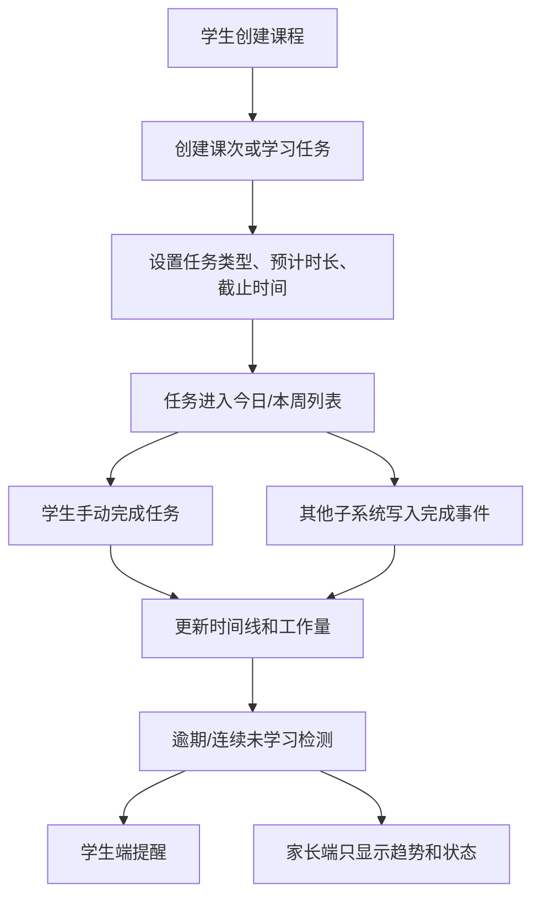

# S1 学习节奏子系统 StudyRhythm PRD

**版本**：v0.1
**日期**：2026-07-07
**状态**：第一个子系统轻量 PRD 草案

---

## 1. Executive Summary

### Problem Statement

大学生学习失控往往不是从“不会做题”开始，而是从“课程、任务、截止时间、复习节奏全部散掉”开始。系统必须先帮助学生建立最基本的学习节奏。

### Proposed Solution

StudyRhythm 提供课程、课次、学习任务、截止时间、工作量累计、逾期提醒和学习时间线。它不负责做笔记、不负责批改、不负责期末组卷，但负责把所有学习动作沉淀成“今天有没有在正常学习”的证据。

### Success Criteria

| 指标 | 验收标准 |
|---|---|
| 任务创建 | 学生能在 30 秒内为一门课创建一个学习任务 |
| 时间约束 | 每个任务必须有截止时间或计划完成日期 |
| 工作量累计 | 系统能按课程统计资料整理、练习、错题复习、备考任务次数 |
| 逾期识别 | 逾期任务能自动标记并进入时间线 |
| 家长摘要 | ParentWindow 能读取 StudyRhythm 的非隐私进度摘要 |

---

## 2. User Experience & Functionality

### User Personas

- **学生**：想知道今天要完成什么，不想手动维护复杂计划表。
- **家长**：想知道孩子有没有持续学习，但不看隐私细节。

### User Stories

| 故事 | 验收标准 |
|---|---|
| As a student, I want to create courses so that my learning records are grouped by subject. | 能创建/编辑/停用课程；课程有学期字段 |
| As a student, I want to create time-limited tasks so that I know what must be done before a deadline. | 任务有类型、预计时长、截止时间、状态 |
| As a student, I want all subsystem actions to become timeline events so that I can see my learning rhythm. | NoteBuilder/PracticeRunner/ErrorFixer 事件能写入时间线 |
| As a parent, I want to view only progress summary so that I can care without monitoring details. | 家长只看完成状态、数量、趋势，不看资料原文/答案 |

### Non-Goals

- 不做复杂 GTD / Notion 式任务管理。
- 不做日历全量同步。
- 不做家长打卡监督工具。
- 不在 S1 里做 AI 笔记、练习批改、错题解析。

---

## 3. User Flow



---

## 4. Inputs / Outputs

### Inputs

- 学生手动创建：课程、课次、任务；
- S2 写入：资料整理完成事件；
- S3 写入：练习完成事件；
- S4 写入：错题复习完成事件；
- S5 写入：备考任务完成事件；
- 系统定时任务：逾期扫描。

### Outputs

- 今日任务列表；
- 本周学习时间线；
- 课程工作量统计；
- 逾期任务列表；
- 家长端摘要数据。

---

## 5. Open-source Components

| 能力 | 组件 | 说明 |
|---|---|---|
| 异步任务/逾期扫描 | BullMQ + Redis | 定时扫描任务状态、失败重试 |
| 数据存储 | PostgreSQL | 课程、任务、时间线、统计 |
| 时间处理 | date-fns / dayjs（二选一） | 日期计算，避免手写时间逻辑 |
| 前端列表/日历展示 | 先用基础组件，后续可接日历库 | MVP 不先做复杂日历 |

---

## 6. AI System Requirements

S1 默认不需要 LLM。

可选 AI 功能放后：

| 功能 | 是否 MVP | 模型 |
|---|---|---|
| 根据学习记录生成周总结 | 否 | DeepSeek/Qwen |
| 根据逾期情况给复习建议 | 否 | DeepSeek/Qwen |
| 复杂学习计划优化 | 否 | GPT 兜底 |

---

## 7. Data Objects（草案）

```text
Course
- id
- student_id
- name
- semester
- status

StudyTask
- id
- student_id
- course_id
- lesson_id?
- type: material_note | practice | error_review | exam_cram | custom
- title
- estimated_minutes
- deadline_at
- status: todo | doing | done | overdue | skipped
- created_at
- completed_at?

StudyEvent
- id
- student_id
- course_id
- source_system: S1 | S2 | S3 | S4 | S5 | S7
- event_type
- title
- workload_minutes?
- occurred_at
- parent_visible: boolean

ParentProgressSummary
- student_id
- date
- completed_task_count
- overdue_task_count
- study_event_count
- material_note_count
- practice_count
- error_review_count
```

---

## 8. Pages / API（草案）

### Pages

| 页面 | 说明 |
|---|---|
| 今日学习 | 今日任务、逾期任务、快速完成 |
| 课程列表 | 当前学期课程 |
| 课程详情 | 课次、任务、资料/练习入口 |
| 学习时间线 | 按天展示完成事件 |

### API

| API | 说明 |
|---|---|
| `POST /courses` | 创建课程 |
| `GET /courses` | 课程列表 |
| `POST /study-tasks` | 创建任务 |
| `PATCH /study-tasks/:id/status` | 更新状态 |
| `POST /study-events` | 子系统写入时间线事件 |
| `GET /timeline` | 学生时间线 |
| `GET /parent/progress-summary` | 家长摘要 |

---

## 9. Acceptance Criteria

- [ ] 能创建课程和任务；
- [ ] 任务必须能设置截止时间和预计时长；
- [ ] 完成任务后生成 StudyEvent；
- [ ] 逾期任务能被定时扫描标记；
- [ ] 其他子系统可通过统一接口写入 StudyEvent；
- [ ] 家长端摘要不包含原始学习资料、题目答案、隐私全文；
- [ ] 清空 `G:\ai-studybuddy-tmp` 不影响 StudyRhythm 数据；
- [ ] 日志不记录学生隐私全文和 API Key。

---

## 10. Roadmap

| 阶段 | 内容 |
|---|---|
| S1-MVP | 课程、任务、时间线、逾期扫描、家长摘要数据 |
| S1-v1.1 | 每周统计、连续未学习提醒、课程工作量趋势 |
| S1-v1.2 | AI 周总结、学生自定义学习目标 |
