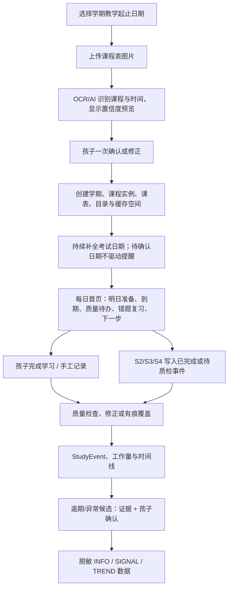

# S1 学习节奏子系统 StudyRhythm PRD

**版本**：v0.06
**日期**：2026-07-20
**状态**：S1 核心、T11 考试确认/任务闭环、T07 当前课程时间线与 T09A–T09E 学生端产品化均已实现并进入 `origin/master`

---

## 1. Executive Summary

### Problem Statement

大学生学习失控往往不是从“不会做题”开始，而是从“课程、任务、截止时间、复习节奏全部散掉”开始。系统必须先帮助学生建立最基本的学习节奏。

### Proposed Solution

StudyRhythm 从学期初始化开始，提供课程表确认、课程与考试目标、学习任务、截止时间、每日闭环、工作量累计、逾期提醒和学习时间线。它不负责做笔记、不负责批改、不负责期末组卷，但负责把所有学习动作沉淀成可核对的证据，并把最少、最合适的下一步呈现给孩子。

### Success Criteria

| 指标       | 验收标准                                                                |
| ---------- | ----------------------------------------------------------------------- |
| 学期初始化 | 孩子可先选学期日期、上传课程表、确认识别预览；未确认 OCR 不写入正式数据 |
| 日常可用   | 每日首页只呈现少量待闭合事项；孩子能在 30 秒内创建或确认一个学习任务    |
| 时间约束   | 每个任务必须有截止时间或计划完成日期；只有确认考试日期进入正式倒计时    |
| 证据闭合   | 任务完成、质量检查、孩子覆盖或待质检状态均能形成可追溯事件              |
| 工作量累计 | 系统能按课程实例统计资料整理、练习、错题复习、备考任务次数              |
| 逾期识别   | 逾期任务能自动标记并进入时间线，但合理特例不计入负面趋势                |
| 家长摘要   | ParentReport 只能读取脱敏统计，并区分日 INFO、周 SIGNAL、月 TREND       |

---

## 2. User Experience & Functionality

### User Personas

- **学生**：想知道今天要完成什么，不想手动维护复杂计划表。
- **家长**：想知道孩子有没有持续学习，但不看隐私细节。

### User Stories

| 故事                                                                                                                           | 验收标准                                                                     |
| ------------------------------------------------------------------------------------------------------------------------------ | ---------------------------------------------------------------------------- |
| As a student, I want to start a semester from a date range and timetable image so that I do not manually recreate every class. | 日历选择 → 图片识别预览 → 一次确认；正式写入是原子化体验，失败不留下半个学期 |
| As a student, I want to update exam dates as notices arrive so that countdowns are trustworthy.                                | 每次日期保留来源、置信度、确认和变更历史；未确认日期只显示待核对             |
| As a student, I want the home page to show the next evidence-backed closure so that I do not maintain a complex plan.          | 显示明日准备、到期、待质检、错题复习与下一步；不强迫接受 AI 排程             |
| As a student, I want to record a reasonable exception so that a one-off disruption is not treated as a persistent problem.     | AI 只提出异常候选和证据；孩子确认的特例保留事实但不计入负面趋势              |
| As a parent, I want only a progress summary so that I can care without monitoring details.                                     | 家长只接收 INFO/SIGNAL/TREND 和考前提醒，不看资料原文/答案，也不登录系统     |

### Non-Goals

- 不做复杂 GTD / Notion 式任务管理，也不要求孩子维护全量项目计划。
- 不做外部日历全量同步或家长远程登录。
- 不做家长打卡监督、排名或惩罚工具。
- 不在 S1 里做 AI 笔记、练习批改、错题解析；S1 只承接它们的脱敏事件和待闭合状态。
- 不让 AI 自动确认课程、考试日期、异常原因或替孩子作最终判断。

---

## 3. User Flow



### 学期与后续事项规则

- 学期状态为 `ACTIVE → TEACHING_ENDED → FOLLOW_UP → ARCHIVED`；教学结束后可等待成绩、补考、迟交或申诉，所有事项完成后才默认只读归档；
- 补考在原 `course_instance` 下新增考试尝试，不能为了补考复制课程；只有学校确有重复固定补课时段，才加临时补考课表；
- 重修在新学期创建新的 `course_instance`，关联原实例；每日首页可同时聚合当前 `ACTIVE` 学期和旧 `FOLLOW_UP` 学期的待办；
- 归档学期默认只读；更正须记录操作者、时间、前后值和原因。

---

## 4. Inputs / Outputs

### Inputs

- 孩子确认的学期日期、课程表识别预览和课程/课表修正；
- 考试通知图片、文本或手工输入，以及来源、置信度、确认和变更记录；
- 孩子创建或确认的任务、完成证据、合理特例和 AI 覆盖原因；
- S2 写入资料整理事件，S3 写入练习事件，S4 写入错题复习事件，S5 写入备考事件；
- 系统定时任务：逾期扫描、待质检恢复和报告数据聚合。

### Outputs

- 证据驱动的每日待闭合列表和下一步行动；
- 当前/后续处理学期聚合的本周学习时间线；
- 课程实例工作量统计、确认考试倒计时和待核对考试日期；
- 逾期、待质检和异常候选列表；
- ParentReport 使用的脱敏 INFO/SIGNAL/TREND 统计数据。

---

## 5. Open-source Components

| 能力              | 组件                         | 说明                                             |
| ----------------- | ---------------------------- | ------------------------------------------------ |
| 异步任务/逾期扫描 | SQLite Job Worker            | 定时扫描任务状态、失败重试；Phase 0.7 先独立验证 |
| 数据存储          | SQLite                       | 课程、任务、时间线、统计；Phase 0.8 正式接入     |
| 时间处理          | date-fns / dayjs（二选一）   | 日期计算，避免手写时间逻辑                       |
| 前端列表/日历展示 | 先用基础组件，后续可接日历库 | MVP 不先做复杂日历                               |

---

## 6. AI System Requirements

S1 默认不需要 LLM。

可选 AI 功能放后：

| 功能                   | 是否 MVP | 模型      |
| ---------------------- | -------- | --------- |
| 根据学习记录生成周总结 | 否       | Kimi/Qwen |
| 根据逾期情况给复习建议 | 否       | Kimi/Qwen |
| 复杂学习计划优化       | 否       | GPT 兜底  |

---

## 7. Data Objects（草案）

```text
Semester
- id
- name
- teaching_starts_on / teaching_ends_on
- status: active | teaching_ended | follow_up | archived
- archived_at?

CourseInstance
- id
- semester_id
- name
- schedule_summary
- status
- retake_of_course_instance_id?

AssessmentAttempt
- id
- course_instance_id
- kind: regular | resit | makeup | other
- scheduled_at?
- date_source: timetable | notice_image | notice_text | manual
- recognition_confidence?
- child_confirmation: pending | confirmed | rejected | superseded
- change_history_ref

StudyTask
- id
- course_instance_id
- assessment_attempt_id?
- knowledge_module_id?
- type: material_note | practice | error_review | exam_cram | custom
- title
- estimated_minutes / actual_minutes?
- deadline_at?
- status: todo | doing | pending_quality_check | done | overdue | skipped

StudyEvent
- id
- course_instance_id
- source_system: S1 | S2 | S3 | S4 | S5 | S7
- event_type / occurred_at / workload_minutes?
- evidence_ref?
- source_confidence?
- child_confirmation?
- quality_gate: required_fix | suggestion | uncertain | passed | overridden | pending
- exception_status: none | candidate | confirmed_reasonable | unexplained
- parent_visibility: info_only | signal_eligible | excluded
```

`Question`、`PracticeSession`、`PracticeAnswer`、`Mistake`、`WeakPoint` 仍是 S3/S4 触发后才建立的详细业务对象；本 S1 PRD 只定义其通过 `StudyEvent` 回流的共同边界。

---

## 8. Pages / API（草案）

### Pages

| 页面         | 说明                                                              |
| ------------ | ----------------------------------------------------------------- |
| 学期开始向导 | 学期日期日历、课程表图片上传、识别置信度预览、一次确认            |
| 每日学习首页 | 少量证据驱动的待闭合事项、质量待办、下一步和当前/后续处理学期聚合 |
| 课程与课表   | 当前学期课程实例、课表、重修关联和临时补考课表（仅实际需要时）    |
| 考试目标     | 待公布/待确认/已确认考试日期、来源、置信度、变更历史与倒计时      |
| 学习时间线   | 按天展示完成、待质检、覆盖和合理特例事件                          |
| 学期归档     | 教学结束、后续事项、只读归档、受控更正和恢复记录                  |

### API

下表保留早期领域草案；当前正式 HTTP 实现统一使用 `/api` 前缀。Phase 1-T11 新增 `GET /api/exams/:id?semesterId=...` 和 `PATCH /api/exams/:id/confirmation`：仅 pending 可首次确认，confirmed 重复确认幂等，rejected/superseded 返回 409，不存在或跨学期返回 404；确认成功后写入固定 S1 证据事件并立即驱动关联任务优先级。T07 已扩展 `GET /api/timeline` 的课程/事件类型过滤，并在考试工作台展示当前课程最近 8 条活动。其余草案路径不因本次回填自动视为已实现。

| API                                                   | 说明                                               |
| ----------------------------------------------------- | -------------------------------------------------- |
| `POST /semesters/onboarding-preview`                  | 上传课程表并返回识别预览与置信度；不写正式业务数据 |
| `POST /semesters/onboarding-confirm`                  | 确认后原子化创建学期、课程实例、课表和目录         |
| `GET /semesters` / `PATCH /semesters/:id`             | 获取学期与更新教学结束/归档状态；归档更正留痕      |
| `POST /course-instances`                              | 创建课程实例；重修必须提供原实例关联               |
| `POST /assessment-attempts`                           | 新增或更新考试尝试；未经确认不触发正式提醒         |
| `POST /study-tasks` / `PATCH /study-tasks/:id/status` | 创建任务与更新闭合、待质检、完成状态               |
| `POST /study-events`                                  | 子系统写入带证据、确认与质量状态的时间线事件       |
| `POST /exceptions/:eventId/confirm`                   | 孩子确认合理特例或保留未解释状态                   |
| `GET /daily-closure` / `GET /timeline`                | 获取每日闭环与学生时间线                           |
| 内部 `ReportDataQuery`                                | 仅供报告生成器读取脱敏聚合；不暴露家长远程 API     |

---

### ParentReport 数据边界

S1 只提供脱敏的课程、任务状态、学习时长、确认考试节点、证据计数、个人基线、异常候选和孩子确认的特例。日报输出稳定、短小、非评价性的 INFO；周报只有重复且未被合理特例排除的 SIGNAL；月报在更长观察窗和足够样本下才输出 TREND。邮件/飞书发送由后续 `ReportService` 完成；父母不是 S1 的远程登录用户，系统不提供 `/parent/*` 公开 HTTP 接口。

---

## 9. Acceptance Criteria

- [ ] 学期向导可完成“日期 → 课程表图片 → 识别预览 → 孩子确认”；任一失败不留下半个学期、孤立目录或缓存；
- [ ] 同一学期课程共享学期库但通过 `course_instance_id` 隔离；不同学期数据、文件和缓存互不混用；
- [ ] 考试日期保存来源、置信度、确认和变更历史；未确认日期不驱动正式倒计时或家长 7/3/1 提醒；
- [ ] 补考不重复建课，重修能正确关联原课程实例；当前学期与 `FOLLOW_UP` 学期的待办能聚合；
- [ ] 每日首页能展示明日准备、到期、质量待办、错题复习与下一步，且不要求接受 AI 排程；
- [ ] 关键质量错误、可选建议和不确定检查三类状态可区分；Provider 故障进入待质检而不阻塞学习；
- [ ] 孩子覆盖 AI 判断或确认合理特例时，保留原结论、证据、原因和时间；
- [ ] 完成任务后生成带来源和状态的 StudyEvent；其他子系统可通过统一接口写入；
- [ ] 家长摘要不包含原始学习资料、题目答案、隐私全文；合理特例不计入负面趋势；
- [ ] 清空 `APP_DATA_ROOT\tmp` 不影响长期数据；日志不记录学生隐私全文和 API Key。

---

## 10. Roadmap

| 阶段 | 内容 | 状态 |
| ---- | ---- | ---- |
| S1 核心 / T11 / T07 | 课程、考试确认、任务、当前课程时间线、家长摘要数据 | ✅ 已实现 |
| Phase 1-T09A | 学期创建、选择与切换；向导含课表识别预览和一次确认 | ✅ 已实现并完成主线复验 |
| Phase 1-T09B/T09C | 每日学习首页；已创建学期的课程、课表与考试目标完善 | ✅ 已实现并完成主线复验 |
| Phase 1-T09D/T09E | 全局导航与学生旅程 E2E；练习历史与学期归档 | ✅ 已实现并完成主线复验 |
| S1-v1.1 | 每周统计、连续未学习提醒、课程工作量趋势 | 后续独立门禁 |
| S1-v1.2 | AI 周总结、学生自定义学习目标 | 后续独立门禁 |
