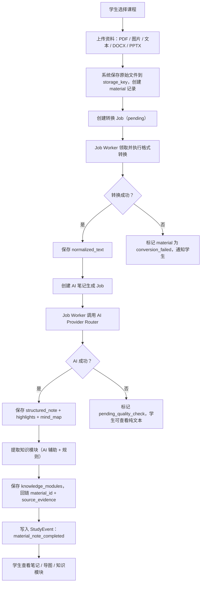
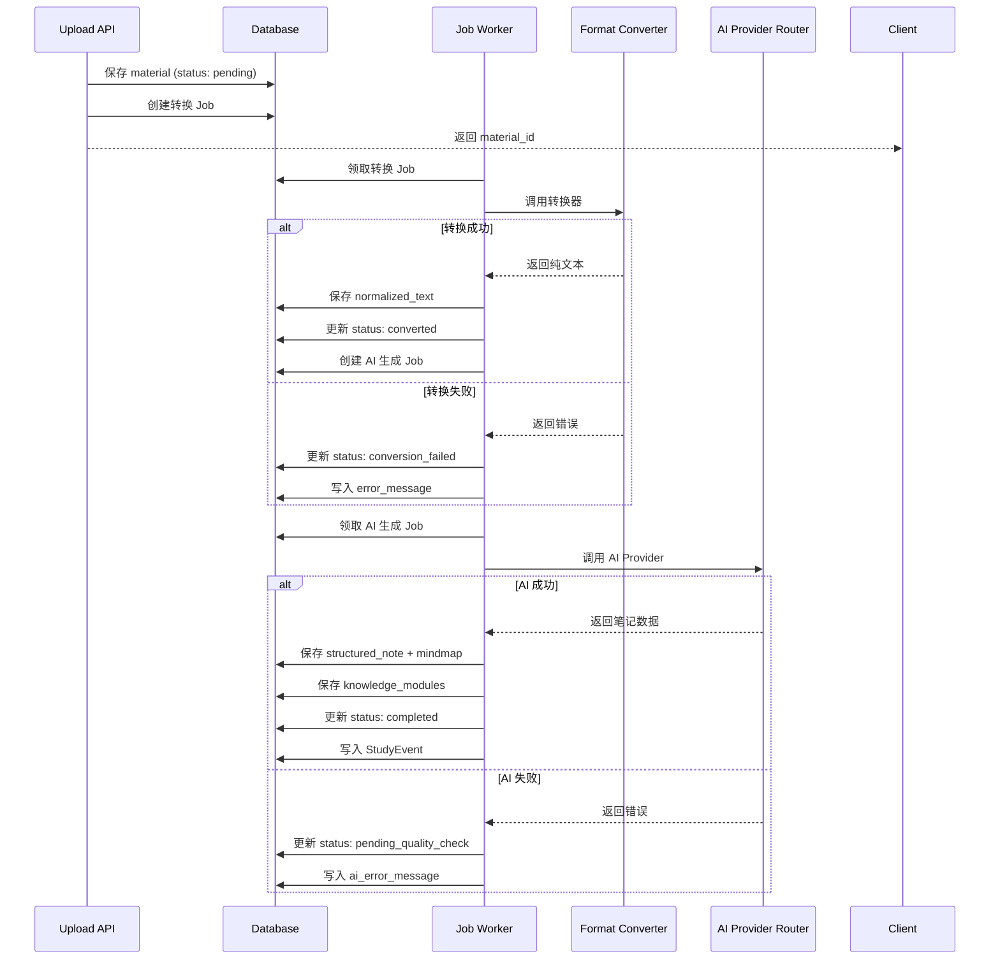

# S2 资料笔记子系统 NoteBuilder PRD

**版本**：v0.03
**日期**：2026-07-13
**状态**：Phase 0.8 开工前轻量设计基线；已对齐 Windows 单机 MVP 的资料处理、AI 笔记生成与知识模块闭环；补齐完整字段约束、API 契约、状态机、Job Worker 重试策略和可执行验收标准

---

## 1. Executive Summary

### Problem Statement

大学生下课后手头堆着 PDF 课件、手写拍照、文本笔记等各种格式的资料，却很少系统整理。从"拿到资料"到"形成可复习的结构化笔记和可练习的知识单元"这段路径断裂了——不是学生不想整理，是手工整理成本太高，而散落的原始文件无法直接用来做题和复习。

### Proposed Solution

NoteBuilder 接收多格式资料（PDF / 图片 / 文本 / DOCX / PPTX），通过格式转换层提取纯文本，再由 AI 生成结构化笔记（Markdown）、重点提炼（highlights）和思维导图数据（Markmap），最终从笔记中提取带来源证据的知识模块。知识模块是后续练习（S3）、错题（S4）和期末冲刺（S5）的共同输入对象。

### Success Criteria

| 指标 | 验收标准 |
|---|---|
| 资料上传 | T07 支持 PDF、图片（JPG/PNG/WebP）、纯文本、DOCX、PPTX 五类本地输入；URL 导入延后到 S2-v1.1 |
| 格式转换 | 转换结果保存为 `normalized_texts`；转换失败给出明确提示，不丢失原始文件 |
| AI 笔记 | 纯文本成功提取后，AI 生成 Markdown 笔记 + highlights JSON + Markmap 数据 |
| 知识模块 | 每份笔记至少提取 1 个知识模块；模块必须回链 material_id 和 source_evidence |
| 异步处理 | 转换和 AI 生成均通过 SQLite Job Worker 异步执行，不阻塞上传响应 |
| AI 降级 | AI 不可用时保留纯文本和 pending_quality_check 状态，不阻塞学生查看原文 |
| 学期隔离 | 资料归属到 course_instance；不同学期文件和数据互不混用 |
| 成本控制 | 笔记生成使用中转 GPT-5.4/5.5 级别模型，不用最贵的模型 |

---

## 2. User Experience & Functionality

### User Personas

- **学生**：想把下课后拿到的 PDF/图片/文本快速变成结构化笔记和知识点，方便复习和练习。
- **家长**：不看笔记正文，只从 S6 报告知道孩子有没有在整理资料。

### User Stories

| 故事 | 验收标准 |
|---|---|
| As a student, I want to upload a PDF and get structured notes so that I don't spend hours manually summarizing. | 上传 → 转换 → AI 笔记 → 可查看 Markdown + 重点 + 导图；全流程异步，上传秒返回 |
| As a student, I want to upload a photo of handwritten notes and get digital text so that I can search and review later. | 图片 → OCR → 纯文本 → AI 笔记；OCR 失败时提示"识别失败，请手工粘贴" |
| As a student, I want to see which knowledge modules came from which material so that I can trace back to the source. | 每个知识模块展示 source_evidence 和对应 material 链接 |
| As a student, I want to track my learning progress per knowledge module so that I know what to review next. | 模块状态可更新为 not_started / learning / mastered；状态变更写入 StudyEvent |
| As a student, I want notes to work even when AI is down so that I can still study from raw text. | AI 不可用时，normalized_text 可查看；笔记标记 pending_quality_check |

### Non-Goals

- 不做笔记富文本编辑器；MVP 只展示 AI 生成结果，不允许孩子在线编辑笔记内容。
- 不做多份资料合并成一份笔记；一份资料对应一份笔记。
- 不做录音转写（S7 ClassCapture 负责）。
- 不做练习题生成（S3 PracticeRunner 负责）。
- 不做错题回流（S4 ErrorFixer 负责）。
- 不做家长看笔记正文（S6 只读脱敏"已整理 N 份资料"统计）。
- 不做 AI 自动确认知识模块的重要性/难度；学生可手动调整。
- 不做云端同步或多设备协同。

---

## 3. User Flow



### 资料状态流转

```text
pending → converting → converted → note_generating → completed
  ↓                       ↓
  ↓                   conversion_failed
  ↓
  └→ converting → converted → note_generating → pending_quality_check
```

**详细转换条件**：参见第 7 节"状态流转规则"表格。

### Job Worker 任务流程



---

## 4. Inputs / Outputs

### Inputs

- 学生上传的原始文件（PDF / 图片 / 文本 / DOCX / PPTX）；URL 导入不属于 T07。
- 文件归属的 course_instance_id；
- 可选：学生标注的资料标题、章节范围。

### Outputs

- 格式转换后的纯文本（normalized_text）；
- AI 生成的结构化 Markdown 笔记；
- 重点提炼（highlights JSON 数组）；
- 思维导图数据（Markmap 格式）；
- 带来源证据的知识模块列表；
- StudyEvent（供 S1 时间线和 S6 报告使用的脱敏完成事件）。

---

## 5. Open-source Components

| 能力 | 组件 | 说明 |
|---|---|---|
| PDF 文本提取 | pdf-parse | 已集成；扫描版 PDF 走 OCR fallback |
| OCR | RapidOCR Python 子进程 | 已集成；按需启动，用完退出 |
| DOCX 转换 | mammoth（via DocxConverter） | 已集成 |
| PPTX 转换 | PptxConverter | 已集成 |
| URL 正文提取 | Readability + JSDOM | 已集成但 T07 不接入；URL 导入延后到 S2-v1.1 |
| 异步任务 | SQLite Job Worker | 已集成；串行执行，有限重试 |
| AI 路由 | AiProviderRouter | 已集成；多 Provider fallback |
| 前端 Markdown | react-markdown + KaTeX | T08 前端集成 |
| 思维导图渲染 | Markmap | T08 前端集成 |

### 组件约束与治理

#### Job Worker 配置

- **并发模式**：串行执行（单 worker 线程）
- **任务优先级**：按 created_at 升序处理
- **重试策略**：
  * 转换任务：失败后立即重试 1 次，仍失败则标记 conversion_failed
  * AI 生成任务：失败后延迟 5s 重试 1 次，仍失败则标记 pending_quality_check
  * 重试事实来源：`jobs.attempts`。同一 material + job_type 的自动与手动执行次数聚合最多 3 次；不得在 material 表复制 retry counter。
- **超时配置**：
  * PDF 转换：30s
  * OCR：60s
  * DOCX/PPTX 转换：30s
  * AI 生成：第一次 30s，重试 45s
- **错误隔离**：单个任务失败不影响其他任务；失败任务写入错误日志，Job Worker 继续处理下一个任务

#### AI Provider Router 配置

- **Fallback 顺序**：
  1. 中转 GPT-5.4/5.5（默认）
  2. Kimi K1 Chat（备选）
  3. Qwen 官方直连（兜底）
- **健康检查**：每个 Provider 连续失败 5 次后，暂停使用 10 分钟，直接尝试下一个 Provider
- **成本统计**：记录每次请求的 token_count 和 generation_duration_ms，供成本分析使用
- **日志规范**：
  * 记录：material_id, model, token_count, duration_ms, success/failure
  * 不记录：normalized_text 全文、AI 响应全文、API Key

---

## 6. AI System Requirements

S2 是 AI StudyBuddy 中第一个正式使用 LLM 的业务子系统。

### AI 使用点

| 功能 | 模型级别 | 是否 MVP | 说明 |
|---|---|---|---|
| 纯文本 → 结构化笔记 | 中转 GPT-5.4/5.5 | ✅ 是 | 按章节结构化，输出 Markdown |
| 纯文本 → 重点提炼 | 同上 | ✅ 是 | 输出 JSON 数组，每项含内容和重要性 |
| 纯文本 → 思维导图 | 同上 | ✅ 是 | 输出 Markmap 兼容的 Markdown 层级 |
| 纯文本 → 知识模块提取 | 同上 | ✅ 是 | 输出结构化知识点列表，含难度和来源引用 |
| 笔记质量检查 | Kimi/Qwen 备选 | 否 | 后续可用于检查笔记遗漏 |

### AI 输出原则

- AI 输出必须是可验证的结构化数据（JSON/Markdown），不是自由文本聊天；
- 不用 AI 做格式转换（PDF→文本已有规则引擎）；
- AI 不可用时，系统保留 normalized_text 并标记 pending_quality_check；
- AI 的知识模块提取只是候选，学生可增删改；
- AI 不能编造来源；source_evidence 必须可回溯到原文位置；
- 笔记生成使用中转渠道的成本最优模型（gpt-5.4/5.5），不用最贵型号。

### AI Prompt 设计要点（实现时细化）

#### System Prompt 结构

```text
角色：你是一位学习助手，帮助大学生将课程资料整理成结构化笔记。

目标：
1. 将纯文本转换为结构化 Markdown 笔记，包含章节标题、重点内容、数学公式（KaTeX 格式）
2. 提炼重点内容，标注重要性（low/medium/high）
3. 生成思维导图数据（Markmap 格式）
4. 提取知识模块，标注难度和考试相关性

约束：
- 不编造来源；source_evidence 必须可回溯到原文位置
- 不省略原文重要内容；保持学术严谨性
- 数学公式使用 KaTeX 语法（$...$ 或 $$...$$）
- 引用原文使用 Markdown blockquote（> ...）
- 知识模块必须独立、可练习、可测试
```

#### User Prompt 结构

```text
课程名称：{course_name}
章节范围：{chapter_range}（可选）

原文：
{normalized_text}

请按以下 JSON schema 输出：
{
  "markdown": "...",
  "highlights": [
    { "content": "...", "importance": "high|medium|low", "position": "第X页第Y段" }
  ],
  "mindMap": "...",
  "knowledgeModules": [
    {
      "title": "...",
      "contentSummary": "...",
      "importance": "critical|high|medium|low",
      "difficulty": "hard|medium|easy",
      "examRelevance": "...",
      "sourceEvidence": "..."
    }
  ]
}
```

#### 长文本分段策略

- **Token 限制**：单次请求不超过 8K tokens（约 6000 字中文）
- **分段规则**：
  1. 按自然章节分段（识别"第X章"、"Chapter X"、"##"等标记）
  2. 每段保留前后 200 字作为上下文重叠
  3. 每段独立生成笔记，最终合并
- **合并策略**：
  1. Markdown：按章节顺序拼接，去重章节标题
  2. Highlights：合并数组，按 importance 排序，保留前 20 条
  3. MindMap：合并顶层节点，保持层级结构
  4. KnowledgeModules：合并数组，去重相似标题（编辑距离 < 3）

#### AI Provider Fallback 链

```text
1. 中转 GPT-5.4/5.5（默认，成本最优）
   - 超时：30s
   - 失败重试：2 次
2. Kimi K1 Chat（备选）
   - 超时：45s
   - 失败重试：1 次
3. Qwen 官方直连（最终兜底）
   - 超时：60s
   - 失败重试：1 次

全部失败 → pending_quality_check
```

#### Prompt 版本管理

- 版本号格式：`s2-note-v{major}.{minor}`
- 当前版本：`s2-note-v1.0`
- 版本记录在 `StructuredNote.prompt_version`，用于追溯和 A/B 测试
- 版本变更时：
  1. 更新 system/user prompt 模板
  2. 递增版本号
  3. 记录变更原因和预期效果
  4. 保留旧版本 prompt 用于回溯

---

## 7. Data Objects（草案）

以下对象已在 `schema-semester.ts` 中定义，此处明确业务语义、约束和索引策略：

```text
Material
- id: UUID PRIMARY KEY
- course_instance_id: UUID NOT NULL, FOREIGN KEY → CourseInstance(id) ON DELETE CASCADE
- file_type: ENUM('pdf', 'image', 'text', 'docx', 'pptx') NOT NULL
- storage_key: TEXT NOT NULL
  * 相对路径；格式：semesters/{semester_id}/files/{course_instance_id}/{uuid}.{ext}
  * migration v3 使用 SQLite INSERT/UPDATE 触发器拒绝 `..`、`:\`、`:/`，应用层仍先走路径校验
- original_filename: TEXT
  * 展示用；未填写 title 时作为默认标题
- title: TEXT
  * 学生标注的标题（可选）
- status: ENUM('pending', 'converting', 'converted', 'note_generating',
               'completed', 'conversion_failed', 'pending_quality_check') NOT NULL DEFAULT 'pending'
  * migration v3 使用 SQLite 触发器拒绝枚举外值
- file_size_bytes: INTEGER NOT NULL
  * 上传时记录；migration v3 触发器拒绝非正值
- conversion_error_message: TEXT
- ai_generation_error_message: TEXT
- truncated: BOOLEAN NOT NULL DEFAULT false
  * 仅表示单次 AI 输入是否截为前 8,000 字；完整 normalized_text 始终保留
- created_at: TIMESTAMPTZ NOT NULL DEFAULT NOW()
- updated_at: TIMESTAMPTZ NOT NULL DEFAULT NOW()

重试事实来源：不在 Material 复制 retry counter；migration v3 为 `jobs` 增加 nullable `material_id`、查询索引与 pending/running 唯一索引。S2 以 `jobs.material_id + job_type` 聚合 `jobs.attempts` 的自动和手动执行次数，最多 3 次。

INDEX idx_material_course_status ON Material(course_instance_id, status, created_at DESC)
INDEX idx_material_storage_key ON Material(storage_key) UNIQUE
INDEX idx_material_created ON Material(created_at DESC)

NormalizedText
- id: UUID PRIMARY KEY
- material_id: UUID NOT NULL, FOREIGN KEY → Material(id) ON DELETE CASCADE
- source_type: ENUM('pdf', 'image', 'text', 'docx', 'pptx') NOT NULL
- text: TEXT NOT NULL
  * 最大长度建议 1MB；超长文本由 Job Worker 分段处理
  * 约束：CHECK(LENGTH(text) > 0 AND LENGTH(text) <= 1048576)
- char_count: INTEGER NOT NULL
  * 提取时统计，前端展示"约 X 字"
  * 约束：CHECK(char_count > 0)
- metadata_json: JSONB NOT NULL DEFAULT '{}'
  * 示例：{ "pageCount": 42, "title": "第三章", "warnings": ["page 5 OCR low confidence"], 
           "converter": "pdf-parse", "converterVersion": "1.2.3", "ocrConfidence": 0.85 }
- created_at: TIMESTAMPTZ NOT NULL DEFAULT NOW()

INDEX idx_normalized_text_material ON NormalizedText(material_id) UNIQUE

StructuredNote
- id: UUID PRIMARY KEY
- material_id: UUID NOT NULL, FOREIGN KEY → Material(id) ON DELETE CASCADE
- knowledge_module_id: UUID, FOREIGN KEY → KnowledgeModule(id) ON DELETE SET NULL
  * 可选，关联到主知识模块（笔记中提取的第一个重要模块）
- markdown: TEXT NOT NULL
  * AI 生成的结构化笔记（Markdown）
  * 包含章节标题、KaTeX 数学公式、引用原文的 blockquote
  * 约束：CHECK(LENGTH(markdown) > 0)
- highlights_json: JSONB NOT NULL DEFAULT '[]'
  * 示例：[{ "content": "向量空间的三个公理", "importance": "high", "position": "第3页第2段" }]
  * 约束：每个元素必须有 content 和 importance 字段
- model: TEXT NOT NULL
  * 示例："gpt-5.4-turbo", "gpt-5.5", "kimi-k1-chat"
- prompt_version: TEXT NOT NULL DEFAULT 's2-note-v1.0'
  * 用于追溯 prompt 版本和 A/B 测试
- token_count: INTEGER
  * AI 请求消耗的 token 数（input + output）
  * 约束：CHECK(token_count IS NULL OR token_count > 0)
- generation_duration_ms: INTEGER
  * 生成耗时（毫秒）
  * 约束：CHECK(generation_duration_ms IS NULL OR generation_duration_ms > 0)
- created_at: TIMESTAMPTZ NOT NULL DEFAULT NOW()
- updated_at: TIMESTAMPTZ NOT NULL DEFAULT NOW()

INDEX idx_note_material ON StructuredNote(material_id) UNIQUE
INDEX idx_note_knowledge_module ON StructuredNote(knowledge_module_id)
INDEX idx_note_model ON StructuredNote(model, created_at DESC)

MindMap
- id: UUID PRIMARY KEY
- note_id: UUID NOT NULL, FOREIGN KEY → StructuredNote(id) ON DELETE CASCADE
- format: ENUM('markmap') NOT NULL DEFAULT 'markmap'
- data: TEXT NOT NULL
  * Markmap 兼容的 Markdown 层级文本
  * 示例：
    # 线性代数
    ## 向量空间
    ### 定义
    ### 公理
    ## 线性变换
  * 约束：CHECK(LENGTH(data) > 0)
- created_at: TIMESTAMPTZ NOT NULL DEFAULT NOW()

INDEX idx_mindmap_note ON MindMap(note_id) UNIQUE

KnowledgeModule
- id: UUID PRIMARY KEY
- course_instance_id: UUID NOT NULL, FOREIGN KEY → CourseInstance(id) ON DELETE CASCADE
- material_id: UUID, FOREIGN KEY → Material(id) ON DELETE SET NULL
  * 来源资料（可选，手动创建时为空）
- title: TEXT NOT NULL
  * 知识点标题，示例："向量空间定义与公理"
  * 约束：CHECK(LENGTH(title) > 0 AND LENGTH(title) <= 200)
- content_summary: TEXT
  * 知识点内容摘要（可选，供练习/错题使用）
- importance: ENUM('low', 'medium', 'high', 'critical') NOT NULL DEFAULT 'medium'
- difficulty: ENUM('easy', 'medium', 'hard') NOT NULL DEFAULT 'medium'
- exam_relevance: TEXT
  * 考试相关描述，示例："期中必考，占比约15%"
- source_evidence: TEXT NOT NULL
  * 原文引用或位置标记，示例："第3页第2段：向量空间需满足…"
  * 约束：CHECK(LENGTH(source_evidence) > 0)
- learn_status: ENUM('not_started', 'learning', 'mastered') NOT NULL DEFAULT 'not_started'
- last_reviewed_at: TIMESTAMPTZ
  * 上次复习时间；learn_status 变更时更新
- created_at: TIMESTAMPTZ NOT NULL DEFAULT NOW()
- updated_at: TIMESTAMPTZ NOT NULL DEFAULT NOW()

INDEX idx_km_course_status ON KnowledgeModule(course_instance_id, learn_status, created_at DESC)
INDEX idx_km_material ON KnowledgeModule(material_id)
INDEX idx_km_importance ON KnowledgeModule(course_instance_id, importance, difficulty)
```

### 状态流转规则

**Material 状态机**：

```text
pending → converting → converted → note_generating → completed
  ↓                       ↓
  ↓                   conversion_failed
  ↓
  └→ converting → converted → note_generating → pending_quality_check
```

详细转换条件：

| 当前状态 | 触发事件 | 目标状态 | 副作用 |
|---|---|---|---|
| pending | Job Worker 领取转换任务 | converting | 无 |
| converting | 转换成功 | converted | 创建 NormalizedText 记录 |
| converting | 转换失败且聚合 jobs.attempts < 3 | pending | 写入转换错误摘要，并将同一 Job 的 available_at 设为当前时间后 5 秒 |
| converting | 转换失败且聚合 jobs.attempts 已达 3 | conversion_failed | 写入 conversion_error_message |
| conversion_failed | 手动重试，聚合 jobs.attempts < 3 且无 pending/running 同类 Job | conversion_failed | 创建一个 pending material_convert Job；Worker 领取后转为 converting |
| conversion_failed | 聚合 attempts >= 3 或同类 Job 已存在 | conversion_failed | 返回 MAX_RETRIES_EXCEEDED 或 JOB_ALREADY_PENDING |
| converted | Job Worker 领取 AI 生成任务 | note_generating | 无 |
| note_generating | AI 生成成功 | completed | 创建 StructuredNote、MindMap、KnowledgeModule 记录；写入 StudyEvent |
| note_generating | AI 请求失败或超时且聚合 jobs.attempts < 3 | converted | 写入 AI 错误摘要，并将同一 Job 的 available_at 设为当前时间后 5 秒 |
| note_generating | AI 请求失败或超时且聚合 jobs.attempts 已达 3 | pending_quality_check | 写入 ai_generation_error_message |
| pending_quality_check | 手动触发 AI 补全，聚合 jobs.attempts < 3 且无 pending/running 同类 Job | pending_quality_check | 创建一个 pending note_generate Job；Worker 领取后转为 note_generating |
| pending_quality_check | 聚合 attempts >= 3 或同类 Job 已存在 | pending_quality_check | 返回 MAX_RETRIES_EXCEEDED 或 JOB_ALREADY_PENDING |

**转换失败恢复策略**：
- 转换失败后，原始文件保留在 storage_key；
- 允许手动触发重试（API `POST /materials/:id/retry-conversion`）；
- 重试次数限制：最多 3 次；第 3 次失败后不再自动重试；
- 学生可通过 API `POST /materials/:id/replace-text` 手动粘贴纯文本，跳过转换直接进入 converted 状态。

**AI 生成失败恢复策略**：
- AI 请求失败时，normalized_text 保留可查看；
- 允许手动触发 AI 补全（API `POST /materials/:id/retry-ai-generation`）；
- 重试次数限制：最多 3 次；第 3 次失败后提示"AI 暂不可用"；
- pending_quality_check 状态的资料在 S1 每日首页标记为"待质检"，但不阻塞学生查看原文。

### 与 S1 的交互

- 笔记完成后写入 `StudyEvent`：
  * source_system: `S2`
  * event_type: `material_note_completed`
  * workload_minutes: 估算值（根据纯文本字数，约 1000 字 = 5 分钟）
  * evidence_ref: `material:{material_id}`
  * source_confidence: `1.0`（AI 成功）或低置信度数值（pending_quality_check）
  * quality_gate: `passed`（AI 成功）或 `pending`（pending_quality_check）
- `StudyTask` 可通过 `knowledge_module_id` 关联知识模块，实现"整理完资料 → 安排复习任务"闭环；
- 知识模块状态变更（not_started → learning → mastered）也写入 StudyEvent：
  * event_type: `knowledge_module_status_changed`
  * evidence_ref: `km:{knowledge_module_id}`
- Material 转换失败或 AI 生成失败时：
  * quality_gate 设为 `suggestion`（建议人工介入）或 `required_fix`（必须修复才能继续）
  * S1 在每日首页展示"待质检"或"转换失败"提示

---

## 8. Pages / API（草案）

### API 契约

| API | 方法 | 说明 |
|---|---|---|
| `/api/materials/upload` | POST | 上传资料文件；multipart/form-data；返回 material_id 和初始状态 |
| `/api/materials` | GET | 按课程实例列出资料列表；支持 status 过滤 |
| `/api/materials/:id` | GET | 获取单个资料详情（含转换状态、纯文本摘要） |
| `/api/materials/:id/retry-conversion` | POST | 手动触发转换重试（conversion_failed 状态） |
| `/api/materials/:id/retry-ai-generation` | POST | 手动触发 AI 笔记补全（pending_quality_check 状态） |
| `/api/materials/:id/replace-text` | POST | 手动粘贴纯文本，跳过转换 |
| `/api/notes/:id` | GET | 获取笔记详情：Markdown + highlights + mindmap |
| `/api/knowledge-modules` | GET | 按课程实例或考试范围读取知识模块列表 |
| `/api/knowledge-modules/:id` | PATCH | 更新知识模块学习状态 / 重要性 / 难度 |

### 详细请求/响应规范

#### **POST /api/materials/upload**

**请求**：`multipart/form-data`

| 字段 | 类型 | 必填 | 约束 | 说明 |
|---|---|---|---|---|
| file | File | 是 | 10MB 以内；支持 pdf/jpg/png/webp/txt/docx/pptx | 上传文件 |
| courseInstanceId | UUID | 是 | 必须是当前 ACTIVE 学期的课程实例 | 归属课程实例 ID |
| title | String | 否 | 200 字符以内 | 可选标题 |

**成功响应（200）**：
```json
{
  "success": true,
  "data": {
    "id": "uuid",
    "courseInstanceId": "uuid",
    "fileType": "pdf",
    "status": "pending",
    "title": "第三章-线性代数",
    "fileSizeBytes": 1024000,
    "createdAt": "2026-07-13T10:00:00Z"
  }
}
```

**错误响应**：

| 状态码 | error.code | error.message | 说明 |
|---|---|---|---|
| 400 | MISSING_REQUIRED_FIELD | "courseInstanceId is required" | 缺少必填字段 |
| 400 | INVALID_FILE_TYPE | "File type .exe is not supported" | 不支持的文件类型 |
| 413 | FILE_TOO_LARGE | "File size exceeds 10MB limit" | 文件超过大小限制 |
| 404 | COURSE_INSTANCE_NOT_FOUND | "Course instance {id} not found" | 课程实例不存在 |
| 409 | SEMESTER_NOT_ACTIVE | "Cannot upload to archived semester" | 学期已归档 |
| 500 | STORAGE_ERROR | "Failed to save file" | 文件存储失败 |

#### **GET /api/materials?courseInstanceId={id}&status={status}**

**查询参数**：

| 参数 | 类型 | 必填 | 约束 | 说明 |
|---|---|---|---|---|
| courseInstanceId | UUID | 是 | 必须是有效的课程实例 ID | 课程实例 ID |
| status | String | 否 | pending/converting/converted/note_generating/completed/conversion_failed/pending_quality_check | 状态过滤 |
| page | Integer | 否 | >= 1，默认 1 | 分页页码 |
| pageSize | Integer | 否 | 1-100，默认 20 | 每页数量 |

**成功响应（200）**：
```json
{
  "success": true,
  "data": {
    "items": [
      {
        "id": "uuid",
        "courseInstanceId": "uuid",
        "fileType": "pdf",
        "status": "completed",
        "title": "第三章-线性代数",
        "fileSizeBytes": 1024000,
        "createdAt": "2026-07-13T10:00:00Z",
        "hasNote": true,
        "knowledgeModuleCount": 5
      }
    ],
    "pagination": {
      "page": 1,
      "pageSize": 20,
      "total": 42,
      "hasMore": true
    }
  }
}
```

#### **GET /api/materials/:id**

**成功响应（200）**：
```json
{
  "success": true,
  "data": {
    "id": "uuid",
    "courseInstanceId": "uuid",
    "fileType": "pdf",
    "status": "completed",
    "title": "第三章-线性代数",
    "originalFilename": "chapter3.pdf",
    "fileSizeBytes": 1024000,
    "storageKey": "semesters/sem123/files/course456/abc789.pdf",
    "conversionRetryCount": 0,
    "aiRetryCount": 0,
    "normalizedText": {
      "id": "uuid",
      "charCount": 5420,
      "preview": "第三章 线性代数\n\n3.1 向量空间...",
      "metadata": {
        "pageCount": 12,
        "converter": "pdf-parse",
        "converterVersion": "1.2.3"
      }
    },
    "createdAt": "2026-07-13T10:00:00Z",
    "updatedAt": "2026-07-13T10:05:00Z"
  }
}
```

**错误响应**：

| 状态码 | error.code | error.message |
|---|---|---|
| 404 | MATERIAL_NOT_FOUND | "Material {id} not found" |

#### **POST /api/materials/:id/retry-conversion**

**前置条件**：material.status = `conversion_failed`、同一 material + `material_convert` 聚合 `jobs.attempts < 3`，且不存在 pending/running 同类 Job

**成功响应（200）**：接口仅创建 pending Job，material 保持真实状态，直到 Worker 领取任务。
```json
{
  "success": true,
  "data": {
    "id": "uuid",
    "status": "conversion_failed",
    "attempts": 1,
    "jobStatus": "pending"
  }
}
```

**错误响应**：

| 状态码 | error.code | error.message |
|---|---|---|
| 400 | INVALID_STATUS | "Material status must be conversion_failed" |
| 409 | MAX_RETRIES_EXCEEDED | "Maximum retry count (3) exceeded" |
| 409 | JOB_ALREADY_PENDING | "A conversion job is already pending or running" |

#### **POST /api/materials/:id/replace-text**

**请求体**：
```json
{
  "text": "第三章 线性代数\n\n3.1 向量空间..."
}
```

**约束**：
- text 必填，长度 1-1048576 字符
- 仅 conversion_failed 或 pending 状态允许

**成功响应（200）**：
```json
{
  "success": true,
  "data": {
    "id": "uuid",
    "status": "converted",
    "normalizedTextId": "uuid"
  }
}
```

#### **GET /api/notes/:id**

**成功响应（200）**：
```json
{
  "success": true,
  "data": {
    "id": "uuid",
    "materialId": "uuid",
    "markdown": "# 第三章 线性代数\n\n## 3.1 向量空间\n...",
    "highlights": [
      {
        "content": "向量空间的三个公理",
        "importance": "high",
        "position": "第3页第2段"
      },
      {
        "content": "基和维数的关系",
        "importance": "medium",
        "position": "第5页第1段"
      }
    ],
    "mindMap": {
      "id": "uuid",
      "format": "markmap",
      "data": "# 线性代数\n## 向量空间\n### 定义\n### 公理\n## 线性变换\n### 矩阵表示"
    },
    "knowledgeModules": [
      {
        "id": "uuid",
        "title": "向量空间定义与公理",
        "importance": "high",
        "difficulty": "medium",
        "learnStatus": "not_started",
        "sourceEvidence": "第3页第2段：向量空间需满足..."
      }
    ],
    "model": "gpt-5.4-turbo",
    "promptVersion": "s2-note-v1.0",
    "tokenCount": 3500,
    "generationDurationMs": 2800,
    "createdAt": "2026-07-13T10:05:00Z"
  }
}
```

**错误响应**：

| 状态码 | error.code | error.message |
|---|---|---|
| 404 | NOTE_NOT_FOUND | "Note {id} not found" |
| 404 | MATERIAL_NOT_COMPLETED | "Material has not completed note generation" |

#### **GET /api/knowledge-modules?courseInstanceId={id}**

**查询参数**：

| 参数 | 类型 | 必填 | 说明 |
|---|---|---|---|
| courseInstanceId | UUID | 是 | 课程实例 ID |
| learnStatus | String | 否 | not_started/learning/mastered |
| importance | String | 否 | low/medium/high/critical |
| page | Integer | 否 | 分页页码 |
| pageSize | Integer | 否 | 每页数量 |

**成功响应（200）**：
```json
{
  "success": true,
  "data": {
    "items": [
      {
        "id": "uuid",
        "courseInstanceId": "uuid",
        "materialId": "uuid",
        "title": "向量空间定义与公理",
        "contentSummary": "定义了向量空间的8条公理...",
        "importance": "high",
        "difficulty": "medium",
        "examRelevance": "期中必考，占比约15%",
        "sourceEvidence": "第3页第2段：向量空间需满足...",
        "learnStatus": "learning",
        "lastReviewedAt": "2026-07-12T14:30:00Z",
        "createdAt": "2026-07-13T10:05:00Z"
      }
    ],
    "pagination": {
      "page": 1,
      "pageSize": 20,
      "total": 23,
      "hasMore": true
    }
  }
}
```

#### **PATCH /api/knowledge-modules/:id**

**请求体**：
```json
{
  "learnStatus": "mastered",
  "importance": "critical",
  "difficulty": "hard",
  "examRelevance": "期末必考，占比约20%"
}
```

**约束**：
- 所有字段可选
- learnStatus 变更会写入 StudyEvent 和更新 last_reviewed_at

**成功响应（200）**：
```json
{
  "success": true,
  "data": {
    "id": "uuid",
    "learnStatus": "mastered",
    "importance": "critical",
    "difficulty": "hard",
    "examRelevance": "期末必考，占比约20%",
    "lastReviewedAt": "2026-07-13T15:20:00Z",
    "updatedAt": "2026-07-13T15:20:00Z"
  }
}
```

**错误响应**：

| 状态码 | error.code | error.message |
|---|---|---|
| 404 | KNOWLEDGE_MODULE_NOT_FOUND | "Knowledge module {id} not found" |
| 400 | INVALID_ENUM_VALUE | "learnStatus must be one of: not_started, learning, mastered" |

### Pages（T08 负责实现）

| 页面 | 说明 |
|---|---|
| 资料上传 | 拖拽或选择文件，选择课程归属，展示上传和处理进度 |
| 笔记展示 | react-markdown 渲染笔记 + KaTeX 数学公式 + 重点高亮 |
| 思维导图 | Markmap 渲染，支持缩放和导航 |
| 知识模块列表 | 按课程展示知识模块，状态可切换，可跳转到来源笔记 |

---

## 9. Acceptance Criteria

### 资料上传与存储

- [ ] 上传文件后，在原始文件落盘、material 与 Job 成功写入后返回 material_id 和 status: pending；
- [ ] 文件保存到 `{STUDY_FILE_ROOT}/semesters/{semester_id}/files/{course_instance_id}/{uuid}.{ext}`，不出现硬编码绝对路径或盘符；
- [ ] storage_key 不包含 `:\`、`:/` 或 `..`；migration v3 通过 SQLite 触发器验证并拒绝非法写入；
- [ ] 上传文件大小超过 10MB 时，返回 413 错误码和 `FILE_TOO_LARGE` 错误；
- [ ] 不支持的文件类型（.exe / .zip / .sh 等）上传时，返回 400 错误码和 `INVALID_FILE_TYPE` 错误；
- [ ] 上传到已归档学期的课程实例时，返回 409 错误码和 `SEMESTER_NOT_ACTIVE` 错误；
- [ ] 并发上传 5 个文件时，所有文件均能成功保存且 storage_key 不重复。

### 格式转换

- [ ] PDF 文件（非扫描版）转换后，normalized_text.text 非空且 char_count > 0；
- [ ] 图片文件（JPG/PNG/WebP）通过 OCR 提取中文文本；OCR 失败时 status = conversion_failed，conversion_error_message 包含"OCR 识别失败，请手动粘贴"；
- [ ] DOCX / PPTX 正常转换后，metadata_json 包含 converter 和 converterVersion 字段；URL 导入不属于 T07。
- [ ] 转换失败的文件，原始文件保留在 storage_key，可重试转换或手动粘贴纯文本；原始文件下载 API 不属于 T07。
- [ ] 转换失败后，自动与手动 retry 均按 jobs.attempts 聚合不超过 3 次；重复 retry 不创建第二个 pending/running Job。
- [ ] 转换失败后重试 3 次仍失败，再次重试返回 409 错误码和 `MAX_RETRIES_EXCEEDED` 错误；
- [ ] 通过 `POST /materials/:id/replace-text` 手动粘贴纯文本后，status 从 conversion_failed → converted，创建 normalized_text 记录。

### AI 笔记生成

- [ ] AI 笔记生成成功后，structured_note.markdown 非空，包含至少一个 `#` 标题；
- [ ] highlights_json 数组非空，每个元素包含 content、importance、position 字段；
- [ ] mindmap.data 非空，格式为 Markmap 兼容的 Markdown 层级（至少包含一个 `#` 和一个 `##`）；
- [ ] 每份笔记至少提取 1 个 knowledge_module，且 source_evidence 非空；
- [ ] knowledge_module.source_evidence 可回溯到 normalized_text.text 的具体位置（通过关键词搜索能找到）；
- [ ] 笔记生成完成后，写入 StudyEvent（source_system: S2, event_type: material_note_completed, quality_gate: passed）；
- [ ] 笔记生成失败后，status = pending_quality_check，normalized_text 仍可查看；
- [ ] AI Provider 全部失败（超时或 API 错误）后，material 进入 pending_quality_check 而不是报错丢失；
- [ ] 手动触发 AI 补全时，聚合 jobs.attempts 未达到 3 次且不存在 pending/running 同类 Job；接口创建 pending Job，Worker 领取后状态从 pending_quality_check → note_generating；
- [ ] T07 对超过 8,000 字的纯文本完整保存；仅单次 AI 输入使用前 8,000 字并记录 truncated，不删除后续原文。章节分段与合并属于后续迭代。

### 知识模块管理

- [ ] 通过 `GET /api/knowledge-modules?courseInstanceId={id}` 获取知识模块列表，支持 learnStatus 和 importance 过滤；
- [ ] 通过 `PATCH /api/knowledge-modules/:id` 更新 learn_status 从 not_started → learning，last_reviewed_at 更新为当前时间；
- [ ] learn_status 变更后，写入 StudyEvent（event_type: knowledge_module_status_changed, evidence_ref: km:{id}）；
- [ ] 手动创建的知识模块（material_id = NULL）可正常更新和查询；
- [ ] 知识模块按 importance 和 difficulty 排序时，顺序为 critical > high > medium > low，hard > medium > easy。

### 学期隔离与数据安全

- [ ] 不同课程实例的资料通过 course_instance_id 隔离；查询 A 课程的资料时，不返回 B 课程的资料；
- [ ] 不同学期的资料通过学期库隔离；切换学期后，文件路径和数据库互不影响；
- [ ] 清空 `{APP_DATA_ROOT}/tmp` 后，已完成的笔记和知识模块仍可查看；
- [ ] T07 不提供 material 删除 API；既有外键删除策略不在 v3 migration 中变更，资料删除与级联清理留待后续专门任务。
- [ ] 日志不记录 normalized_text.text 全文、AI 请求体全文或 API Key；
- [ ] 日志记录 material_id、file_type、status、char_count、token_count、generation_duration_ms，不记录文件内容。

### 并发与性能

- [ ] Job Worker 串行处理转换和 AI 生成任务；同时有 10 个 pending 任务时，按 created_at 顺序依次执行；
- [ ] 单个转换任务超时时间：PDF 30s，OCR 60s，DOCX/PPTX 30s；超时后标记 conversion_failed；
- [ ] 单个 AI 生成任务超时时间：第一次 30s，重试 45s；超时后进入 pending_quality_check；
- [ ] 上传 API 在原始文件落盘、material 与 Job 成功写入后返回；性能测量包含真实文件 I/O 和 Job 创建，不用排除前置工作来计算接口耗时。
- [ ] 查询 API（GET /materials, GET /notes/:id）响应时间 < 500ms（包含数据库查询和 JSON 序列化）。

### 错误处理与降级

- [ ] storage_key、material.status 或 normalized_text.text 违反 v3 SQLite 触发器约束时，数据库拒绝写入并返回错误；
- [ ] API 请求缺少必填字段时，返回 400 错误码和明确的错误信息（如 "courseInstanceId is required"）；
- [ ] API 请求包含不存在的 courseInstanceId 时，返回 404 错误码和 `COURSE_INSTANCE_NOT_FOUND` 错误；
- [ ] 数据库连接失败时，API 返回 500 错误码和 `DATABASE_ERROR` 错误，不暴露内部错误栈；
- [ ] AI Provider 连续失败 3 次后，进入 pending_quality_check，学生可继续查看 normalized_text。

---

## 10. Roadmap

| 阶段 | 内容 |
|---|---|
| S2-MVP（Phase 0.8 T07） | 资料上传 + 格式转换 + AI 笔记 + 知识模块提取 + 基础 API |
| S2-v1.1 | 笔记重新生成、手动触发 AI 补全、URL 批量导入 |
| S2-v1.2 | 知识模块与考试范围关联、模块覆盖率统计 |
| S2-v2.0 | 多资料交叉知识图谱、知识模块自动合并去重 |


