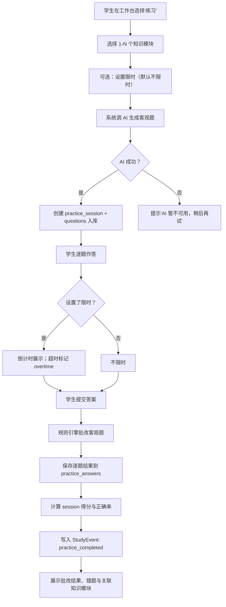

# S3 限时练习子系统 PracticeRunner PRD

**版本**：v0.03
**日期**：2026-07-16
**状态**：Phase 1 轻量设计基线；定义知识模块驱动的限时练习、客观题规则批改与练习记录闭环；T03A Schema 计划已创建并待批准实施

---

## 1. Executive Summary

### Problem Statement

学生整理完笔记和知识模块后，最常见的下一步是"做题验证自己是否掌握了"。但如果没有现成题目，学生需要自己找题或者等老师布置——这让"整理完就练"这条路径断裂了。AI 可以根据知识模块即时生成针对性练习题，让"看完就练"成为自然闭环。

### Proposed Solution

PracticeRunner 从知识模块出发，由 AI 生成客观题（单选/多选/填空），学生在可选限时条件下完成作答，系统用规则引擎即时批改，记录逐题作答结果。错误答题作为事实证据输出给 S4（错题改错），练习完成事件写入 S1 时间线。

### Success Criteria

| 指标 | 验收标准 |
| --- | --- |
| 题目生成 | 选择 1–N 个知识模块，AI 生成 5–20 道客观题（单选/多选/填空）并入库 |
| 练习创建 | 创建 practice_session 关联当前考试、课程和所选模块 |
| 限时作答 | 学生在可选时间限制内逐题作答；超时标记但不阻止提交 |
| 规则批改 | 提交后即时批改：单选精确匹配、多选全选匹配、填空归一化匹配 |
| 结果记录 | 逐题记录作答内容、正确性、用时；session 记录总分和正确率 |
| 错题输出 | `is_correct = false` 的答题记录可被 S4 消费，不在 S3 做归档 |
| 事件写入 | 练习完成写入 `practice_completed` StudyEvent |
| AI 降级 | AI 不可用时不创建练习，明确提示；不生成空题 session |
| 学期隔离 | 题目和练习归属到 course_instance + assessment_attempt |

---

## 2. User Experience & Functionality

### User Personas

- **学生**：学完一个知识模块后想快速验证掌握程度，不想等老师布置作业。
- **家长**：不看题目和答案，只从 S6 报告知道孩子做了几次练习、正确率趋势。

### User Stories

| 故事 | 验收标准 |
| --- | --- |
| 作为学生，我想选择几个知识模块后快速生成练习题，这样我不用自己去找题。 | 选模块 → AI 生成题目 → 创建练习 session；全流程 < 30s |
| 作为学生，我想在限时条件下做题，这样模拟真实考试节奏。 | 可选设置时间限制；倒计时可见；超时不锁屏但标记 |
| 作为学生，我想提交后立刻看到批改结果，这样我知道哪些没掌握。 | 提交即出结果：逐题对错、正确答案、总分 |
| 作为学生，我想看到错题关联的知识模块和原始资料，这样我能回去复习。 | 错题展示关联的知识模块标题和 source_evidence |
| 作为学生，我想多次练习同一组知识模块，每次题目不完全相同。 | 重复生成可得到不同题目组合（AI temperature + 随机种子） |

### Non-Goals

- 不做主观题批改（简答/计算/论述），留给 S3-v1.1。
- 不做错题归档、薄弱点归纳或复习排程（S4 负责）。
- 不做跨课程混合练习或全科模拟卷（S5 负责）。
- 不做题库管理、教师出题、人工录题界面。
- 不做 AI 自动判断学生"是否掌握"并改变知识模块状态。
- 不做练习排程、每日练习推荐或番茄钟。
- 不做编程题在线判题或实验题模拟。
- 不做家长看题目/答案或远程监控练习过程。

---

## 3. User Flow



### 练习 Session 状态

```text
created → in_progress → submitted → graded
```

| 当前状态 | 触发事件 | 目标状态 | 说明 |
| --- | --- | --- | --- |
| created | AI 题目生成完成，session 入库 | in_progress | 学生可以开始作答 |
| in_progress | 学生点击"提交" | submitted | 锁定答案，不可修改 |
| submitted | 规则引擎完成批改 | graded | 结果可查看 |

> 注：`created → in_progress` 在当前 MVP 中合并为一步（AI 生成后直接进入作答），因为没有"保存草稿后续作答"的需求。实现时 session 直接以 `in_progress` 入库即可。

---

## 4. Inputs / Outputs

### Inputs

- 学生选择的知识模块 ID 列表（1–10 个）
- 可选：期望题目数量（默认 10，最小 5，最大 20）
- 可选：时间限制秒数（0 = 不限时）
- 可选：期望难度偏好（easy / medium / hard / mixed）
- 当前考试 ID（assessmentAttemptId，用于关联）
- 学生的逐题作答内容

### Outputs

- 生成的题目列表（含题干、选项/空位、正确答案、难度、关联模块）
- 逐题批改结果（学生答案、正确答案、是否正确、用时）
- 练习 session 汇总（总题数、正确数、正确率、总用时、是否超时）
- StudyEvent：`practice_completed`，含 session_id、正确率、用时
- 供 S4 消费的错题事实：`practice_answer` 记录中 `is_correct = false` 的行

---

## 5. Open-source Components

| 能力 | 组件 | 说明 |
| --- | --- | --- |
| 数据存储 | SQLite（学期库） | 题目、练习、答题记录与现有 S1/S2 同库 |
| AI 题目生成 | AiProviderRouter | 复用 S2 已接入的多 Provider fallback |
| 规则引擎 | 纯 TypeScript 函数 | 客观题匹配逻辑简单，不需要外部规则引擎库 |
| 前端交互 | React + Vite | 复用现有前端架构 |
| 计时 | 浏览器 `performance.now()` | 前端计时，提交时带上用时 |

### 组件约束

#### AI 题目生成配置

- **Provider**：复用 `AiProviderRouter`，与 S2 笔记生成共享 fallback 链
- **超时**：首次 35s，重试 45s
- **重试策略**：失败后延迟 5s 重试 1 次，仍失败则拒绝创建练习
- **不单独创建 Job**：题目生成同步等待 AI 响应（≤ 35s），不走 Job Worker 异步
  - 理由：学生点击"生成练习"后期望几秒内看到题目；异步 Job + 轮询 UX 不如同步等待
  - 如果未来生成 20 题超时，再改为 Job + 轮询

#### 规则批改引擎

- **单选题**：`student_answer === correct_answer`
- **多选题**：`sort(student_answers) deepEquals sort(correct_answers)`（全对才得分）
- **填空题**：`normalize(student_answer) === normalize(correct_answer)`
  - normalize：trim → 全角转半角 → 统一大小写 → 去除多余空格
  - 支持多个正确答案（OR 关系）：任一匹配即为正确

---

## 6. AI System Requirements

### AI 使用点

| 功能 | 模型级别 | 是否 MVP | 说明 |
| --- | --- | --- | --- |
| 知识模块 → 客观题生成 | 中转 GPT-5.4/5.5 | ✅ 是 | 根据模块内容生成选择/填空题 |
| 主观题评分 | 中转 GPT-5.5 | 否 | S3-v1.1 |
| 错因分析/解析生成 | Kimi/Qwen 备选 | 否 | S3-v1.2 或 S4 |

### AI 输出原则

- AI 输出必须是可验证的结构化 JSON，不是自由文本
- 题目必须基于知识模块的 source_evidence 和 content_summary，不编造超出原文范围的内容
- 每道题必须有唯一正确答案（选择题）或明确的正确答案列表（填空题）
- 干扰项（选择题错误选项）必须合理但可区分，不故意误导
- AI 不可用时不生成空题或伪题；直接拒绝并提示

### Prompt 设计要点

#### System Prompt

```text
角色：你是一位大学课程出题助手，根据知识点生成针对性练习题。

目标：
1. 根据提供的知识模块生成客观题（单选、多选、填空）
2. 每道题必须基于知识模块的内容，不编造超出原文范围的知识
3. 题目难度应匹配知识模块标注的难度等级
4. 干扰选项应合理但可明确区分

约束：
- 单选题：恰好 4 个选项（A/B/C/D），1 个正确
- 多选题：4-5 个选项，2-4 个正确
- 填空题：答案简短明确，支持多个等价表述
- 不出主观题、论述题、编程题
- 不使用"以上都对"/"以上都不对"作为选项
- 数学公式使用 KaTeX 语法
```

#### User Prompt

```text
请根据以下知识模块生成 {count} 道客观题。

知识模块：
{modules_json}

要求：
- 难度偏好：{difficulty}
- 题型分布：单选约 60%，多选约 20%，填空约 20%
- 每题标注关联的知识模块 ID

请按以下 JSON schema 输出：
{
  "questions": [
    {
      "type": "single_choice" | "multiple_choice" | "fill_blank",
      "stem": "题干文本",
      "options": ["A. ...", "B. ...", "C. ...", "D. ..."],  // 填空题为 null
      "correct_answer": "A" | ["A", "C"] | "答案文本",
      "acceptable_answers": null | ["答案1", "答案2"],  // 填空题的等价答案
      "difficulty": "easy" | "medium" | "hard",
      "knowledge_module_id": "uuid",
      "explanation": "简短解析"
    }
  ]
}
```

#### Prompt 版本管理

- 版本号格式：`s3-practice-v{major}.{minor}`
- 当前版本：`s3-practice-v1.0`
- 版本变更记录原因和预期效果

---

## 7. Data Objects

以下为 S3 新增表，归属学期库，与 S1/S2 表同库。

```text
Question
- id: UUID PRIMARY KEY
- practice_session_id: UUID NOT NULL → PracticeSession(id) ON DELETE CASCADE
  * 每道生成题只属于一个练习 session；保证作答前后题目集合、顺序和历史结果稳定
- course_instance_id: UUID NOT NULL → CourseInstance(id) ON DELETE CASCADE
- knowledge_module_id: UUID NOT NULL → KnowledgeModule(id) ON DELETE CASCADE
- question_order: INTEGER NOT NULL
  * 题目在 session 中的稳定顺序（1-based）；作答前展示、提交后批改和历史回放均以此为准
- type: ENUM('single_choice', 'multiple_choice', 'fill_blank') NOT NULL
- stem: TEXT NOT NULL
  * 题干；支持 KaTeX 数学公式
  * CHECK(LENGTH(stem) > 0 AND LENGTH(stem) <= 2000)
- options_json: TEXT
  * 选择题选项数组；填空题为 NULL
  * SQLite 中保存为序列化 JSON；由服务层解析并校验为字符串数组
  * 示例：["A. 向量空间", "B. 标量空间", "C. 仿射空间", "D. 欧氏空间"]
- correct_answer: TEXT NOT NULL
  * 单选："A"；多选："A,C"（逗号分隔排序）；填空："正确答案"
- acceptable_answers_json: TEXT
  * 填空题等价答案列表；选择题为 NULL
  * SQLite 中保存为序列化 JSON；由服务层解析并校验为字符串数组
  * 示例：["线性空间", "向量空间", "linear space"]
- difficulty: ENUM('easy', 'medium', 'hard') NOT NULL DEFAULT 'medium'
- explanation: TEXT
  * 简短解析（可选）
- source_evidence: TEXT
  * 题目依据的原文证据（从知识模块继承或 AI 补充）
- ai_model: TEXT NOT NULL
  * 生成此题的 AI 模型
- prompt_version: TEXT NOT NULL DEFAULT 's3-practice-v1.0'
- created_at: TEXT NOT NULL
  * UTC ISO 8601 字符串，与现有学期库约定一致

INDEX idx_question_session ON Question(practice_session_id, question_order)
INDEX idx_question_module ON Question(knowledge_module_id, created_at DESC)
INDEX idx_question_course ON Question(course_instance_id, difficulty, type)
UNIQUE INDEX idx_question_session_order ON Question(practice_session_id, question_order)
```

```text
PracticeSession
- id: UUID PRIMARY KEY
- course_instance_id: UUID NOT NULL → CourseInstance(id) ON DELETE CASCADE
- assessment_attempt_id: UUID → AssessmentAttempt(id) ON DELETE SET NULL
  * 关联考试（可选，从工作台发起时自动绑定）
- status: TEXT NOT NULL DEFAULT 'in_progress'
  * 仅允许 `in_progress`、`submitted`、`graded`，由服务层状态机校验
- question_count: INTEGER NOT NULL
  * CHECK(question_count >= 1 AND question_count <= 20)
- time_limit_seconds: INTEGER
  * NULL 表示不限时；CHECK(time_limit_seconds IS NULL OR time_limit_seconds > 0)
- started_at: TEXT NOT NULL
- submitted_at: TEXT
- graded_at: TEXT
  * 均为 UTC ISO 8601 字符串
- total_score: INTEGER
  * 正确题数（批改后填入）
- correct_rate: REAL
  * 正确率 0.0-1.0（批改后填入）
- overtime: BOOLEAN NOT NULL DEFAULT false
  * 提交时实际用时是否超过 time_limit_seconds
- total_duration_seconds: INTEGER
  * 从开始到提交的总用时
- difficulty_preference: TEXT NOT NULL DEFAULT 'mixed'
  * 仅允许 `easy`、`medium`、`hard`、`mixed`，由服务层校验
- created_at: TEXT NOT NULL
- updated_at: TEXT NOT NULL

INDEX idx_session_course ON PracticeSession(course_instance_id, created_at DESC)
INDEX idx_session_exam ON PracticeSession(assessment_attempt_id, created_at DESC)
INDEX idx_session_status ON PracticeSession(status, created_at DESC)
```

```text
PracticeAnswer
- id: UUID PRIMARY KEY
- session_id: UUID NOT NULL → PracticeSession(id) ON DELETE CASCADE
- question_id: UUID NOT NULL → Question(id) ON DELETE CASCADE
- student_answer: TEXT
  * 学生作答内容；未作答为 NULL
- is_correct: BOOLEAN
  * 批改结果；未批改为 NULL
- time_spent_seconds: INTEGER
  * 本题作答用时（前端计时）
  * CHECK(time_spent_seconds IS NULL OR time_spent_seconds >= 0)
- answer_order: INTEGER NOT NULL
  * 题目在 session 中的顺序（1-based）
- created_at: TEXT NOT NULL
  * UTC ISO 8601 字符串

INDEX idx_answer_session ON PracticeAnswer(session_id, answer_order)
INDEX idx_answer_question ON PracticeAnswer(question_id, is_correct)
UNIQUE INDEX idx_answer_session_question ON PracticeAnswer(session_id, question_id)
```

### 与现有对象的关系

```text
KnowledgeModule (S2 已有)
  ← Question.knowledge_module_id（1:N，一个模块可有多道题）

PracticeSession
  → CourseInstance (S1 已有)
  → AssessmentAttempt (S1 已有，可选)
  ← Question.practice_session_id（1:N，当前 session 的完整题目集合）

PracticeAnswer
  → PracticeSession (本子系统)
  → Question (本子系统)

StudyEvent (S1 已有)
  ← PracticeSession 完成后写入 practice_completed 事件
```

---

## 8. Pages / API

### API

| 端点 | 方法 | 说明 |
| --- | --- | --- |
| `/api/practice-sessions` | POST | 创建练习：传入模块 ID 列表、题数、难度、限时；AI 生成题目后返回 session |
| `/api/practice-sessions` | GET | 获取当前考试/课程的练习列表（分页、按时间倒序） |
| `/api/practice-sessions/:id` | GET | 获取练习详情（含题目；未提交时不含正确答案） |
| `/api/practice-sessions/:id/submit` | POST | 提交作答：传入逐题答案；触发批改并返回结果 |
| `/api/practice-sessions/:id/result` | GET | 获取批改结果（含逐题对错、正确答案、解析） |

### API 契约

#### POST /api/practice-sessions

```json
// Request
{
  "semesterId": "uuid",
  "courseInstanceId": "uuid",
  "assessmentAttemptId": "uuid (可选)",
  "knowledgeModuleIds": ["uuid", ...],
  "questionCount": 10,
  "difficultyPreference": "mixed",
  "timeLimitSeconds": null
}

// Response (ApiSuccess)
{
  "success": true,
  "data": {
    "id": "uuid",
    "status": "in_progress",
    "questions": [
      {
        "id": "uuid",
        "type": "single_choice",
        "stem": "...",
        "options": ["A. ...", "B. ...", "C. ...", "D. ..."],
        "difficulty": "medium",
        "knowledgeModuleId": "uuid",
        "questionOrder": 1
      }
    ],
    "questionCount": 10,
    "timeLimitSeconds": null,
    "startedAt": "ISO8601"
  }
}
```

#### POST /api/practice-sessions/:id/submit

```json
// Request
{
  "answers": [
    { "questionId": "uuid", "answer": "A", "timeSpentSeconds": 25 },
    { "questionId": "uuid", "answer": "B,D", "timeSpentSeconds": 40 },
    { "questionId": "uuid", "answer": "线性空间", "timeSpentSeconds": 15 }
  ],
  "totalDurationSeconds": 320
}

// Response (ApiSuccess)
{
  "success": true,
  "data": {
    "sessionId": "uuid",
    "status": "graded",
    "totalScore": 7,
    "questionCount": 10,
    "correctRate": 0.7,
    "overtime": false,
    "totalDurationSeconds": 320,
    "answers": [
      {
        "questionId": "uuid",
        "studentAnswer": "A",
        "correctAnswer": "A",
        "isCorrect": true,
        "explanation": "..."
      }
    ]
  }
}
```

### Pages

| 页面 | 说明 |
| --- | --- |
| 练习发起（工作台"练习"区） | 展示可练知识模块列表、选择模块、设定参数、发起生成 |
| 作答页 | 逐题展示题目、选项/填空输入、计时器（限时时）、提交按钮 |
| 结果页 | 逐题批改详情、正确答案、解析、关联知识模块链接、总分汇总 |
| 练习历史 | 按时间倒序列出已完成练习、正确率、趋势 |

---

## 9. Acceptance Criteria

- [ ] 选择 1–10 个知识模块可发起练习；AI 成功生成 5–20 道客观题入库
- [ ] AI 失败时不创建 session，返回标准错误信封并提示学生
- [ ] 题目结构化存储：类型、题干、选项、正确答案、关联模块、来源证据
- [ ] 练习作答：逐题展示、前端计时、可选限时倒计时
- [ ] 提交后规则批改：单选精确匹配、多选全选匹配、填空归一化匹配
- [ ] 批改结果含逐题对错、正确答案、解析和关联知识模块
- [ ] 练习完成写入 `practice_completed` StudyEvent 到 S1 时间线
- [ ] 错题答案记录（`is_correct = false`）可供 S4 查询，不在 S3 归档
- [ ] 重复练习同组模块可生成不同题目
- [ ] 超时标记但不阻止提交
- [ ] 学期隔离：不同学期题目和练习不混用
- [ ] 家长只能通过 S6 读取脱敏练习统计，不能看到题目或答案

---

## 10. Non-Goals & Roadmap

### 明确不做

- 主观题（简答/计算/论述）的 AI 批改
- 错题归档、薄弱点归纳、复习排程（S4）
- 跨课程/跨考试混合组卷（S5）
- 教师出题、人工录题、题库管理后台
- AI 自动判断"已掌握"并修改知识模块状态
- 练习排程、每日推荐、番茄钟
- 编程题在线判题
- 家长查看题目/答案

### Roadmap

| 阶段 | 内容 |
| --- | --- |
| S3-MVP | 客观题生成 + 限时作答 + 规则批改 + 练习记录 + StudyEvent |
| S3-v1.1 | 主观题（简答/计算）AI 评分、部分得分 |
| S3-v1.2 | 题目难度自适应、错因分析生成详细解析 |
| S3-v1.3 | 练习推荐（基于 S4 薄弱点自动选模块） |


---

## 11. Revision Notes

| 版本 | 日期 | 说明 |
| --- | --- | --- |
| v0.03 | 2026-07-16 | 对齐 T03A Schema 计划：补齐 `Question.question_order`，将 API 示例字段从 `answerOrder` 校准为 `questionOrder`；仍不表示 S3 Schema 或业务代码已实现 |
| v0.02 | 2026-07-15 | Phase 1-T03 创建 S3 轻量 PRD |
