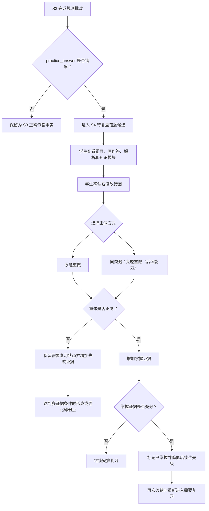

# S4 错题改错子系统 ErrorFixer PRD

**版本**：v0.6
**日期**：2026-07-20
**状态**：T04A Schema/归档、T04B 错题改错前端和 T05 回流均已完成；S6 报告生成/推送、T07 时间线与 T08 配置中心也已完成

---

## 1. Executive Summary

### Problem Statement

S3 已经能生成练习、记录逐题作答并即时批改，但“看到做错了”还不等于完成学习闭环。学生需要知道错误来自哪道题、关联哪个知识模块、可能为什么错、下一步该重做什么，以及哪些错误已经通过后续证据得到纠正。

如果系统只展示一次结果页，错题会随着练习结束而失去行动入口；如果系统又把一次错误直接判定为永久薄弱点，则会放大偶然失误并替学生作出不可靠判断。

### Proposed Solution

ErrorFixer 以 S3 已批改的错误作答事实为入口，为学生建立可追溯的错题改正流程：查看原题与来源、确认错因、选择重做方式、保留后续作答证据，并在证据充分时形成薄弱点候选或掌握结论。

S4 不修改 S3 的题目、原始作答或批改结果。`practice_answers.is_correct = false` 只作为只读事实输入；错题归档、薄弱点记录、前端闭环和回流规则已分别通过 T04A、T04B 与 T05 独立任务验收。

### Success Criteria

| 指标 | 验收标准 |
| --- | --- |
| 错题来源 | 每条错题都能追溯到同学期的原练习、题目、逐题作答和关联知识模块 |
| 事实边界 | S4 不反写或重判 S3 的 `practice_answers`，重复消费同一错误作答不会产生重复错题事实 |
| 错因确认 | 学生可以确认或修改错因；AI 只能提供带“不确定”标记的建议，不能替学生确认 |
| 改错闭环 | 学生可从待复盘错题进入原题重做，并保留重做结果作为新证据 |
| 重做扩展 | 产品边界容纳原题、同类题和变题重做；MVP 先保证原题重做可用，生成式重做失败不阻塞复盘 |
| 薄弱点证据 | 单次错误不能直接成为永久薄弱点；至少需要多次错误或重做未通过等可解释证据 |
| 掌握判断 | “已掌握”必须由后续正确作答或学生确认支撑，不因查看解析或时间经过自动成立 |
| 隐私 | 错题正文、原始答案和学生作答不进入 S6 家长报告，只允许脱敏聚合统计 |
| 学期隔离 | 错题、重做证据和薄弱点默认留在来源学期；跨学期复用必须显式选择且保留来源 |

---

## 2. User Experience & Functionality

### User Personas

- **学生**：做完练习后需要把错误转成下一步行动，而不是只看到一次红色标记。
- **家长**：只需要知道复盘数量、完成趋势和是否持续改进，不应看到题目、答案、错因正文或学生原始作答。

### User Stories

| 故事 | 验收标准 |
| --- | --- |
| 作为学生，我想看到尚未处理的错题，这样我知道先复盘什么。 | 错题按课程、知识模块和处理状态可筛选，默认优先展示待复盘项 |
| 作为学生，我想知道这道错题来自哪里，这样我能回到对应练习和知识模块。 | 详情保留练习时间、题目、我的答案、正确答案、解析和知识模块来源 |
| 作为学生，我想确认自己为什么出错，这样复习不是只背答案。 | 可选择概念不清、审题错误、公式错误、步骤缺失、时间不足或自行补充；AI 建议可拒绝或修改 |
| 作为学生，我想重新做题验证自己是否真的改会了。 | 原题重做产生独立结果；提交前不泄露答案，提交后显示对错和解析 |
| 作为学生，我想在证据充分后把错题标为已掌握。 | 状态变化展示依据；后续再次答错时可重新进入需要复习状态 |
| 作为学生，我想知道哪些知识模块反复出错。 | 薄弱点只基于多条可追溯证据形成，并能展开查看证据来源 |

### Non-Goals

- 不改变 S3 的出题、限时、作答、规则批改或练习结果语义。
- 不把一次错误、一次超时或一次未作答直接解释为永久薄弱点。
- 不让 AI 自动确认错因、自动判定掌握或替学生生成虚假的反思文本。
- 不在 S4 内实现跨考试自动排程、期末模拟卷或临考速背；这些属于 S5。
- 不在家长端展示题干、正确答案、学生答案、错题正文或错因正文。
- 不在本 PRD 任务中创建 Schema、API、页面、Worker、Provider 调用或任何业务代码。

---

## 3. User Flow



### 错题处理状态

```text
待复盘 -> 需要复习 -> 已掌握
              ^          |
              |----------|
                再次答错
```

| 状态 | 含义 | 进入条件 |
| --- | --- | --- |
| 待复盘 | 已有错误事实，但学生尚未完成错因确认和首次改错 | S3 产生新的错误作答事实 |
| 需要复习 | 已复盘但重做未通过，或掌握证据仍不足 | 学生确认错因、重做错误或证据不足 |
| 已掌握 | 有后续正确作答或学生确认等可见证据，当前无需优先复习 | 满足后续任务定义的掌握规则 |

“已掌握”不是终态。后续练习再次出现关联错误时，错题或薄弱点可以回到“需要复习”，同时保留历史证据，不覆盖原记录。

---

## 4. Inputs / Outputs

### Inputs

- S3 已批改且 `is_correct = false` 的 `PracticeAnswer`；
- 对应的 `Question`、`PracticeSession`、课程、考试尝试和 `KnowledgeModule` 关联；
- 学生确认的错因、补充说明和重做选择；
- 原题或后续同类题、变题的重做结果；
- 可选 AI 错因建议、改错提示或变题结果，均不得替代学生确认和规则批改。

### Outputs

- 可追溯的错题复盘记录和处理状态；
- 学生确认的错因及其来源标记；
- 每次重做的结果证据和掌握证据；
- 由多条错误证据归纳的薄弱点候选或薄弱点；
- 供 S1/T05 已实现回流规则消费的复习需求和优先级依据；
- 供 S6 后续读取的脱敏聚合统计，不包含题目或答案正文。

---

## 5. Components & Degradation

| 能力 | 组件边界 | 降级原则 |
| --- | --- | --- |
| 错题与证据存储 | 学期 SQLite；具体表和迁移由 T04A 设计 | 存储失败时不得伪造已归档或已掌握状态 |
| 自动归档与规则判断 | 纯规则逻辑；同一来源答题必须幂等 | 规则异常时保留 S3 原始事实，允许稍后重试 |
| 到期复习 | 复用现有 SQLite Job Worker 的能力边界；是否接入由后续任务决定 | Worker 不可用时仍可手动查看和重做错题 |
| 错因与改错建议 | 复用 `AiProviderRouter`，仅提供可拒绝的建议 | AI 不可用时使用人工错因和原题重做，不阻塞主流程 |
| 同类题 / 变题 | 复用 S3 题目生成边界，生成内容仍需结构校验 | 生成失败时保留原题重做入口，不创建空重做任务 |

本 PRD 不选定新开源依赖。T04A/T04B 若需要新增依赖，必须另行评估许可证、Windows 兼容性、隐私和失败降级。

---

## 6. AI System Requirements

### AI 使用点

| 功能 | MVP 要求 | 约束 |
| --- | --- | --- |
| 错因分类建议 | 可选 | 输出候选类别、简短依据和不确定性；学生必须确认 |
| 改错提示 | 可选 | 优先提示思路或检查点，不直接代写学生反思 |
| 同类题 / 变题 | 后续能力 | 必须基于关联知识模块和来源证据，继续走 S3 的结构化题目校验与规则批改 |
| 薄弱点归纳 | 可选 | 只能总结多条可追溯证据，不得由单次错误直接下结论 |

### AI 输出原则

- AI 建议必须与系统事实分开存储和展示，并标明“建议”而不是学生结论。
- Prompt 只使用完成当前任务所需的题目、作答摘要和知识模块证据，不读取无关资料全文。
- AI 失败、超时、全 Provider 冷却或输出非法时，不改变错题状态，不阻塞人工复盘和原题重做。
- 日志不得记录题干、学生答案、资料正文、完整 UUID、Provider URL、密钥或模型完整输出。
- AI 不得把“粗心”“态度问题”等推测作为事实，也不得生成惩罚性或羞辱性反馈。

---

## 7. Conceptual Data Objects

本节只定义产品职责，不是 Schema。表、字段、索引、约束、迁移版本和事务方案必须由 T04A 独立计划确定。

### Mistake

代表一个可执行的错题复盘单元：连接 S3 的错误作答事实、原题、练习场次、课程和知识模块，并承载当前复盘状态、学生确认的错因以及重做证据。

同一条 `PracticeAnswer` 只能对应一个来源错题事实；重复扫描或重试不得重复创建。S4 不复制或改写 S3 的原始作答作为新事实，展示时通过可验证关联读取。

### Redo Evidence

代表一次原题、同类题或变题重做的可追溯结果。它必须区分题目来源、作答时间、批改方式和结果，不能只保存“已重做”布尔值。

### WeakPoint

代表由多条错误或重做失败证据支撑的薄弱知识点。它关联 `KnowledgeModule` 和证据集合，并提供当前强度或状态；单条错误最多形成候选，不能直接成为永久薄弱点。

### 与现有对象的关系

```text
KnowledgeModule (S2)
  <- Question (S3)
      <- PracticeAnswer.is_correct = false (S3，只读事实)
          -> Mistake (S4，复盘单元)
              -> Redo Evidence (S4，后续作答证据)
              -> WeakPoint (S4，多证据归纳)
                  -> 下一轮 StudyTask / 优先级建议 (T05/S1 已实现回流)
```

所有关系默认限制在同一学期库和同一课程实例。重修或跨学期复用时，只能显式引用历史摘要和来源，不得把旧学期记录改写为新学期事实。

---

## 8. Product Surfaces

| 产品界面 | 责任 |
| --- | --- |
| 错题列表 | 按课程、知识模块和处理状态筛选；默认突出待复盘和需要复习项 |
| 错题详情 | 展示原题、学生答案、正确答案、解析、练习时间、关联知识模块、错因和历史证据 |
| 改错流程 | 学生确认错因，选择重做方式；提交前隐藏答案，提交后展示规则批改结果 |
| 薄弱点视图 | 展示多证据归纳结果、证据数量和来源；允许进入相关错题和知识模块 |
| 工作台“查漏补缺”区 | 后续只展示当前考试/课程最需要处理的少量事项，不制造强制排程 |

具体 API、DTO、路由、组件和缓存策略不在本 PRD 中确定。前端实现必须只消费后端 API，不直接读取 SQLite 或本地文件。

---

## 9. Acceptance Criteria

- [ ] S3 错误作答可被幂等归档为 S4 错题，且正确作答不会进入错题流程。
- [ ] 每条错题都能追溯到原 `PracticeAnswer`、`Question`、`PracticeSession` 和 `KnowledgeModule`。
- [ ] S4 不修改原题、原始作答、正确答案或 S3 批改结果。
- [ ] 学生可查看待复盘错题并确认、修改或拒绝 AI 错因建议。
- [ ] 原题重做在提交前隐藏答案，提交后产生独立、可追溯的批改证据。
- [ ] 重做未通过时保持需要复习；掌握状态有可见证据，再次答错可重新打开。
- [ ] 单次错误不会直接形成永久薄弱点；薄弱点可展开查看多条来源证据。
- [ ] AI 不可用时，错题列表、人工错因、原题重做和规则批改仍可使用。
- [ ] 不同学期和课程的错题、重做及薄弱点不会混用。
- [ ] S6 只能读取脱敏计数和趋势，不读取题干、答案、学生作答或错因正文。
- [x] T04A、T04B、T05 均已按各自独立计划和用户批准完成；后续增强仍需另立计划。

---

## 10. Roadmap & Gates

| 阶段 | 范围 | 开始门禁 |
| --- | --- | --- |
| Phase 1-T04 | 本轻量 PRD、索引和任务清单 | 已按批准计划完成文档任务 |
| Phase 1-T04A | `Mistake` / `WeakPoint` Schema、错误作答幂等归档、规则与测试 | ✅ 已完成：学期库 migration v5、`mistakes`/`mistake_evidence`/`weak_points`、S3 提交后自动归档与集成测试 |
| Phase 1-T04B | 错题列表、详情、错因确认、原题重做和工作台入口 | ✅ 已完成：错题 API、列表/详情页、错因确认、原题重做、薄弱点展示和工作台入口 |
| Phase 1-T05 | 复习排程、知识模块/任务优先级回流、掌握后降频 | ✅ 已完成：回流规则使用现有 S1/S4 数据结构，不新增 Schema、公开 API 或前端页面 |
| 后续增强 | 同类题/变题重做、AI 错因建议优化、跨学期显式复用 | MVP 稳定后另立计划 |

S5、S7 不因本 PRD 创建而自动获得实施授权。S6 的 T06A/T06B 已分别按独立计划完成，但仍只允许读取 S4 的脱敏聚合，不读取题目、答案、学生作答或错因正文。T09A–T09E 学生端产品化已完成并进入 `origin/master`，不改变 S4 所有权；当前没有新的已批准业务实施任务。

---

## 11. Revision Notes

| 版本 | 日期 | 说明 |
| --- | --- | --- |
| v0.6 | 2026-07-20 | 同步 T09A–T09E 已完成并进入远端主线；当前无新的已批准业务实施任务，保持 S6 只读脱敏聚合和 S4 后续增强需独立计划的边界 |
| v0.5 | 2026-07-18 | 同步 T06A/T06B、T07、T08 完成事实与 T09A 下一门禁；保持 S6 只读脱敏聚合和 S4 后续增强需独立计划的边界 |
| v0.4 | 2026-07-17 | 同步 T06 完成态：S6 家长观察 PRD 已创建，下一门禁为 T06A S6 家长报告生成；S6 仍只能读取 S4 脱敏聚合 |
| v0.3 | 2026-07-17 | 同步 T04B/T05 完成态：S4 错题改错前端闭环和回流规则已验收，下一门禁为 T06 S6 家长观察 PRD |
| v0.2 | 2026-07-16 | T04A 完成：新增错题归档与薄弱点 Schema，实现 S3 错误作答幂等归档；前端、重做、错因确认和回流规则仍留待 T04B/T05 |
| v0.1 | 2026-07-16 | 创建 S4 轻量 PRD；明确 S3 错误作答只读输入、错因确认、重做证据、薄弱点多证据原则、隐私边界与 T04A/T04B/T05 独立门禁 |
