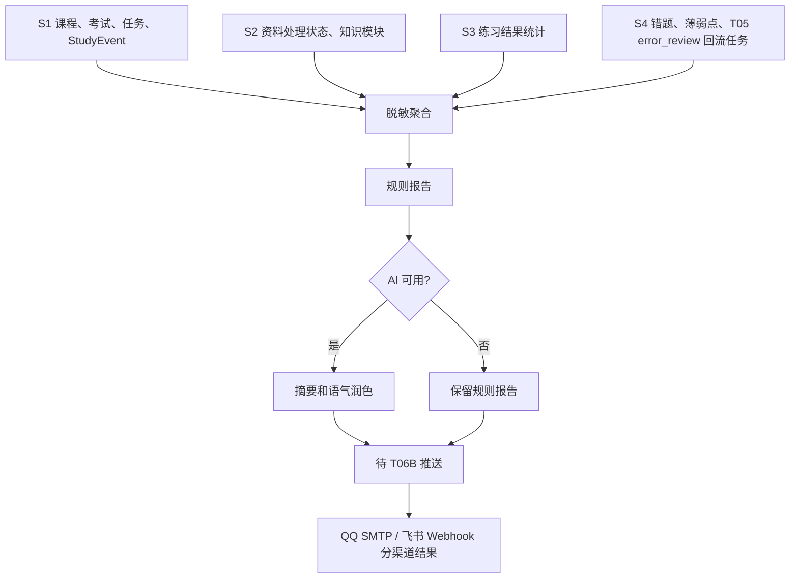

# S6 家长观察子系统 ParentReport PRD

**版本**：v0.2
**日期**：2026-07-17
**状态**：Phase 1-T06 PRD、T06A 脱敏报告生成和 T06B QQ SMTP/飞书渠道推送均已实现；真实 SMTP、飞书 Webhook、Provider 与 Windows 计划任务注册 smoke 不作为常规验证依赖

---

## 1. Executive Summary

### Problem Statement

AI StudyBuddy 的主系统属于学生本人，学习资料、笔记、作答、错因和聊天内容都应留在学生本机。家长需要知道孩子是否保持正常学习节奏、是否临近考试、是否出现持续掉队信号，但不应通过远程登录、家长面板或查看原文细节来“查岗”。

S6 要解决的是异步、脱敏、可解释的安心摘要：让家长看到学习事实和趋势，不看到隐私原文和完整答案。

### Proposed Solution

ParentReport 从 S1/S2/S3/S4 已产生的事实中读取脱敏聚合信息，生成日报、周报、月报和考前 7/3/1 天提醒。规则报告必须能独立生成；AI 只在规则报告基础上做简短摘要或语气润色，AI 失败时仍保留可发送的规则报告。

T06 只定义产品需求与边界；T06A 再实现报告生成，T06B 再实现 QQ SMTP 与飞书 Webhook 推送。

### Success Criteria

- 家长能从报告中理解：今天/本周/本月是否有学习活动、任务是否按时推进、考试是否临近、是否存在连续薄弱点或错题回流。
- 报告只包含脱敏事实、计数、状态、趋势和轻量提醒，不包含资料原文、笔记正文、完整题干、完整答案、学生作答、聊天内容、真实渠道地址或完整 UUID。
- AI 不可用时，规则报告仍然可生成、可审计、可发送。
- 渠道发送失败不会删除报告，也不会阻塞其他渠道；重复周期不应重复发送同一渠道报告。
- 学生仍是唯一业务操作者；家长不登录系统、不编辑任务、不查看本机页面。

---

## 2. User Experience & Functionality

### User Personas

| 用户 | 角色 | 需要 | 边界 |
| ---- | ---- | ---- | ---- |
| 学生 | 数据拥有者与唯一操作者 | 保持学习闭环、减少家长反复询问 | 不被远程监控，不暴露原文、答案或聊天内容 |
| 家长 | 异步脱敏报告接收者 | 知道孩子是否在正常学习、是否临近考试、是否需要温和提醒 | 不登录、不查岗、不看资料原文和完整作答 |

### Report Types

| 类型 | 触发窗口 | 核心内容 | 备注 |
| ---- | -------- | -------- | ---- |
| 日报 | 每日 | 当天学习活动、完成/逾期任务、资料处理状态、练习与错题轻量摘要 | 用事实和短提醒，不做长篇评价 |
| 周报 | 每周 | 课程与任务趋势、重复逾期、练习正确率趋势、活跃薄弱点 | 突出连续信号，不因单日波动放大风险 |
| 月报 | 每月 | 更长窗口趋势、考试准备状态、知识模块掌握变化 | 用于了解整体节奏，不替代成绩单 |
| 考前提醒 | 考前 7/3/1 天 | 已确认考试、倒计时、待完成任务、复习重点与错题回流状态 | 只基于学生确认的考试日期 |

### User Stories

| 编号 | 故事 | 验收要点 |
| ---- | ---- | -------- |
| S6-US1 | 作为家长，我想收到每日简报，知道孩子今天是否完成了关键学习事项。 | 报告展示完成/逾期/待处理数量和简短提醒，不展示任务隐私详情。 |
| S6-US2 | 作为家长，我想每周看到趋势，而不是被单日波动误导。 | 周报聚合连续逾期、练习正确率变化和活跃薄弱点数量。 |
| S6-US3 | 作为学生，我希望报告不泄露我的资料原文、笔记、答案和错因细节。 | 所有报告字段都以计数、状态、趋势和脱敏标题为主，不输出敏感正文。 |
| S6-US4 | 作为家长，我希望考试临近时收到 7/3/1 天提醒。 | 只对学生已确认、课程匹配的考试触发提醒。 |
| S6-US5 | 作为系统维护者，我希望 AI 或某个渠道失败时不丢报告。 | 规则报告独立存在；渠道结果分别记录，可只重试失败渠道。 |

### Non-Goals

- 不做家长 Web 面板、家长独立账号、移动端 App、远程登录、公网入口或云同步。
- 不允许家长查看资料原文、笔记正文、完整题干、完整答案、学生作答、错因正文或聊天内容。
- 不允许家长在 S6 中创建、编辑、删除学生任务或改变学习计划。
- 不做 S5 期末冲刺、S7 课堂录音、Phase 3 安全控制台或真实 Provider smoke。
- 不在本 PRD 中实现报告生成、SMTP、飞书 Webhook、Worker、调度或数据库迁移。

---

## 3. Report Flow

### Report Lifecycle

| 状态 | 含义 |
| ---- | ---- |
| `drafted` | 已按规则生成报告内容，尚未进入渠道发送。 |
| `enhanced` | AI 摘要或润色成功，规则报告仍保留。 |
| `ready_to_send` | 报告可交给渠道层发送。 |
| `partially_sent` | 至少一个渠道成功，仍有渠道失败或待重试。 |
| `sent` | 目标渠道均已成功或被明确跳过。 |
| `failed` | 当前周期没有任何渠道成功；报告内容仍保留，可重试。 |

> 上述状态是产品概念；T06B 已用 `parent_reports` 冻结脱敏快照和 `report_deliveries` 渠道记录实现投递恢复，但不新增 HTTP API、shared 类型、前端或常驻 Worker。

---

## 4. Inputs / Outputs

### Inputs

| 来源 | 可读取内容 | 禁止读取/输出内容 |
| ---- | ---------- | ------------------ |
| S1 课程/考试/任务 | 课程名、确认考试日期、任务状态、到期状态、优先级、StudyEvent 类型和时间 | 完整 UUID、敏感备注、未确认考试驱动的正式提醒 |
| S2 资料笔记 | 资料处理状态、质量待确认状态、知识模块标题、掌握状态 | 资料原文、笔记正文、上传文件内容 |
| S3 限时练习 | 练习次数、完成时间、正确率、用时、知识模块关联 | 完整题干、标准答案、学生作答 |
| S4 错题改错 | 错题数量、状态分布、薄弱点数量、重做成功/失败计数 | 错因正文、完整错题、答案、作答详情 |
| T05 回流规则 | `error_review` 复习任务状态、知识模块 `learning/mastered` 变化、薄弱点活跃/掌握状态 | 回流事务内部细节、完整证据 ID |

### Outputs

| 输出 | 内容 |
| ---- | ---- |
| 规则报告 | 周期、报告类型、生成时间、课程/考试/任务/资料/练习/错题的脱敏聚合块、轻量提醒。 |
| AI 增强摘要 | 基于规则报告的短摘要或更自然措辞；不得引入规则报告之外的新事实。 |
| 发送载荷 | 供 T06B 渠道层使用的 HTML 邮件内容或飞书卡片内容。 |
| 渠道结果 | 每个渠道的成功/失败、失败摘要、下一次可重试建议；不得记录密钥、完整 Webhook 或家长完整地址。 |

### Report Key and Deduplication

- 每份报告应有稳定的概念键，例如 `report:<type>:<date-or-window>`。
- 渠道发送以 `report_key + channel` 的数据库唯一记录去重；正常重复执行、到期租约恢复和重试复用同一冻结快照，成功记录不再重复投递。
- 对外渠道的语义是**至少一次投递**，不是跨 SMTP/飞书服务的 exactly-once：如果外部渠道已成功接收、但本机在写入 `sent` 前崩溃，后续恢复可能再次投递相同的脱敏快照。
- 渠道失败互不阻塞：QQ SMTP 失败不影响飞书，飞书失败不影响 QQ SMTP。
- 失败重试只能重试失败渠道，不能重新生成不同事实版本来覆盖原报告；同一 `report_key + channel` 跨 runner、进程和重启最多自动尝试三次，第三次失败后保留本机脱敏留档，等待维护者人工处置。

---

## 5. Privacy, AI, and Degradation

### Privacy Rules

- 只输出脱敏聚合：数量、状态、趋势、短标题、日期窗口和提醒级别。
- 不输出资料原文、笔记正文、完整题干、完整答案、学生作答、错因正文、聊天内容、真实 Provider 请求/响应、真实渠道地址、完整 UUID。
- 日志只能记录报告类型、周期、渠道名、成功/失败、耗时、短哈希和失败摘要。
- 家长渠道地址、SMTP 授权码、飞书 Webhook URL 只允许存在于本地私有配置，不得进入 Git、日志或报告正文。

### AI Boundaries

- AI 只可使用已经脱敏的规则报告作为输入。
- AI 只做摘要、语气润色、重复信号解释和提醒措辞，不得生成新事实、猜测原因或替学生作评价。
- AI 输出必须可被规则报告复核；无法复核的句子应丢弃或降级为规则文本。
- AI 失败、超时、全 Provider 冷却或返回不合规内容时，系统使用规则报告继续流程。

### Degradation

| 故障 | 降级行为 |
| ---- | -------- |
| AI 不可用 | 发送或保留规则报告，不阻塞报告周期。 |
| 单个渠道失败 | 记录该渠道失败，其他渠道继续发送。 |
| 所有渠道失败 | 保留冻结的脱敏报告，保存本机脱敏 HTML 与固定投递错误摘要，等待后续重试或由维护者手工补发。 |
| 数据不足 | 报告显示“暂无足够数据”，不编造趋势。 |
| 未确认考试 | 不触发正式 7/3/1 考前提醒。 |

---

## 6. Conceptual Data Objects

### ParentReport

代表某一周期内面向家长的脱敏报告。它应包含报告类型、周期、生成时间、规则内容、可选 AI 摘要、发送准备状态和短哈希。

### ReportSection

代表报告中的结构化片段，例如学习节奏、资料处理、练习表现、错题回流、考试提醒。每个片段只包含脱敏事实和解释，不包含敏感正文。

### ReportDelivery

代表某份报告在某个渠道上的发送结果。它应支持按渠道独立成功、失败、重试和去重。

### 与现有对象的关系

- S1 的课程、考试、任务与 StudyEvent 是报告事实主线。
- S2 提供资料处理状态和知识模块学习状态，不提供资料或笔记正文。
- S3 提供练习完成和正确率等统计，不提供题目、答案和作答详情。
- S4 提供错题状态和薄弱点聚合，不提供错因正文或完整错题。
- T05 回流后的 `error_review` 任务用于提示复习闭环是否正在推进。

---

## 7. Product Surfaces

| Surface | T06 PRD 定义 | 实现门禁 |
| ------- | ------------ | -------- |
| 报告内容结构 | 定义日报/周报/月报/考前提醒的信息块和隐私边界 | T06A |
| 报告生成服务 | 规则统计、AI 润色、失败兜底 | T06A |
| QQ SMTP 邮件 | HTML 报告发送、失败记录、重试 | T06B |
| 飞书 Webhook | 卡片推送、失败记录、重试 | T06B |
| 前端页面 | 本轮不做；如未来需要，只能先出独立计划 | 后续独立门禁 |
| 家长 Web 面板 | 非目标 | 不属于 MVP 简版 |

---

## 8. Acceptance Criteria

- [x] 能基于既有事实生成日报、周报、月报和考前 7/3/1 天提醒的规则报告。
- [x] 规则报告在 AI 不可用时仍可使用。
- [x] AI 增强只能基于脱敏规则报告，不引入新事实。
- [x] 报告不包含资料原文、笔记正文、完整题干、完整答案、学生作答、错因正文、聊天内容、真实渠道地址或完整 UUID。
- [x] S3/S4 只向 S6 暴露脱敏统计和趋势，不暴露题目、答案、作答或错因正文。
- [x] 报告以 `report_key + channel` 数据库记录去重，正常重复执行不重复发送；外部渠道成功与本机写入 `sent` 之间发生进程中断时，明确按至少一次投递处理，可能重复同一冻结脱敏快照。
- [x] QQ SMTP 与飞书 Webhook 渠道失败互不阻塞，可分别重试。
- [x] 每个失败渠道对同一冻结批次最多自动尝试三次；达到上限后不再自动补发，保留本机脱敏留档供维护者处置。
- [x] 未确认考试不会触发正式考前提醒。
- [x] 家长不能登录、不能编辑任务、不能访问学生本机页面。

---

## 9. Roadmap & Gates

| 阶段 | 内容 | 状态 |
| ---- | ---- | ---- |
| T06 | 创建 S6 轻量 PRD，登记索引与任务清单 | ✅ 本文档创建 |
| T06A | 规则报告生成、AI 摘要/润色、AI 失败兜底、报告内容测试 | ✅ 已实现并合入主线 |
| T06B | QQ SMTP、飞书 Webhook、渠道失败隔离、冻结快照、去重/重试与推送测试 | ✅ 已实现；真实外部渠道与计划任务注册 smoke 非常规验证 |
| Phase 3 | 家长端安全、性能与更完整配置治理 | ⏳ 不属于 Phase 1 MVP 简版 |

T06A/T06B 已分别经过独立计划和用户明确批准后实施；S5、S7 和 Phase 3 继续按既有门禁等待。

---

## 10. Revision Notes

| 版本 | 日期 | 说明 |
| ---- | ---- | ---- |
| v0.2 | 2026-07-17 | 登记 T06A 规则报告生成与 T06B 推送渠道实施：`report:<date>` 冻结脱敏快照、QQ SMTP/飞书独立投递、渠道级去重/重试、双渠道失败本机 HTML 与错误摘要留档；外部投递为至少一次语义，崩溃于外部成功与本机标记之间时可能重复同一冻结快照；不新增 HTTP API、前端、常驻 Worker 或真实渠道 smoke。 |
| v0.1 | 2026-07-17 | 创建 S6 家长观察轻量 PRD；定义脱敏日报/周报/月报/考前提醒、规则优先、AI 降级、渠道去重与失败隔离边界；不实现 T06A/T06B |
