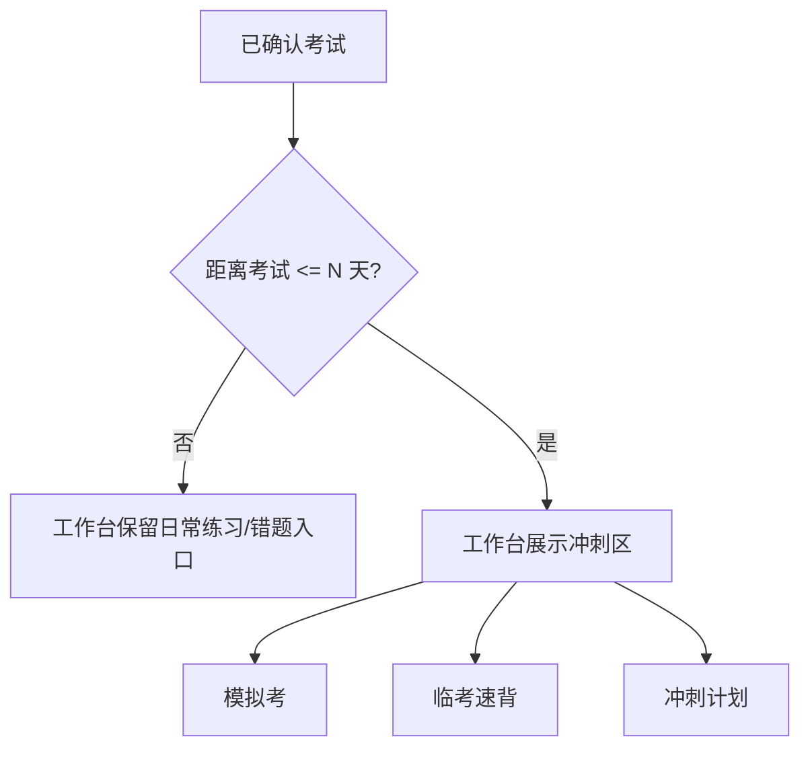
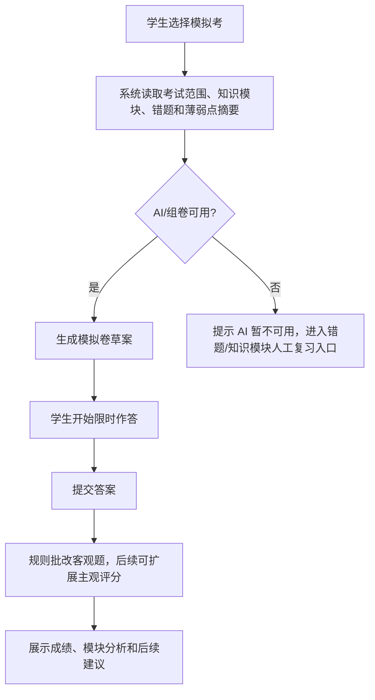
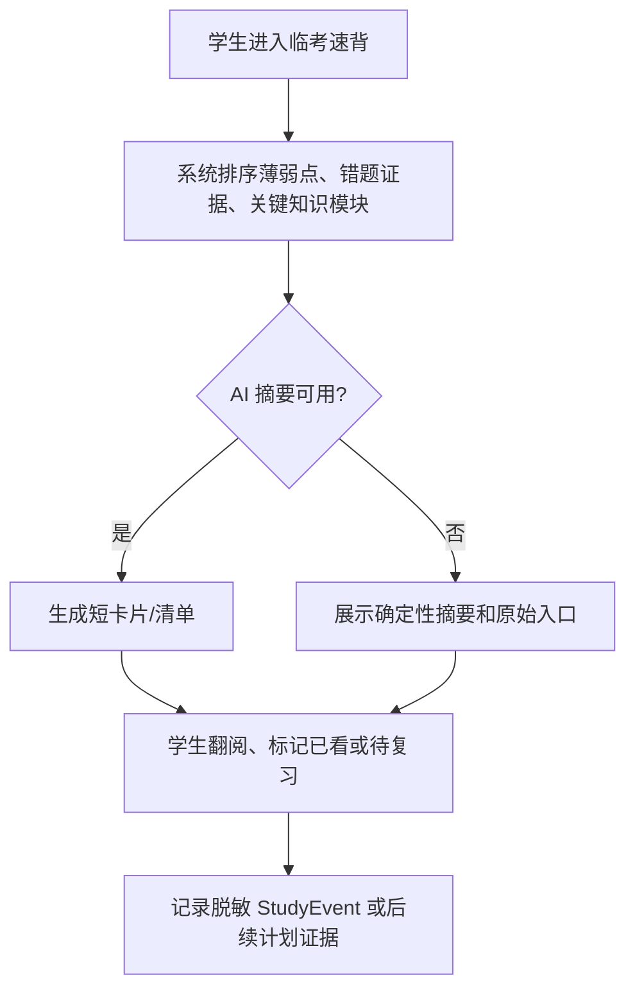

# S5 期末冲刺子系统 ExamCrammer PRD

**版本**：v0.4
**日期**：2026-07-21
**状态**：Phase 2-T01–T06 与 POST-PHASE2 分支/主线全量验证、完整 E2E 和文档对齐均已完成并推送 `origin/master`；后续增强仍须独立计划和批准

---

## 1. Executive Summary

### Problem Statement

Phase 1 已经跑通从课程/考试目标、资料笔记、限时练习、错题改错到脱敏家长报告的最小学习闭环。临近期末时，学生的主要问题会从“日常是否在学”转为“能否围绕某一场考试做集中冲刺”：

- 需要用限时模拟考检验整场考试范围，而不是只做单个知识模块练习；
- 需要把 S4 已沉淀的错题和薄弱点转成临考速背材料，而不是重新翻散落记录；
- 需要根据考试倒计时、剩余任务和薄弱点得到可执行的每日冲刺建议；
- 需要在考试工作台中看到清晰入口，而不是让模拟考、错题、资料和任务分散在多个页面。

### Proposed Solution

ExamCrammer 在已确认考试的上下文中，只读复用 S1/S2/S3/S4 的事实对象：考试日期、知识模块、练习记录、错题、薄弱点和回流任务。它在考前阶段提供三个核心能力：

1. **模拟考**：按考试范围和薄弱点生成限时模拟卷，完成后记录成绩、正确率、耗时和知识模块覆盖情况；
2. **临考速背**：从薄弱点、错题证据和关键知识模块生成短卡片或清单，帮助学生在有限时间内复习高风险内容；
3. **冲刺计划**：根据考试倒计时、未完成任务、错题/薄弱点和历史练习表现，给出每日复习建议与工作台入口。

T01 只定义 S5 的产品需求、边界、概念对象和后续任务拆分。Schema、API、Worker、前端页面和真实 AI 调用均留给 T02–T06 的独立计划。

### Success Criteria

| 指标          | 验收标准                                                                        |
| ------------- | ------------------------------------------------------------------------------- |
| 考试上下文    | 所有 S5 能力都归属到一个已确认的 `assessment_attempt`，不脱离考试工作台单独漂移 |
| 模拟考        | 能从考试范围、知识模块和薄弱点生成限时模拟卷，提交后展示成绩与模块分析          |
| 临考速背      | 能把错题、薄弱点和关键知识模块转成短小、可翻阅、可追溯来源的速背内容            |
| 冲刺计划      | 能根据倒计时、薄弱点和未完成事项给出每日建议；建议不替学生自动改写事实          |
| 与 S3/S4 关系 | 复用练习/错题能力与证据，但不破坏 S3/S4 已有语义和历史记录                      |
| 隐私          | S5 产生的题干、答案、学生作答和速背正文不进入 S6 家长报告，只允许脱敏统计       |
| 降级          | AI 不可用时不创建空模拟卷或虚假速背卡；保留人工复习入口和确定性提示             |
| 门禁          | 后续每个实现子任务必须先有 `.plans/`、独立审查和用户明确批准                    |

---

## 2. User Experience & Functionality

### User Personas

| 用户 | 角色               | 需要                                          | 边界                                           |
| ---- | ------------------ | --------------------------------------------- | ---------------------------------------------- |
| 学生 | 唯一业务操作者     | 在考前集中做模拟、速背和每日冲刺安排          | 可以拒绝或调整建议；系统不替学生伪造完成记录   |
| 家长 | 异步脱敏报告接收者 | 只知道孩子是否进入冲刺、是否完成模拟/复习趋势 | 不看模拟卷、答案、学生作答、错题正文或速背正文 |

### Core Scenarios

| 场景       | 学生动作                                                        | 系统输出                                       |
| ---------- | --------------------------------------------------------------- | ---------------------------------------------- |
| 模拟考     | 在已确认考试工作台点击“开始模拟考”，选择题量/时长或使用默认配置 | 生成模拟卷、计时作答、提交后展示成绩与模块弱点 |
| 临考速背   | 进入“临考速背”，按薄弱点或错题范围翻阅短卡片                    | 来源可追溯的速背卡片、已看/待看状态、重点提示  |
| 冲刺计划   | 查看考前 N 天每日建议，选择今天先做什么                         | 今日冲刺建议、关联任务/练习/错题入口、完成反馈 |
| 考前工作台 | 考试临近时从考试工作台看到“冲刺”区                              | 模拟考、速背、错题回顾和计划入口聚合           |

### User Stories

| 编号   | 故事                                                                     | 验收要点                                                              |
| ------ | ------------------------------------------------------------------------ | --------------------------------------------------------------------- |
| S5-US1 | 作为学生，我想在考前做一套限时模拟卷，这样我能知道整场考试准备得怎么样。 | 模拟卷归属当前考试，提交后有总分、正确率、耗时和模块分析。            |
| S5-US2 | 作为学生，我想优先复习反复出错的内容，这样临考前不用从头翻所有资料。     | 速背内容优先来自 S4 薄弱点、错题证据和 S2 知识模块摘要。              |
| S5-US3 | 作为学生，我想看到未来几天的冲刺建议，这样我每天知道先做什么。           | 建议基于已确认考试日期和现有事实；未确认考试不触发正式冲刺计划。      |
| S5-US4 | 作为学生，我希望 AI 不可用时仍能继续复习。                               | AI 失败时展示确定性入口：错题列表、知识模块、既有练习历史和手工计划。 |
| S5-US5 | 作为家长，我只想知道孩子是否有冲刺活动，不想看到试卷和答案。             | S6 只读脱敏计数和趋势，不输出题干、答案、作答或速背正文。             |

### Non-Goals

- 不替代 S3 的日常限时练习；S5 模拟考是考前综合场景。
- 不替代 S4 的错题改错；S5 只读错题/薄弱点并生成冲刺入口或速背建议。
- 不在 S5 中实现 S3 Worker、S4 同类题/变题增强、S7 课堂采集或家长 Web 面板。
- 不做教师出卷后台、题库管理后台、成绩单导入、学校教务系统同步或云端排行榜。
- 不把 AI 建议写成不可更改的事实，不自动标记“已掌握”或“已完成”。
- 不在本 PRD 任务中创建 Schema、API、Worker、前端页面、shared 类型或真实 Provider 调用。

---

## 3. User Flow

### 3.1 冲刺入口触发



### 3.2 模拟考流程



### 3.3 临考速背流程



---

## 4. Inputs & Outputs

### Inputs

| 来源     | 输入                                           | 使用边界                                             |
| -------- | ---------------------------------------------- | ---------------------------------------------------- |
| S1       | 已确认考试日期、倒计时、任务、StudyEvent       | 驱动冲刺窗口和每日建议；未确认考试不触发正式冲刺     |
| S2       | 知识模块、资料来源摘要、学习状态               | 作为组卷范围和速背内容来源；不直接暴露资料原文       |
| S3       | 练习 session、题目、答题记录、正确率、练习历史 | 复用客观题批改和练习记录语义；不改写历史练习结果     |
| S4       | 错题、错因、重做证据、薄弱点、回流任务         | 决定高优先级复习内容；不替代 S4 掌握判断             |
| 配置中心 | AI Provider 已验证/环境 fallback 状态          | AI 可用时用于组卷/摘要；不可用时降级，不阻塞人工复习 |

### Outputs

| 输出       | 内容                                                      | 后续归属                                                              |
| ---------- | --------------------------------------------------------- | --------------------------------------------------------------------- |
| 模拟卷     | 题目、选项、答案、解析、关联模块、时长配置                | 后续 T02/T03 设计 Schema/API/UI                                       |
| 模拟考结果 | 总分、正确率、耗时、逐题结果、模块覆盖和弱项分析          | 可被 S1 时间线和 S6 脱敏聚合读取                                      |
| 速背卡片   | 短标题、要点、来源模块/错题/薄弱点摘要、已看状态          | T04 已实现确定性即时只读生成、独立 UI 与会话恢复；不新增持久化 Schema |
| 冲刺计划   | 每日建议、关联任务/练习/错题入口、完成状态                | 后续 T05/T06 与 S1 任务关系单独设计                                   |
| StudyEvent | `exam_cram_started`、`mock_exam_completed` 等摘要事件候选 | 事件不得包含题干、答案、作答或长正文                                  |

---

## 5. AI & Rule Boundaries

### AI 可以做

- 根据知识模块摘要、错题摘要和考试范围生成模拟题；
- 生成题目解析、速背卡片和冲刺建议草案；
- 对开放题或复杂题给出评分建议（后续增强，需质量门和人工确认）；
- 用简短中文解释模块弱点和下一步建议。

### AI 不可以做

- 在没有学生作答事实时伪造完成记录、分数或掌握结论；
- 自动把知识模块改为已掌握或把错题关闭；
- 输出或保存真实 API Key、Provider URL、SMTP 授权码、飞书 Webhook 或完整 UUID；
- 把资料原文、完整错题本、完整模拟卷或学生答案发送到家长报告；
- 在 AI 失败时创建空模拟卷、空速背卡或看似成功的冲刺计划。

### 规则必须做

- 考试倒计时、已确认状态、任务完成状态、练习正确率和错题数量等事实由数据库与规则产生；
- 客观题批改优先复用 S3 已有规则批改语义；
- S6 可读内容只保留脱敏计数、趋势和活动摘要；
- 日志和 API 响应只返回固定错误码或脱敏摘要。

---

## 6. Conceptual Data Objects

> 本节包含产品概念与当前实现映射。T02 已以 migration v9 持久化模拟卷与作答结果；T04 速背卡和 T05 冲刺计划是即时只读 DTO，不创建对应表；T06 仅做前端工作台聚合。

### CramSession

代表某次围绕考试的冲刺活动，可区分 `mock_exam`、`flash_review`、`daily_plan` 等类型。它应关联学期、课程实例、已确认考试、开始/结束时间、状态和摘要统计。

### MockExamPaper

代表一次模拟卷。它包含题目集合、题目顺序、题型、分值、难度、来源知识模块和生成元数据。它不应复制资料原文；只保存最小可追溯来源引用。

### MockExamAttempt

代表学生对某份模拟卷的一次限时作答。它包含开始/提交/批改时间、总分、正确率、耗时、超时状态、逐题作答和模块分析。

### FlashcardSet / Flashcard

代表一次临考速背集合及其卡片。卡片应短小、可翻阅、可追溯来源，来源可以是知识模块、错题或薄弱点。卡片正文不进入家长报告。

### CramPlan

代表围绕考试倒计时生成的每日冲刺建议。它可以引用 S1 任务、S3 练习、S4 错题或 S5 模拟考，但不能自动把建议当成事实完成。

### 与现有对象的关系

```text
AssessmentAttempt (S1)
  <- KnowledgeModule (S2)
  <- PracticeSession / PracticeAnswer (S3)
  <- Mistake / WeakPoint (S4)
      -> CramSession / MockExamAttempt / Flashcard / CramPlan (S5 概念)
          -> StudyEvent 摘要事实
          -> S6 脱敏统计
```

所有对象默认限制在同一学期库和同一考试上下文内。跨学期复用历史错题或资料摘要时，必须显式选择并保留来源，不得改写旧学期事实。

---

## 7. Product Surfaces

| Surface            | S5 PRD 定义                              | 实现门禁           |
| ------------------ | ---------------------------------------- | ------------------ |
| 考试工作台“冲刺”区 | 考前 N 天展示模拟考、速背和冲刺计划入口  | T06                |
| 模拟考生成         | 读取考试范围/知识模块/薄弱点，生成模拟卷 | T02                |
| 模拟考作答与结果   | 浏览器计时、提交、成绩和模块分析         | T03                |
| 临考速背           | 生成并展示可追溯的短卡片/清单            | T04                |
| 冲刺计划           | 按倒计时和薄弱点建议每日复习动作         | T05                |
| S6 报告读取        | 只读脱敏统计，不读取题目/答案/正文       | 后续按 S6 边界补充 |

---

## 8. Acceptance Criteria

- [x] 已确认考试的工作台可展示 S5 冲刺入口；未确认考试保持只读提示且不触发正式冲刺计划。
- [x] 模拟卷生成只使用当前考试范围、知识模块摘要和错题/薄弱点摘要，失败时不创建空卷。
- [x] 模拟考支持限时作答、提交、客观题批改、成绩统计、模块分析和结果回看。
- [x] 临考速背卡片能追溯到知识模块、错题或薄弱点摘要；T04 使用确定性只读聚合，不暴露无来源的 AI 编造内容。
- [x] 冲刺计划能按剩余天数、未完成任务、练习表现、错题和薄弱点给出未来 7 天确定性每日建议。
- [x] S5 不反写或重判 S3/S4 历史事实；T04/T05/T06 均为只读聚合或导航。
- [ ] S5 写入的 StudyEvent 只包含脱敏摘要和 `evidence_ref`，不包含题干、答案、作答或卡片正文。
- [ ] S6 只能读取模拟次数、完成状态、趋势和冲刺活动摘要，不读取模拟卷内容或速背正文。
- [x] 当前 T04/T05/T06 不依赖 AI；学生始终可进入错题、知识模块、既有练习历史和速背入口做确定性复习。
- [x] API、页面状态和工作台切换测试证明不同学期、课程和考试的冲刺数据不会混用。

---

## 9. Roadmap & Gates

| 阶段        | 范围                                              | 状态                                                                        |
| ----------- | ------------------------------------------------- | --------------------------------------------------------------------------- |
| Phase 2-T01 | 创建 S5 轻量 PRD、同步 docs/00 与 docs/04         | ✅ 本文档创建；仅文档，不含实现                                             |
| Phase 2-T02 | 模拟考 Schema 与生成                              | ✅ 已完成主线复验并推送 `origin/master`                                     |
| Phase 2-T03 | 模拟考前端                                        | ✅ 已完成主线复验并推送 `origin/master`                                     |
| Phase 2-T04 | 临考速背                                          | ✅ 已完成主线复验并推送 `origin/master`；确定性只读卡片、独立页面与总倒计时 |
| Phase 2-T05 | 冲刺计划生成                                      | ✅ 已完成主线复验并推送；确定性即时只读 7 天建议，不持久化 `CramPlan`       |
| Phase 2-T06 | 工作台“冲刺”区集成                                | ✅ 已完成主线复验并推送；仅前端聚合既有入口与状态                           |
| 后续增强    | 主观题评分、真题导入、跨学期复用、S6 冲刺摘要扩展 | 另立计划，不由本文直接授权                                                  |

T02–T06 均已按“`docs/04` 登记 → `.plans/` → 独立审查 → 用户明确批准 → 分支验证 → 主线复验”流程完成。后续增强仍不得因本文档存在而自动获得实施授权。

---

## 10. Non-Goals & Safety Boundaries

- 不启动 S7 课堂采集、ASR、视频处理或课堂素材 PRD。
- 不回到 Phase 1-T09B–T09E，不修改每日首页、课表、全局导航、练习历史或学期归档既有事实。
- 不实现 S3 Worker，也不把 S5 模拟考作为绕过 S3/S4 后续增强门禁的入口。
- 不运行真实 AI、QQ SMTP、飞书、中转站、Windows Task Scheduler 或其他外部 smoke。
- 不提交真实资料原文、真实考试名称、完整 UUID、API Key、SMTP 授权码、飞书 Webhook、Provider URL 或外部账号信息。
- 不复制外部参考项目的源码、视觉、图片、长段文案或品牌资产。

---

## 11. Revision Notes

| 版本 | 日期       | 说明                                                                                                                                                                                                                                    |
| ---- | ---------- | --------------------------------------------------------------------------------------------------------------------------------------------------------------------------------------------------------------------------------------- |
| v0.4 | 2026-07-21 | 同步 POST-PHASE2 分支与主线全量测试、完整 E2E 和文档对齐均已完成并推送；未扩大 StudyEvent、S6 摘要、持久化计划或真实 AI 边界。                                                                                                          |
| v0.3 | 2026-07-21 | 同步 T05 确定性即时只读冲刺计划和 T06 工作台冲刺区已完成主线复验并推送；勾选已有证据的验收项，保留 StudyEvent、S6 冲刺摘要、持久化计划与真实 AI 为未完成边界。                                                                          |
| v0.2 | 2026-07-21 | 同步 Phase 2-T02 模拟考 Schema 与生成、T03 模拟考前端和 T04 临考速背已完成主线复验并推送 `origin/master`；T04 为确定性只读卡片、独立页面与总倒计时，不新增 Schema/migration、Worker 或真实 AI 调用；T05–T06、S7 与 S3 Worker 仍未启动。 |
| v0.1 | 2026-07-20 | Phase 2-T01：在 S3 练习与 S4 错题稳定运行门禁满足、且用户明确批准后创建 S5 期末冲刺轻量 PRD；定义模拟考、临考速背、冲刺计划和考前工作台入口边界；不创建 Schema/API/Worker/前端，不启动 T02–T06、S7 或真实外部 smoke。                   |
